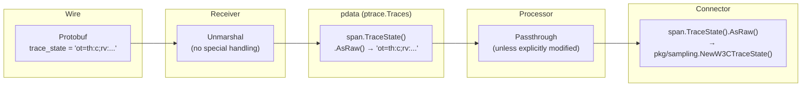
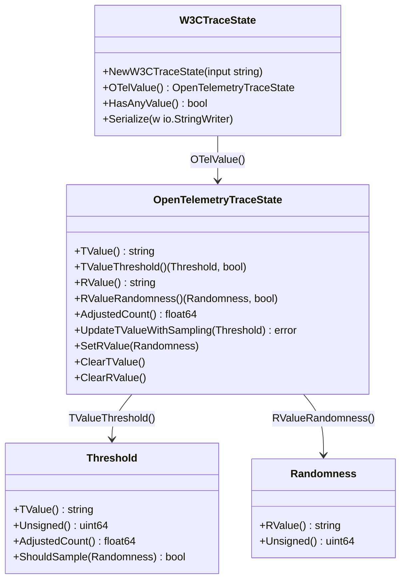
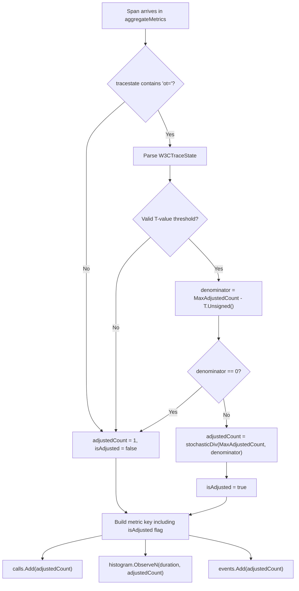
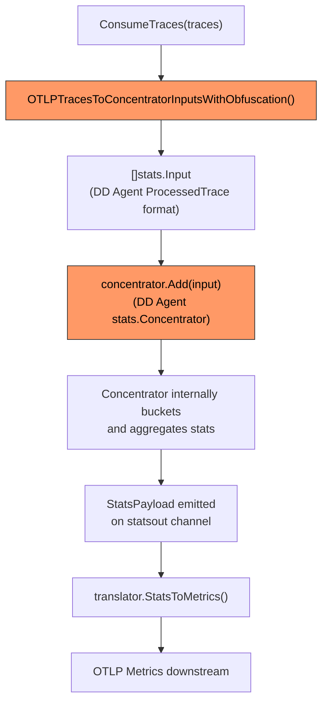
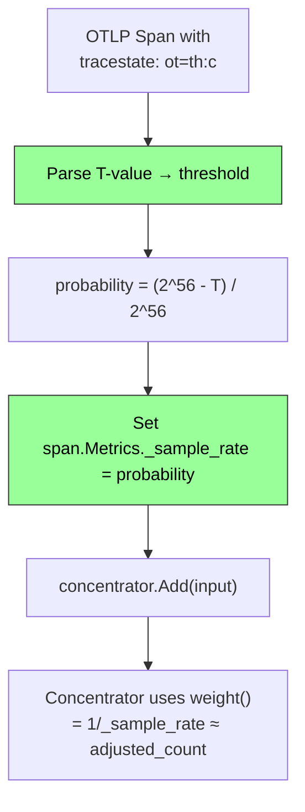
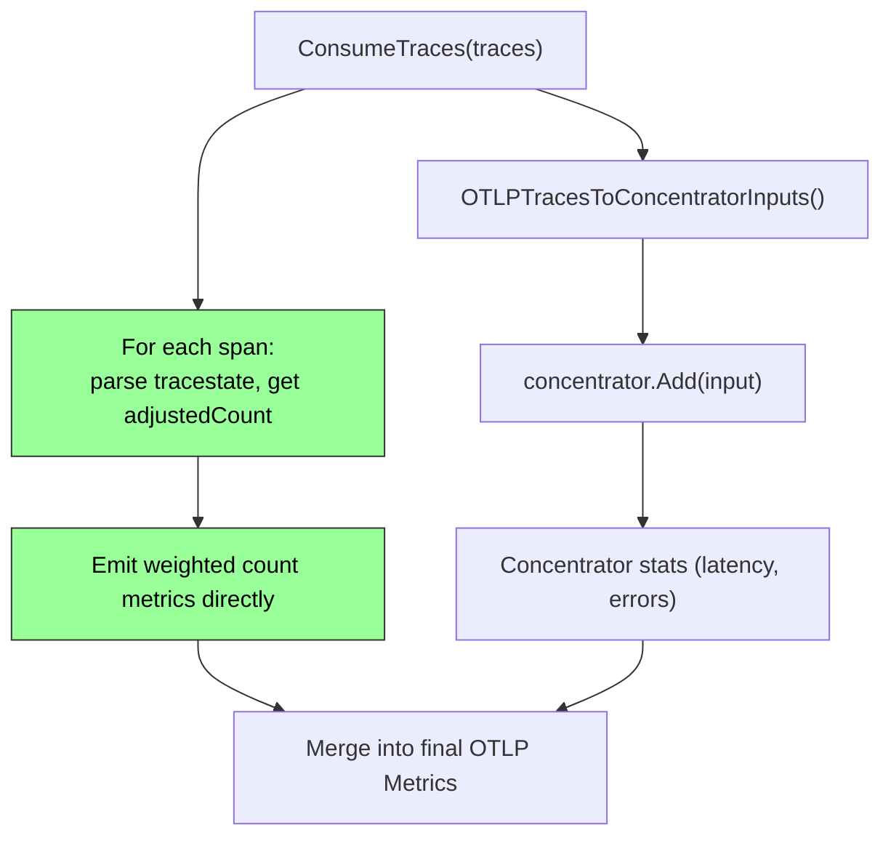

# Head Sampling & Adjusted Count in OpenTelemetry

A comprehensive reference for how head sampling probability is encoded, how
adjusted count corrects for sampling bias, and how these concepts are (or could
be) applied in the **spanmetricsconnector** and **Datadog connector**.

> **Target audience:** Contributors working on
> [issue #45539](https://github.com/open-telemetry/opentelemetry-collector-contrib/issues/45539) —
> adding adjusted-count support to the Datadog connector.

---

## Table of Contents

1. [End-to-End Head Sampling Flow](#1-end-to-end-head-sampling-flow)
2. [TraceState Flow Through the Collector Pipeline](#2-tracestate-flow-through-the-collector-pipeline)
3. [W3C Tracestate Probability Encoding (OTEP 235)](#3-w3c-tracestate-probability-encoding-otep-235)
4. [The `pkg/sampling` Library](#4-the-pkgsampling-library)
5. [spanmetricsconnector Reference Implementation](#5-spanmetricsconnector-reference-implementation)
6. [Datadog Connector Architecture](#6-datadog-connector-architecture)
7. [Adoption Strategy for the Datadog Connector](#7-adoption-strategy-for-the-datadog-connector)
8. [Key Differences Table](#8-key-differences-table)

---

## 1. End-to-End Head Sampling Flow

Head sampling decides whether to keep or drop a trace **before** the trace is
complete. The sampling probability is recorded in the W3C `tracestate` header so
that downstream consumers can compensate for the bias.

```mermaid
sequenceDiagram
    participant App as Application / SDK
    participant Sampler as Head Sampler
    participant Col as OTel Collector
    participant Con as Connector (spanmetrics / datadog)

    App->>Sampler: New span created
    Sampler->>Sampler: Generate R-value (randomness from TraceID)
    Sampler->>Sampler: Compare T (threshold) ≤ R (randomness)?
    alt T ≤ R → Sampled
        Sampler->>App: Record span, set tracestate: ot=th:<T>;rv:<R>
        App->>Col: Export span batch
        Col->>Con: Forward spans via pipeline
        Con->>Con: Parse tracestate → extract T-value
        Con->>Con: Compute adjusted_count = 1/probability
        Con->>Con: Weight metrics by adjusted_count
    else T > R → Dropped
        Sampler-->>App: Span dropped (not exported)
    end
```

### Why adjusted count matters

If a head sampler keeps 1-in-10 spans, every surviving span **represents 10
original spans**. Without correction, any count-based metric (calls, errors,
events) would undercount by 10×. The adjusted count restores the true
population count.

```
adjusted_count = 1 / sampling_probability
```

For a 10% sampler: `adjusted_count = 1 / 0.10 = 10`.

---

## 2. TraceState Flow Through the Collector Pipeline

Understanding how `tracestate` travels through the Collector is foundational
for connectors that need to read sampling probability. The key insight:
**tracestate is a plain string field that passes through untouched unless a
component explicitly modifies it.**

### Proto-level representation

In the OpenTelemetry protobuf definition, `trace_state` is a simple string
field on the `Span` message:

```protobuf
// From opentelemetry-proto trace.proto
message Span {
  bytes trace_id = 1;
  bytes span_id = 2;
  string trace_state = 3;  // W3C tracestate header value
  // ...
}
```

There is no special encoding or nested structure at the wire level — it is an
opaque string that carries the full W3C `tracestate` value.

### Receiver deserialization

When a receiver (e.g., OTLP receiver) ingests trace data, standard protobuf
unmarshalling populates the `trace_state` field. No receiver-specific parsing
or transformation is applied to this field — it arrives as-is from the
exporting SDK or upstream collector.

### pdata accessor API

Inside the Collector, spans are accessed through the `pdata` abstraction layer.
The `TraceState` accessor provides a thin string wrapper:

```go
// ptrace.Span — access the tracestate
span.TraceState()  // returns pcommon.TraceState

// pcommon.TraceState — read/write the raw string
span.TraceState().AsRaw()    // returns the tracestate string
span.TraceState().FromRaw(v) // sets the tracestate string
```

`pcommon.TraceState` is intentionally minimal — it does not parse the W3C
format. Parsing is left to consumers (like `pkg/sampling`).

### Pipeline transit

As spans flow through the pipeline (`receiver → processor → exporter` or
`receiver → processor → connector`), the tracestate rides inside the
`ptrace.Traces` data structure. It is **not** stripped, transformed, or
re-encoded at pipeline boundaries. The value a connector reads is exactly what
the receiver deserialized, unless an intervening processor modified it.



### Components that modify tracestate

Most processors and exporters leave tracestate untouched. The notable
exceptions:

| Component | How it modifies tracestate | File |
|---|---|---|
| `probabilisticsamplerprocessor` | Updates T-value and R-value via `pkg/sampling` after making a sampling decision | `processor/probabilisticsamplerprocessor/tracesprocessor.go` |
| OTTL `set(span.trace_state, ...)` | Direct read/write through the `TraceState` accessor; can set arbitrary values | `pkg/ottl/contexts/internal/ctxspan/span.go` |
| OTTL `set(span.trace_state["key"], ...)` | Parses tracestate as key/value pairs, modifies individual keys | `pkg/ottl/contexts/internal/ctxspan/span.go` |
| Format translators | Receivers/exporters for non-OTLP formats may map tracestate to/from format-specific fields | Varies by receiver/exporter |

For reference, the probabilistic sampler reads and writes tracestate like this:

```go
// Read: parse W3C tracestate from the span
tsc.W3CTraceState, err = sampling.NewW3CTraceState(s.TraceState().AsRaw())

// Modify: update the T-value after a sampling decision
tc.W3CTraceState.OTelValue().UpdateTValueWithSampling(th)

// Write back: serialize and store
tc.span.TraceState().FromRaw(w.String())
```

### Implication for connectors

A connector that needs to read sampling probability does **not** need any
special wiring, configuration, or pipeline plumbing. The tracestate is already
present on every span. The entire read path is:

```go
raw := span.TraceState().AsRaw()
w3c, err := sampling.NewW3CTraceState(raw)
if err != nil {
    // no valid tracestate — treat as unsampled (adjustedCount = 1)
}
threshold, ok := w3c.OTelValue().TValueThreshold()
if ok {
    adjustedCount := threshold.AdjustedCount()
}
```

No receiver changes, no processor insertion, no configuration flags — just
parse the string that is already there.

---

## 3. W3C Tracestate Probability Encoding (OTEP 235)

[OTEP 235](https://github.com/open-telemetry/oteps/blob/main/text/trace/0235-sampling-threshold-in-trace-state.md)
defines how sampling probability is encoded in the W3C `tracestate` header
using the OpenTelemetry vendor section (`ot=`).

### Tracestate structure

```
tracestate: ot=th:<T-value>;rv:<R-value>,vendorA=value,...
            ^^                            ^^^^^^^^^^^^^^^
            OTel section                  Other vendors
```

### T-value (Threshold)

The **T-value** is a variable-length hexadecimal string (up to 14 hex digits =
56 bits) representing the **rejection threshold**:

| Property | Value |
|---|---|
| Encoding | Hex string, trailing zeros omitted |
| Max digits | 14 (56 bits of precision) |
| Range | `"0"` (never sample) to `""` empty (always sample) |
| Max unsigned value | 2^56 = `0x100000000000000` |

**Decoding formula:**

```
threshold_unsigned = hex_decode(T-value) << (4 × (14 - len(T-value)))
```

For example, T-value `"c"` decodes to:

```
0xc << (4 × 13) = 0xc0000000000000
```

This means 0xc0000000000000 / 0x100000000000000 ≈ 75% of spans are
**rejected**, giving a ~25% sampling probability.

### R-value (Randomness)

The **R-value** is a fixed 14-character hex string representing 56 bits of
randomness. It can be:

- **Explicit:** Carried in the tracestate as `rv:<14-hex-chars>`
- **Implicit:** Derived from the last 7 bytes (56 bits) of the TraceID

### Sampling decision

```
Sample if:  T ≤ R   (threshold ≤ randomness)
Drop if:    T > R
```

### Probability formula

```
sampling_probability = (MaxAdjustedCount - T_unsigned) / MaxAdjustedCount
adjusted_count       = MaxAdjustedCount / (MaxAdjustedCount - T_unsigned)
```

Where `MaxAdjustedCount = 2^56`.

---

## 4. The `pkg/sampling` Library

The `pkg/sampling` package in this repository provides the building blocks for
working with OTEP 235 probability encoding.

### Type hierarchy



### Key types and functions

#### `Threshold` (`pkg/sampling/threshold.go`)

Represents an exact sampling probability threshold using 56 bits.

```go
const MaxAdjustedCount = 1 << 56  // 0x100000000000000

// Parse a T-value hex string into a Threshold
func TValueToThreshold(s string) (Threshold, error)

// The sampling decision: true if this item should be sampled
func (th Threshold) ShouldSample(rnd Randomness) bool  // T ≤ R

// The representativity of a sampled item
func (th Threshold) AdjustedCount() float64  // MaxAdjustedCount / (MaxAdjustedCount - unsigned)
```

#### `Randomness` (`pkg/sampling/randomness.go`)

Represents 56 bits of randomness derived from TraceID or an explicit R-value.

```go
// Extract randomness from the last 56 bits of a TraceID
func TraceIDToRandomness(id pcommon.TraceID) Randomness

// Parse an explicit 14-hex-digit R-value
func RValueToRandomness(s string) (Randomness, error)
```

#### `W3CTraceState` (`pkg/sampling/w3ctracestate.go`)

Parses the full W3C `tracestate` header, extracting the `ot=` vendor section
while preserving all other vendor entries.

```go
func NewW3CTraceState(input string) (W3CTraceState, error)
func (w3c *W3CTraceState) OTelValue() *OpenTelemetryTraceState
```

#### `OpenTelemetryTraceState` (`pkg/sampling/oteltracestate.go`)

Parses the `ot=` section into its component fields (T-value, R-value, extras).

```go
func (otts *OpenTelemetryTraceState) TValueThreshold() (Threshold, bool)
func (otts *OpenTelemetryTraceState) AdjustedCount() float64
```

### Consistency invariant

The `UpdateTValueWithSampling` method enforces a critical rule: **sampling
probability can only decrease** (threshold can only increase). This prevents
a downstream sampler from claiming a higher probability than actually applied:

```go
func (otts *OpenTelemetryTraceState) UpdateTValueWithSampling(
    sampledThreshold Threshold,
) error
// Returns ErrInconsistentSampling if the new threshold would
// imply a higher sampling probability than the existing one.
```

---

## 5. spanmetricsconnector Reference Implementation

The spanmetricsconnector (issue
[#45539 reference](https://github.com/open-telemetry/opentelemetry-collector-contrib/issues/45539))
provides the canonical implementation of adjusted-count-aware metric generation.

### File: `connector/spanmetricsconnector/internal/metrics/adjusted_count.go`

The core computation:

```go
func computeAdjustedCount(tracestate string) (uint64, bool) {
    if !strings.Contains(tracestate, "ot=") {
        return 1, false
    }
    w3cTraceState, err := sampling.NewW3CTraceState(tracestate)
    if err != nil {
        return 1, false
    }
    threshold, exists := w3cTraceState.OTelValue().TValueThreshold()
    if !exists {
        return 1, false
    }
    denominator := sampling.MaxAdjustedCount - threshold.Unsigned()
    if denominator == 0 {
        return 1, false
    }
    return stochasticDiv(sampling.MaxAdjustedCount, denominator), true
}
```

### The complete span-to-weighted-metric flow



### Stochastic rounding

The adjusted count is an integer, but the true value of
`MaxAdjustedCount / denominator` is often not an integer. The implementation
uses **stochastic rounding** to produce an unbiased integer estimate:

```go
func stochasticDiv(numerator, denominator uint64) uint64 {
    quotient  := numerator / denominator
    remainder := numerator % denominator
    if remainder == 0 {
        return quotient
    }
    // Round up with probability = remainder/denominator
    rng := prngPool.Get().(*xorshift64star)
    defer prngPool.Put(rng)
    if rng.next()%denominator < remainder {
        quotient++
    }
    return quotient
}
```

Over many spans, this converges to the correct expected value without floating
point accumulation errors.

### Performance: single-entry cache

Consecutive spans from the same trace share identical `tracestate` values. A
simple single-entry cache avoids redundant W3C parsing:

```go
type AdjustedCountCache struct {
    tracestate string
    count      uint64
    isAdjusted bool
}
```

The cache is created per `aggregateMetrics` call (function-local, no
synchronization needed) and checked before every `computeAdjustedCount`.

### Integration in `connector.go:aggregateMetrics()`

```go
// Line 388: Create local cache
adjustedCountCache := metrics.NewAdjustedCountCache()

// Line 419: Per-span — compute adjusted count (cache-aware)
adjustedCount, isAdjusted := metrics.GetStochasticAdjustedCountWithCache(
    &span, &adjustedCountCache,
)

// Line 422: isAdjusted is part of the metric key (separate series)
key := p.buildKey(serviceName, span, callsDimensions, resourceAttr, isAdjusted)

// Line 433: Calls counter weighted by adjusted count
s.Add(adjustedCount)

// Line 447: Duration histogram weighted by adjusted count
h.ObserveN(duration, adjustedCount)

// Line 475: Event counter weighted by adjusted count
e.Add(adjustedCount)
```

### Config: `EnableMetricsSamplingMethod`

When `enable_metrics_sampling_method: true`, a `sampling.method` attribute is
added to each metric:

| Value | Meaning |
|---|---|
| `"extrapolated"` | `isAdjusted == true` — count was derived from tracestate |
| `"counted"` | `isAdjusted == false` — span counted as 1 (no sampling info) |

This lets consumers distinguish between exact and estimated counts.

---

## 6. Datadog Connector Architecture

The Datadog connector
(`pkg/datadog/apmstats/connector.go`) generates APM stats
metrics from trace data. Its architecture is fundamentally different from
spanmetricsconnector.

### Current flow



### Key architectural differences

1. **External aggregation engine.** The DD Agent `stats.Concentrator` owns all
   span counting and stat bucketing. The connector code **does not** directly
   touch per-span counts.

2. **OTLP → DD span conversion.** The function
   `OTLPTracesToConcentratorInputsWithObfuscation()` (from
   `github.com/DataDog/datadog-agent/pkg/trace/otel/stats`) converts OTLP spans
   to the DD Agent's internal `stats.Input` format. This is where any
   sample-rate metadata would need to be injected.

3. **DD Agent weight model.** The Concentrator uses `pb.Span.Metrics["_sample_rate"]`
   to compute a per-trace-chunk weight via its internal `weight()` function:
   ```
   weight = 1.0 / _sample_rate
   ```
   This is conceptually equivalent to `adjustedCount` but uses a **float64
   rate** rather than an integer threshold.

### stats.Input structure

```go
type Input struct {
    Traces        []traceutil.ProcessedTrace
    ContainerID   string
    ContainerTags []string
    ProcessTags   string
}
```

The `ProcessedTrace` contains converted DD-format spans. The Concentrator
iterates over these spans and uses their `Metrics["_sample_rate"]` field for
weighting.

---

## 7. Adoption Strategy for the Datadog Connector

There are three main approaches to bring adjusted-count support to the Datadog
connector, each with different trade-offs.

### Option A: Inject `_sample_rate` during OTLP→DD conversion

Modify `OTLPTracesToConcentratorInputsWithObfuscation()` (or a wrapper) to
parse the W3C tracestate T-value and set `pb.Span.Metrics["_sample_rate"]`
on the converted DD spans before they reach the Concentrator.



| Pros | Cons |
|---|---|
| Minimal changes to connector code | Requires change in DD Agent `pkg/trace/otel/stats` |
| Leverages existing Concentrator `weight()` | Float64 precision loss vs. uint64 stochastic rounding |
| Consistent with DD Agent's own sampling model | Must coordinate with DD Agent release cycle |

### Option B: Pre-aggregate in the connector, bypass Concentrator for counts

Compute adjusted count in the connector (reusing `pkg/sampling` + the
spanmetricsconnector pattern) and emit count metrics directly, while still
using the Concentrator for latency distributions and other stats.



| Pros | Cons |
|---|---|
| Full control over count precision (stochastic rounding) | Dual aggregation paths — more complex |
| No DD Agent dependency for this feature | Must keep both paths consistent |
| Can ship independently | Concentrator still uses unweighted counts for its stats |

### Option C: Upstream the change into DD Agent Concentrator

Modify the DD Agent's `Concentrator` to natively understand W3C tracestate
T-values, computing adjusted counts internally.

| Pros | Cons |
|---|---|
| Single source of truth for all DD Agent consumers | Largest scope of change |
| Benefits DD Agent beyond just the OTel connector | Longest lead time |
| Clean architecture | Requires DD Agent team buy-in |

### Recommendation

**Option A is the pragmatic first step.** It requires the smallest change
(mapping T-value → `_sample_rate` during conversion), reuses the existing
Concentrator weighting mechanism, and can be done in the
`OTLPTracesToConcentratorInputsWithObfuscation` function or a post-processing
step in the connector. The float64 precision loss is negligible for practical
sampling rates.

Option C is the ideal long-term solution but can be pursued independently.

---

## 8. Key Differences Table

| Aspect | spanmetricsconnector | Datadog connector |
|---|---|---|
| **Aggregation engine** | Built-in (direct `Add`/`ObserveN` on metric objects) | External (`stats.Concentrator` from DD Agent) |
| **Sampling info source** | W3C tracestate `ot=th:<T>` | `pb.Span.Metrics["_sample_rate"]` (DD convention) |
| **Weight type** | `uint64` (stochastic-rounded adjusted count) | `float64` (`1.0 / _sample_rate`) |
| **Weight computation** | `stochasticDiv(MaxAdjustedCount, MaxAdjustedCount - T)` | `1.0 / span.Metrics["_sample_rate"]` |
| **Granularity** | Per-span | Per-trace-chunk |
| **Parsing library** | `pkg/sampling` (W3C + OTel tracestate) | N/A (expects pre-set `_sample_rate` float) |
| **Cache strategy** | Single-entry tracestate cache (function-local) | N/A (Concentrator manages internally) |
| **Config flag** | `enable_metrics_sampling_method` | None currently |
| **Metric separation** | `isAdjusted` flag in metric key → separate series | Single series (weight applied internally) |
| **OTLP conversion** | None needed (already OTLP) | `OTLPTracesToConcentratorInputsWithObfuscation()` |

---

## Appendix: Worked Example

A 25% head sampler produces spans with tracestate:

```
tracestate: ot=th:c
```

**Step 1 — Decode T-value:**
```
T-value = "c"
T_unsigned = 0xc << (4 × 13) = 0xc0000000000000
```

**Step 2 — Compute denominator:**
```
denominator = MaxAdjustedCount - T_unsigned
            = 0x100000000000000 - 0xc0000000000000
            = 0x40000000000000
```

**Step 3 — Compute adjusted count:**
```
adjustedCount = MaxAdjustedCount / denominator
              = 0x100000000000000 / 0x40000000000000
              = 4
```

Each surviving span counts as **4** (since 1/0.25 = 4). ✓

**Step 4 — Apply to metrics:**
```
calls.Add(4)                    // 4 calls represented
histogram.ObserveN(duration, 4) // duration recorded 4 times
```

**Step 5 — For DD connector (Option A), convert to `_sample_rate`:**
```
probability   = denominator / MaxAdjustedCount = 0.25
_sample_rate  = 0.25
DD weight()   = 1.0 / 0.25 = 4.0  ✓ (matches adjustedCount)
```
