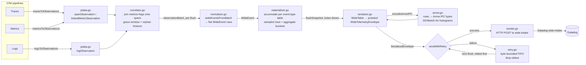
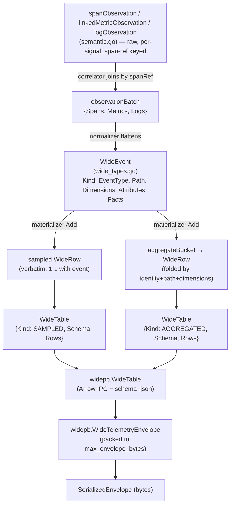
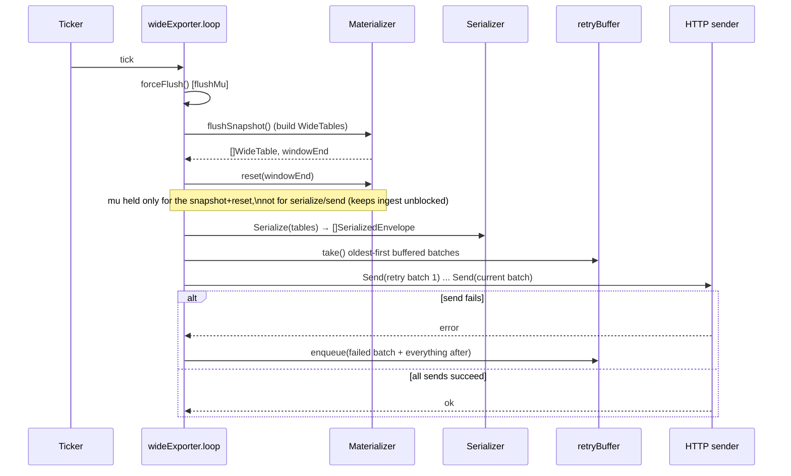

# Datadog Wide Exporter — Architecture

One-line mental model: **OTel signals in → correlate spans with their metrics/logs → normalize into flat "wide events" → materialize into per-flush-window tables (sampled rows + aggregates) → serialize to Arrow/protobuf envelopes → POST to wide-intake, with a bounded retry buffer.**

Every stage is bounded in memory (`wide.max_*` config) so a slow/down intake degrades (drops) instead of OOMing.

## 1. Big picture



## 2. Where each stage lives

| Stage | File | Responsibility |
| --- | --- | --- |
| OTel → observations | `pdata.go` | Walks `ptrace.Traces` / `pmetric.Metrics` / `plog.Logs`; extracts resource dimensions, span attributes, exemplars; produces `spanObservation`, `linkedMetricObservation`, `logObservation` (types in `semantic.go`). |
| Correlation | `correlator.go` | Buffers spans/metrics/logs by `spanRef{traceID,spanID}` until the span itself arrives (or an orphan timeout elapses), then emits one `observationBatch`. |
| Flattening | `normalizer.go` | Turns a correlated batch into independent `WideEvent`s (one per span, one per metric sample/aggregate, one per log) with `Dimensions`/`Attributes`/`Facts`. |
| Accumulation | `materializer.go` | Not concurrency-safe; owned by the exporter under `e.mu`. Buffers **sampled rows** verbatim and folds facts into **aggregate buckets** keyed by `(event type, path, dimensions)`. Tracks per-identity schema (`FieldSchema`) and enforces the three `Max*` caps. |
| Serialization | `serializer.go` + `arrow.go` | `WideTable` → Arrow IPC (zstd) record batch → `widepb.WideTable` → packed into one or more `widepb.WideTelemetryEnvelope`s bounded by `wide.max_envelope_bytes`. |
| Egress + retry | `exporter.go` (`sendWithRetry`) + `retry.go` + `sender.go` | Drains the retry buffer (oldest first), appends the current window, POSTs each batch; on failure re-enqueues the failed batch onward into the byte-bounded `retryBuffer` (drop-oldest). |
| Wiring | `factory.go` | Ref-counted singleton `*wideExporter` per `component.ID` — traces/metrics/logs pipelines share one exporter instance, correlator, and materializer. |
| Config | `config.go` | `api.*` (key/site), `wide.*` (flush cadence, caps, endpoint override), `correlation.*` (grace/orphan/sweep timings). |

## 3. Data model, stage by stage



Key rule baked into the normalizer/materializer: **aggregate rows never carry a `TraceID`/`SpanID`** — they're pure dimension-keyed rollups, never attached to a representative span (per the README's semantic contract).

## 4. Correlator: span/metric/log join lifecycle

Every signal referencing a `(traceID, spanID)` is buffered in a `pendingSpan` map entry until the span arrives or it times out as an orphan. A background sweep (`correlation.sweep_interval`, default 50ms) evaluates every entry each tick.

```mermaid
stateDiagram-v2
    [*] --> Pending: onMetric/onLog/onSpan\ncreates pendingSpan{firstSignalAt}
    Pending --> Pending: more onMetric/onLog\n(span not yet seen)
    Pending --> SpanSeen: onSpan arrives\n(spanArrivedAt = now)
    SpanSeen --> SpanSeen: late onMetric/onLog\nattach directly to b.span
    SpanSeen --> Emitted: sweep tick,\nnow - spanArrivedAt >= grace_window\n(default 300ms)
    Pending --> Orphaned: sweep tick,\nnow - firstSignalAt >= orphan_timeout\n(default 5s)
    Orphaned --> Emitted: exportOrphanBundles\n(aggregates + logs only;\nspan-linked samples dropped, no carrier)
    Emitted --> [*]: sink() = exporter.exportObservationBatch
```

Notes:
- `onMetric` with `Aggregate != nil` and sampled exemplars keeps the aggregate attached to the **first** exemplar's span carrier — so if that span never shows up, the aggregate still exports as an orphan; sample-only observations without exemplars skip correlation entirely and are sunk immediately.
- If a `sink()` call fails (e.g. context cancellation during flush), `requeue` puts everything back into `pending` unless a fresher entry has already taken that key — so correlation state survives transient errors.
- `shutdown()` stops the sweep loop and does one final `drainAll` (emits everything regardless of grace/orphan timers) so nothing is silently lost on collector shutdown.

### Arrival order is (mostly) irrelevant — same spanRef, span arrives first

Walking `span → metric → log` for one `spanRef`:

1. **`onSpan`** (`correlator.go:59-79`): creates the bucket `b`, sets `b.span = &span`, `b.spanArrivedAt = now`. `b.samples`/`b.logs` are empty since nothing arrived earlier.
2. **`onMetric`** (`correlator.go:98-137`): `pendingSpan(sample.Span)` returns the same bucket; since `b.span != nil`, the sample is appended **directly** to `b.span.Metrics` (the `b.samples` queue is bypassed — that queue only exists for metrics that beat the span). A datapoint `Aggregate`, if present, is stored separately on `b.aggregates` — it is *never* attached to `b.span.Metrics`, per the "aggregates are never parented to a span" rule.
3. **`onLog`** (`correlator.go:81-96`): `b.span != nil`, so the log is appended straight to `b.span.Logs`.
4. **On flush** (grace window elapses after `spanArrivedAt`): `emit()` ships the span (now carrying the metric sample and the log inline) plus `b.aggregates` as separate top-level metric entries. The normalizer turns this into: one span row, one metric-sample row parented to the span, one log row parented to the span, and one standalone metric-aggregate row with no trace/span linkage.

If the metric/log had arrived **before** the span instead, they'd queue into `b.samples`/`b.logs`, and `onSpan` merges those queues into `span.Metrics`/`span.Logs` on arrival (`correlator.go:66-67`). Same end state either way — only the intermediate storage path (direct append vs. queue-then-merge) differs, as long as everything lands within `grace_window` of the span's arrival.

**Edge case — late arrival after the bundle already flushed:** if a metric sample or log shows up *after* `spanArrivedAt + grace_window` has already swept and emitted the bundle, `pendingSpan` allocates a brand-new empty bucket for it — it can never rejoin the already-emitted span. If that new bucket then times out as an orphan with no span ever showing up, `exportOrphanBundles` (`correlator.go:305-317`) exports its `aggregates` and `logs`, but explicitly **drops** any queued exemplar samples (`b.samples`) — they have no span to parent to and are silently discarded.

## 5. Flush lifecycle (ticker-driven, `wide.flush_interval`, default 10s)



`consumeTraces` / `consumeMetrics` / `consumeLogs` (the actual `exporterhelper` consumer functions) push observations into the correlator and then call `correlator.forceFlush(ctx)` — so correlated batches also drain synchronously on every consume call, not just on the ticker's sweep. The ticker in `exporter.go` is what drives the **materializer→intake** flush, a separate cadence from the correlator's sweep.

## 6. Concurrency & locking

- `wideExporter.mu` — guards `materializer`, `identity`, `lastErr`. Held only for quick in-memory operations (`Add`, snapshot+reset), never across network I/O.
- `wideExporter.flushMu` — serializes concurrent flushes (ticker vs. shutdown) so serialize+send is never run twice concurrently; `retry` is only touched under this lock.
- `correlator.mu` — guards `pending` map and `orphanLogs`; independent of the exporter's locks.
- `Materializer` itself declares it is **not** safe for concurrent use — safety comes entirely from always calling it under `wideExporter.mu`.

## 7. Bounded-memory knobs (drop-new / drop-oldest)

| Config | Governs | Drop policy |
| --- | --- | --- |
| `wide.max_sampled_rows` | rows retained per flush window | drop-new |
| `wide.max_aggregate_buckets` | distinct `(event type, path, dimensions)` buckets per window | drop-new (existing buckets keep aggregating) |
| `wide.max_schemas` | distinct table identities tracked per window | drop-new |
| `wide.max_retry_buffer_bytes` | bytes of serialized envelopes held after a failed intake POST | drop-oldest |
| `wide.max_envelope_bytes` | protobuf envelope size before splitting into multiple envelopes | n/a (packing boundary, error if a single table exceeds it) |
| `correlation.grace_window` | time after a span arrives before its bundle is considered complete | n/a |
| `correlation.orphan_timeout` | time before metrics/logs with no span are exported standalone | n/a |

`sending_queue`/`retry_on_failure` (standard `exporterhelper` settings) only protect the **ingest** path (`consumeTraces` etc. returning before any HTTP call) — they do not retry the wide-intake POST itself. That durability is `wide.max_retry_buffer_bytes` alone.

## 8. Factory / lifecycle wiring

`factory.go` keeps a `map[component.ID]*wideExporter` with a refcount: the traces, metrics, and logs exporters for the *same* `datadogwide` component instance all `acquire()` the same `*wideExporter`, so they share one correlator/materializer/retry buffer. The instance is only `shutdown()` once the last of the three pipelines releases it.
