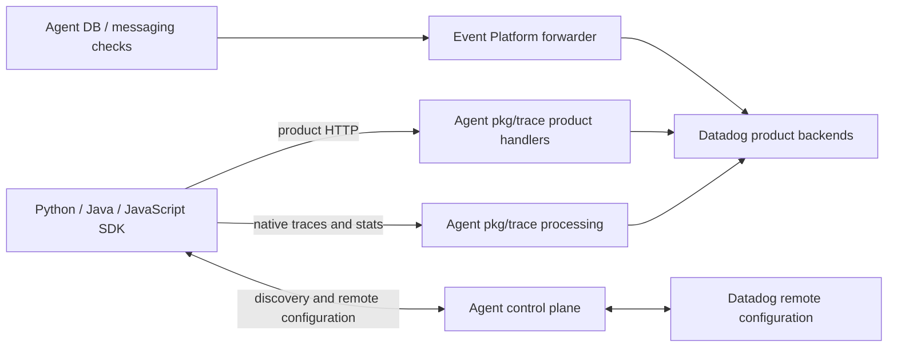
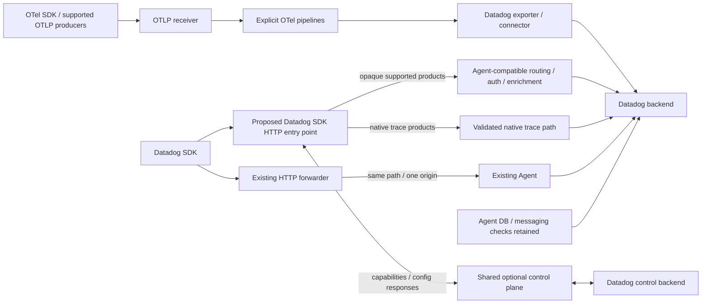

# Architecture and compatibility boundaries

Status: source-backed current-state map; proposed paths require product validation.
The exact source baseline is in [sources.json](sources.json). No authenticated Datadog
product/UI success has been observed in this work.

## Current path

`pkg/trace/api/endpoints.go` registers the native trace endpoints and product handlers.
This common listener does not make every payload an APM trace, and endpoint registration
does not imply every product is enabled or that the handler has a usable backend.
DBM checks and messaging-system collection must be followed outside `pkg/trace`.

## Proposed Collector paths

The HTTP entry point and control-plane feature set are proposals. Current contrib
`datadogextension` does not expose them. An optional forwarder in front of a real Agent
can preserve the Agent API; direct backend routing needs a separate compatibility proof.
Normal pipelines remain explicit Collector configuration, preserving upstream compatibility.

## Existing components and precise limits

| Component | Current role | Implication |
| --- | --- | --- |
| `extension/httpforwarderextension` | One origin; original path/query retained; configurable client transport/headers | Useful for same-path forwarding or an Agent bridge; not a product router |
| `extension/datadogextension` | Collector metadata/status and serializer integration | Product HTTP proxy, discovery, RC and product settings require implementation |
| `receiver/datadogreceiver` | Native APM/metrics/logs translated to OTel; limited `/info` | Native format conversion is not proof of proprietary-product parity |
| `exporter/datadogexporter` | OTLP conversion plus embedded Agent processing/writers | Explicitly disables embedded HTTP receiver; product endpoints are not exposed |
| `connector/datadogconnector` | APM statistics through shared stats factory | Reuse where appropriate; it is not an arbitrary product collector or proxy |
| Agent DDOT components | Distribution, converter, serializer and flare integration | Inventory actual imported versions; do not infer an SDK proxy from component names |

Contrib receiver `getEndpoints` registers `/` returning HTTP 200, which also matches
unregistered paths. A successful response to `/debugger/...` or `/profiling/...` can therefore
mean silent discard. `buildInfoResponse` sets `span_meta_structs:false` and
`long_running_spans:false`. Compatibility tests must assert downstream payloads and return
paths, including negative capability tests, rather than only HTTP status.

The Datadog exporter `newTraceAgentConfig` sets `ReceiverEnabled=false`; embedding Agent
processing does not automatically expose the Agent product listener or RC.

## Placement rules

1. Keep opaque product uploads opaque when the Agent only routes/authenticates/enriches them.
   Product-specific intake aliases and control-plane semantics belong in a Datadog-owned
   optional component; reuse generic upstream HTTP mechanisms where the contract fits.
2. Keep real OTLP signals in upstream receivers and explicit pipelines. Verify product-specific
   attributes, IDs, events, sampling and backend semantics before claiming product support.
3. Keep transformations, filtering, aggregation and trace-product extraction with the relevant
   native/OTLP processing component. An HTTP extension must not silently create pipelines.
4. Keep Agent-native DBM and message-system checks in the Agent per the principles; separately
   research upstream collection equivalents. SDK-side correlation/statistics are distinct paths.
5. Disablement must cover all managed data and control routes, discovery advertisements and
   automatic extraction. It cannot stop SDK-local instrumentation or SDK agentless requests;
   document SDK controls and retain a neutral Collector configuration without proprietary paths.

## Primary source anchors

- [Agent endpoint inventory](https://github.com/DataDog/datadog-agent/blob/761050392a732097645b76d9845d36629f1ef3dc/pkg/trace/api/endpoints.go).
- [Datadog receiver routes and discovery](https://github.com/open-telemetry/opentelemetry-collector-contrib/blob/16fa3257d56c299e115a558b1a668018a39990d5/receiver/datadogreceiver/receiver.go).
- [Receiver trace translation](https://github.com/open-telemetry/opentelemetry-collector-contrib/blob/16fa3257d56c299e115a558b1a668018a39990d5/receiver/datadogreceiver/internal/translator/traces_translator.go).
- [Exporter embedded Agent configuration](https://github.com/open-telemetry/opentelemetry-collector-contrib/blob/16fa3257d56c299e115a558b1a668018a39990d5/exporter/datadogexporter/traces_exporter.go).
- [Connector factory](https://github.com/open-telemetry/opentelemetry-collector-contrib/blob/16fa3257d56c299e115a558b1a668018a39990d5/connector/datadogconnector/factory.go).

See the shared and product reports for detailed decisions, evidence and experiments.
