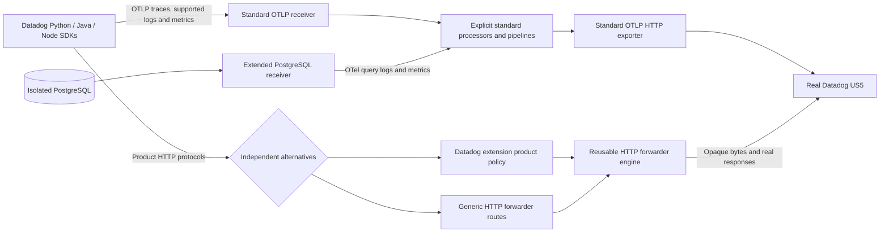

# Runnable OTLP-native Datadog product PoC

This implementation follows [new-instr.md](../new-instr.md). It builds two real Collector
distributions, runs synthetic SDK workloads in `kind-otel-dd`, and uses real Datadog US5
intakes. **All eight products remain incomplete until their product behavior is verified
in Datadog.** Intake acceptance, local fixtures and ready pods are reported separately.

## Implemented architecture



There is no Datadog receiver, Datadog exporter, Datadog connector or embedded Trace Agent
in either distribution. The generic build omits the Datadog extension entirely and has
zero `datadog-agent/pkg/trace` dependencies. The Datadog-extension build retains two
existing transitive utilities (`pkg/trace/log` and `pkg/trace/traceutil/normalize`) used
by its existing metadata dependencies. New forwarding logic imports neither utility.

The reusable forwarder adds exact path/header routes, upstream authentication replacement,
opaque compression preservation, path/query mapping, bounded request handling, discovery,
selected response translation and per-route disable settings. It preserves real error
responses and Retry-After and refuses upstream redirects. The Datadog extension owns only
the optional product listener and policy/configuration; it cannot create pipelines.

## Current coverage and remaining boundaries

The SDK artifacts exercised are Python `ddtrace 4.13.0rc1`, Java `dd-java-agent 1.66.0`,
and Node `dd-trace 6.16.0`. These published artifacts differ from inspected source HEADs;
source pins and artifact hashes are recorded in the product evidence. Java uses its OTel
configuration gate in addition to the OTLP exporter selection. Setting
`DD_TRACE_OTEL_ENABLED=true` alone does not select OTLP, and a native protocol override
must not be set. Java may send an empty native discovery probe; no ordinary trace spans
are accepted on native trace endpoints.

| Product | Runnable path and exercised SDKs | Remaining product boundary |
| --- | --- | --- |
| [Profiling](continuous-profiling/README.md) | Python, Java and Node real profiles; OTLP traces; both HTTP alternatives | Datadog profile/flamegraph visibility and trace correlation |
| [LLM](llm-observability/README.md) | All three SDKs emit GenAI OTLP spans; Python native span/evaluation forwarding | Backend LLM conversion, session/evaluation visibility and correlation |
| [AppSec](application-security/README.md) | Real Python and Node WAF events through standard OTLP; meaningful enabled/disabled tests | Java structured metadata export gap reproduced; backend security UI, full IAST/RASP/SCA and RC unverified |
| [DBM](database-monitoring/README.md) | Real Python/psycopg queries; PostgreSQL receiver extracts SQL-comment W3C context before obfuscation | Query logs are OTel events, not a completed Datadog DBM event adapter; DBM backend/readback missing |
| [DSM](data-streams-monitoring/README.md) | Python, Java and Node linked checkpoints, opaque statistics, OTLP traces and disable tests | Backend topology, broker lag, schemas and action/control collection |
| [CI](ci-visibility/README.md) | Real Python pytest lifecycle/coverage/control calls plus separate ordinary OTLP traces | Python private context-provider flag needed; Java OTLP writer bypasses CI envelopes; backend optimization/UI unverified |
| [Live Debugging](live-debugging/README.md) | Real Python local probes, snapshot/diagnostic uploads and OTLP workload; both alternatives | Signed remote configuration and UI-created probes; full Java/Node parity |
| [Data Jobs](data-jobs-monitoring/README.md) | Real OpenLineage Python and native Java/Spark SQL jobs in kind, both alternatives and disabled controls | In-flight Spark updates gated by unsupported Agent capability; backend job UI/readback |

The [three-signal SDK matrix](sdk-signals/README.md) records all nine passing local
trace/log/metric combinations, correlated log IDs, value-preserving counters and disabled
log/metric gates. Python uses HTTP/protobuf for logs and metrics, Java uses HTTP/JSON,
and Node uses HTTP/protobuf for correlated logs because its JSON log encoding fails.
All three host SDK workloads also ran through the kind Collector and real US5 exporter;
aggregate counters rose without refused/failed deltas. That is transport evidence,
not authenticated backend attribution. The Collector has
explicit traces, logs and metrics OTLP pipelines; PostgreSQL emits actual OTel metrics
and query log events. Unsupported SDK signals are not routed through native Agent intake.

## Reproduce

Requirements: Go `1.26.4`, Docker, kind, kubectl, Python 3 with PyYAML, sufficient disk
space for application images, and context `kind-otel-dd` with worker `otel-dd-worker`.
The scripts check context before mutating this development cluster. Product requirements,
Dockerfiles and dependency locks pin SDK versions. They do not install into source SDK trees.

1. Supply Secret `ddot-poc/datadog-api-key` with key `api-key` using your secret manager.
   Set `DD_SITE` in [kind/collectors.yaml](kind/collectors.yaml) for another Datadog site.
   This run validated the existing US5 key without recording it. No application key is
   required for the observed intake paths; authenticated readback needs separate access.
2. Build and deploy the isolated database, then build both Collectors:

   ```sh
   kubectl --context kind-otel-dd apply -f research/implementation/kind/namespace.yaml
   python3 research/implementation/database-monitoring/deploy.py
   python3 research/implementation/scripts/build-collector.py
   python3 research/implementation/scripts/build-collector.py --generic-only \
     --output /tmp/ddot-poc-build-generic --image ddot-products-collector-generic:poc
   python3 research/implementation/scripts/deploy-collectors.py
   ```

3. Build application images using each product's Dockerfiles/instructions. The common
   script loads the profiling, LLM, AppSec and DSM images and deploys their manifests:

   ```sh
   python3 research/implementation/scripts/deploy-workloads.py
   ```

   CI, Live Debugging and Data Jobs have separate scoped manifests/scripts in their
   directories. One-shot Jobs are retained for evidence; the common script skips existing
   Jobs. Explicitly delete only the named PoC Jobs to rerun them. No production changes
   or default-branch merges are part of this workflow.
4. Verify actual routing and controls:

   ```sh
   python3 research/implementation/scripts/verify-disabled-kind.py
   python3 research/implementation/scripts/capture-kind-evidence.py
   ```

   Product READMEs describe semantic SDK/component tests. Both changed extension modules
   and the PostgreSQL receiver have meaningful Go tests. The distribution is built with
   local module replacements; `/tmp/ddot-poc-build*/build.json` records source, binary hash,
   image ID and actual transitive Trace Agent utilities. A dirty-build marker is explicit.

The [combined Datadog policy config](collector/combined.yaml) and
[generic alternative](collector/combined-http-forwarder.yaml) are independently validated
with their actual binaries. The primary collects the isolated database; the alternative
avoids duplicate database scraping. Both accept all three ordinary OTLP signals.

## Product switches and limitations

All six HTTP product flags default to false. Configure `product_proxy` to bind its
listener, then opt in under `extensions.datadog.products`. Disable one product by setting
its `enabled` field to false. The generic alternative uses `disabled: true` on the routes
belonging to that product; update `/info` to reflect only enabled capabilities. Keep a
route entry or remove the whole extension when disabling everything: an empty routes
list deliberately retains the forwarder's pre-existing single-origin mode.

AppSec and DBM are pipeline/SDK owned. Enabling those two names in the Datadog proxy is
rejected rather than pretending to create receivers. Disable AppSec in the SDK. Disable
DBM collection by removing its receiver and both explicit pipelines, and independently
disable SDK SQL comment propagation. Disable native LLM forwarding with its flag; prevent
OTLP LLM conversion separately using [disabled-otlp.yaml](llm-observability/disabled-otlp.yaml).
Every product directory documents its SDK settings and exercised disabled behavior.

The kind gate check observed all 33 product routes returning 404 for **both** alternatives,
no forwarded product requests, ordinary OTLP trace acceptance, and the explicit LLM
conversion-disable attribute. It used isolated temporary Collectors and removed them.
This proves configured transport gates, not backend deletion or remote feature control.

Neither alternative implements signed remote configuration, native APM ingestion,
dynamic media routes, durable product queues, Agent broker collectors, nor complete
container metadata enrichment. Static `/info` advertises only implemented routes; it is
local capability discovery, not a mock Datadog backend response.

## Forwarder comparison

| Dimension | Datadog extension | Generic HTTP forwarder |
| --- | --- | --- |
| HTTP implementation | Composes the same reusable engine | Uses the engine directly |
| Configuration | Six compact product flags and site/key settings | Explicit auditable route/header table |
| Vendor coupling | Datadog policy plus existing extension metadata dependencies | Vendor-specific values isolated in configuration; no Trace Agent utility dependencies |
| Real intake evidence | Product-specific outcomes recorded in kind evidence | Independently built binary and real intake outcomes recorded |
| Control limitations | Explicit missing RC/Agent behavior | Same missing behavior; no fabricated capability |

Recommend the **generic forwarder** as the default when minimizing vendor coupling is the
priority. The Datadog extension is a convenience option for centrally maintained product
routes. Both use standard OTLP pipelines for ordinary telemetry. Route policy still needs
maintenance as SDK/backend contracts evolve; neither alternative claims full Agent parity.

## Evidence and access needed

[evidence/kind-migration.json](evidence/kind-migration.json) records removal of the fake
backend and mock route. [evidence/kind-integration.json](evidence/kind-integration.json)
contains bounded upstream status counts, exported-signal counters and pod/image identities.
[evidence/kind-disabled.json](evidence/kind-disabled.json) records gate checks. Per-product
files distinguish source inspection, local contract fixtures, real SDK output and kind
observations. A mock response is never product completion evidence.

Required to finish: read-scoped Datadog account/application-key access plus product
entitlements and product-specific verification. DBM event mapping, SDK gaps and signed
remote control require implementation beyond access alone. Keep all blocked product PRs
as drafts. The final draft is from `poc-all-products` into the user's fork `main`.
