# Application Security implementation

**Incomplete: real Python and Node WAF events survive a standard Collector OTLP
pipeline, but Datadog security product behavior is not yet verified.** The Java SDK
also has a reproduced structured metadata export gap. No Datadog receiver, trace
Agent, native trace forwarding route or application security proxy is used.

The runnable applications generate a benign request and a harmless request with the
bundled WAF's `dd-test-scanner-log` marker. Python runs Flask; Node uses its core HTTP
server. Both execute the actual SDK WAF and bundled rules. No synthetic security
event is substituted for those detections. The separate Java regression probe uses
synthetic metadata only to demonstrate an encoder defect and is not deployed.

```mermaid
flowchart LR
  Request[Local benign / scanner fixture] --> SDK[Datadog SDK instrumentation + WAF]
  SDK -->|OTLP HTTP JSON| Receiver[Standard otlp receiver :4318]
  Receiver --> Batch[batch processor]
  Batch --> Exporter[Standard otlp_http exporter]
  Exporter -->|OTLP HTTPS + API key| Backend[Real Datadog OTLP intake]
  Backend -. behavior unverified .-> UI[Security event / service / API inventory]
```



The full product configuration is [collector.yaml](collector.yaml). Use
`DD_SITE=us5.datadoghq.com` for the discovered PoC organization and supply the API key
only to the Collector. Applications have no backend credentials. The coordinator
owns the actual Collector build, combined configuration and Service `collector` in
namespace `ddot-poc`. The product configuration is also usable with a standard
Collector containing `otlp`, `batch` and `otlp_http`; it needs no vendor extension.

## Implemented and tested behavior

| SDK/runtime | Real activity | OTLP contract observed | Status |
| --- | --- | --- | --- |
| Python `ddtrace==4.13.0rc1`, Python 3.12.13, Flask 3.1.3 | Real WAF detection and API schema generation | `appsec` bytes attribute contains MessagePack triggers; trigger span ID matches OTLP span ID; `appsec.event=true`, keep priority 2, decision maker `-5`, trace source `02`, schema attributes survive | Direct SDK capture and actual Collector receiver/batch/exporter tested; backend product unverified |
| Node `dd-trace==6.16.0`, Node 24.18.0 | Real WAF detection and API schema generation in core HTTP server | `_dd.appsec.json` string contains full triggers; keep priority 2, decision maker `-3`; schema attributes survive. This fixture did not emit `_dd.p.ts` | Actual Collector pipeline tested; backend product unverified |
| Java agent `1.66.0`, Microsoft OpenJDK 21.0.11 | Synthetic structured metadata encoder probe, **not a WAF/IAST execution** | Scalar attribute survives; actual SDK span's `meta_struct` entry is absent from OTLP JSON | SDK gap reproduced; full Java WAF/IAST path incomplete |

[local-results.json](local-results.json) records seven cases. Four Python cases cover
enabled/disabled WAF directly and through the actual built Collector. Two Node cases
cover enabled/disabled WAF through that Collector. Enabled cases assert rule
`ua0-600-55x` and API schemas. Disabled cases assert no AppSec event or attribute and
continued ordinary traces. The Java case sets and reads back structured metadata on
the real SDK span, then verifies the scalar is exported while structured data is lost.
Its expected failure is recorded as a blocker, not as successful security support.
Java discovery also sends native endpoint capability probes containing only `[[], []]`
when the fixture has no `/info`; the test decodes them and asserts they contain no
ordinary spans. Python and Node cases emit no native trace requests. Build identities
are recorded in [build-results.json](build-results.json).

The test endpoint is a loopback assertion fixture only. Final Collector configuration
uses a real Datadog destination. Fixture HTTP 200 responses and test passes do not
establish intake compatibility, product entitlement, storage, findings or UI behavior.

## Build and deploy

From this directory, after the coordinator's Collector deployment is ready:

```sh
docker build -t ddot-appsec-python:poc .
docker build -f Dockerfile.node -t ddot-appsec-node:poc .
kind load docker-image --name otel-dd ddot-appsec-python:poc ddot-appsec-node:poc
kubectl --context kind-otel-dd -n ddot-poc apply -f deployment.yaml -f job-node.yaml
kubectl --context kind-otel-dd -n ddot-poc rollout status deployment/appsec-python-otlp
kubectl --context kind-otel-dd -n ddot-poc wait --for=condition=complete job/appsec-node-otlp --timeout=120s
kubectl --context kind-otel-dd -n ddot-poc logs deployment/appsec-python-otlp --tail=20
```

Python generates activity every 30 seconds. The Node Job sends two requests and exits.
The Python health probe establishes readiness; a completed Node Job establishes that
the application ran. Neither is a security backend verification. Recreate the scoped
Job to generate another batch. Do not replace the shared Collector configuration while
other product tests are running; the coordinator integrates this explicit trace path.

The images use pinned runtime/package versions. The Python requirements include all
application transitive dependencies; Node's lockfile includes tarball integrity values.
The app fails if an explicit native protocol override is present. It defaults to OTLP
HTTP/JSON, which is supported by these actual SDK versions. Do not assume enabling
the OpenTelemetry API alone selects OTLP. Java additionally requires
`DD_TRACE_OTEL_ENABLED=true` for its OTEL configuration alias gate.

## Disablement and ownership

The application defaults to `DD_APPSEC_ENABLED=false`; deployment explicitly opts in.
To disable this running PoC while keeping ordinary traces:

```sh
kubectl --context kind-otel-dd -n ddot-poc patch deployment appsec-python-otlp \
  --type strategic --patch-file deployment-disabled.patch.yaml
kubectl --context kind-otel-dd -n ddot-poc rollout status deployment/appsec-python-otlp
```

For Node, create the next Job with `DD_APPSEC_ENABLED=false` (Job pod templates are
immutable). Reapply the Python enabled deployment to restore it. Both applications
disable remote configuration and IAST separately. Local enabled/disabled tests confirm
that the scanner request remains ordinary telemetry after WAF disablement.

Application Security is pipeline-owned. The shared Datadog extension intentionally
rejects `products.application_security.enabled: true`: it has no dedicated AppSec HTTP
route and cannot create or remove trace processors. Its false setting alone cannot
disable SDK WAF execution or strip security data from mixed OTLP traces. Configure
SDK activation and the explicit trace pipeline separately. No speculative attribute
rewriting or unsupported backend kill switch is inserted. If centralized rejection of
security payloads from independently configured SDKs is required, an agreed policy and
separate processing configuration are still needed.

## Reproduce the wire tests

Install [test-requirements.txt](test-requirements.txt) into an isolated Python runtime.
Use the coordinator's built Collector and the exact Java agent artifact recorded in
[Java runtime provenance](../../java-runtime.json):

```sh
PYTHONPATH=/tmp/ddot-research-python-runtime:/tmp/ddot-research-appsec-python \
  PYTHONDONTWRITEBYTECODE=1 python3 verify.py \
  --collector /tmp/ddot-poc-build/collector/ddot-products-collector \
  --python-runtime /tmp/ddot-research-python-runtime:/tmp/ddot-research-appsec-python \
  --node-image ddot-appsec-node:poc \
  --java-agent /tmp/ddot-research-java-agent-1.66.0.jar \
  --java-home /usr/local/sdkman/candidates/java/current \
  --output local-results.json
```

Replace runtime paths as needed. Node and Java options are optional for a Python-only
check. The test clears inherited DD/OTEL configuration, forces OTLP, captures any native
trace destination, starts the actual Collector service and parses its exported OTLP
JSON. It verifies the binary attribute's MessagePack contents without converting the
payload inside the Collector. The production exporter defaults to protobuf; OTLP bytes
are model-level values, not a request-body forwarding assumption.

## Source boundaries and remaining blockers

The source checkout inventory remains [sources.json](../../sources.json). The Python
wheel is tag commit `c280552330bb906df23b2963d6457a8d23fb81de`, distinct from inspected
main `d6ab482ea3fb3c8666e75ac1905a3325b8f80098`. Node 6.16.0 is tag commit
`ac687e81bdd1d75acf2e0629bb960d4b49db91d9`, distinct from inspected master
`d62655e12494634bb53f8c0cd440f087b004ca63`. Java 1.66.0 is tag commit
`a099fffb31657bb6e8b4d04ee741491f3480829d`, distinct from inspected master
`7b903a53644abc39f55b2fb21283546ae9801f35`. Source repositories were not modified.

The concrete Java change needed is structured metadata serialization in
`dd-trace-core/src/main/java/datadog/trace/core/otlp/trace/OtlpTraceJson.java` and
`OtlpTraceProto.java`. Both inspected encoders call `processTagsAndBaggage` but do not
read `getMetaStruct`. Java IAST reports use structured metadata, so a scalar-only
exporter cannot provide parity. A Collector processor cannot reconstruct data already
discarded by the SDK. Before choosing the encoding, the SDK and backend teams must
confirm the bytes contract: Python here emits MessagePack, whereas Node master's
`packages/dd-trace/src/opentelemetry/trace/otlp_transformer.js` explicitly encodes
`meta_struct` as JSON bytes. The Node WAF run used its legacy JSON attribute and did
not validate that auxiliary structured branch. No unsupported new codec was invented.

The existing native Agent path in `pkg/trace/api` and writer code is a behavioral
reference only. The new implementation supersedes the earlier recommendation to repair
the Datadog receiver. Standard OTel components retain the Python WAF payload that the
old receiver experiment lost. Datadog's [SDK OTLP documentation](https://docs.datadoghq.com/opentelemetry/instrument/dd_sdks/)
describes OTLP export as preview; it is not evidence that every security feature works.

Still required for product completion:

- Readable real security product results for `service:ddot-appsec-python` and
  `service:ddot-appsec-node`, matching scanner findings, request context and API schemas.
  Available API-key intake access alone does not provide authenticated UI/readback access.
- Signed ASM remote configuration and application acknowledgements, managed rules and
  blocking control. These applications intentionally use local bundled rules and disable
  RC; a static HTTP proxy cannot implement the Agent's signed-state provider.
- Java structured export fix with an agreed backend contract and actual Java WAF/IAST
  workloads; real IAST/RASP/blocking tests for Python and Node; SCA dependency telemetry
  and its separate ingestion contract. These features are not covered by the WAF fixture.
- Final combined kind and backend evidence recorded by the coordinator. Until those
  checks pass, keep [product PR #13](https://github.com/dineshg13/opentelemetry-collector-contrib/pull/13)
  in draft and label the product incomplete.
