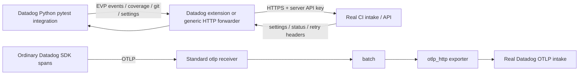

# CI Visibility implementation

**Backend update, 2026-09-20:** Both Python forwarding services have stored pass/skip test hierarchy and ordinary APM spans. Coverage/optimization outcomes, test/APM parenting and full SDK parity remain unverified.

[Current authenticated readback and limits](https://github.com/dineshg13/opentelemetry-collector-contrib/blob/dinesh.gurumurthy/poc-all-products/research/implementation/backend-readback/README.md). Earlier dated test evidence below is retained.

**Incomplete pending real Test Optimization results and SDK parity.** This implementation
runs the real Python pytest integration through an actual Collector. Native CI events,
coverage and synchronous settings/git APIs use the shared product forwarder; ordinary
application spans use the SDK's OTLP exporter and standard Collector components.
It does not use the Datadog receiver or embed the trace Agent.



## Runnable deliverables and configuration

[run.py](run.py) runs [test_workload.py](test_workload.py): one passing test, one skipped
test and an ordinary traced operation. The image contains a small real git repository
with only the fixture files. Its declared `https://example.invalid/ddot-ci-fixture.git`
remote is representative CI metadata, not a cloned customer repository or backend
destination. This deliberately synthetic workload exercises real SDK event creation and
git packfile generation without uploading unrelated workspace contents.

[collector.yaml](collector.yaml) uses the extended Datadog extension. Its explicit
`products.ci_visibility.enabled: true` enables only the implemented CI routes and EVP
discovery. [collector-http-forwarder.yaml](collector-http-forwarder.yaml) is an independently
configurable alternative using the extended generic HTTP forwarder. Both strip the EVP
prefix, match the SDK destination header against an exact route allowlist, preserve
compressed/multipart bodies and responses, remove caller credentials and inject the
Collector API key. The generic example is generated by [configure.py](configure.py).
Neither extension creates the separate OTLP receiver, processor or exporter.

Both configurations validated against the actual built distribution. The generic
alternative ran with real Python and Java SDKs in [local tests](local-results.json).
Shared Datadog extension tests cover its route construction and forwarding behavior;
the two Jobs provide independent real-backend executions through both deployed alternatives.
The coordinator records their deployment and backend evidence separately. The local
fixture is not a replacement for that comparison or product verification.

Recommend the Datadog extension as the product default because the per-product setting
and discovery policy stay together. The generic extension is viable when operators want
explicit endpoint configuration. Both reuse the generic Collector HTTP forwarding code;
neither copies Agent product processing. The implemented routes cover events, per-test
coverage, coverage reports, settings, skippable/known/flaky tests, test management and git.
Media upload URL patterns, optional CI logs and failed-test replay are not implemented
by this CI route group. This workload disables optional log submission and debugger features.

Use `DD_SITE=us5.datadoghq.com` for the discovered test organization; set `DD_API_KEY`
only in the Collector Secret. The generic alternative additionally uses `DD_HOSTNAME`.
Applications have no API key and use `collector:8126` for products and `collector:4318`
for ordinary OTLP traces. No final deployment points at a fake Datadog endpoint.

## SDK interaction and coverage

| SDK | Executed behavior | Limitation |
| --- | --- | --- |
| Python ddtrace 4.13.0rc1, Python 3.12.13, pytest 8.3.5 | Actual new pytest plugin; test hierarchy, pass/skip, coverage, settings/known/skippable/test management, git search/packfile and ordinary OTLP span | Requires existing private `_DD_CIVISIBILITY_USE_CI_CONTEXT_PROVIDER=true` to prevent the CI plugin intercepting ordinary traces |
| Java agent 1.66.0, Microsoft OpenJDK 21.0.11 | Actual manual session/module/suite/test API with `DD_TRACE_OTEL_ENABLED=true` and OTLP configured | `OtlpWriter` wins before CI writer selection: four spans reach OTLP, zero native CI event envelopes; settings/git calls still run. Backend Test Optimization behavior for these OTLP spans is not established |
| Node SDK | Pinned source inspected; previous research has component probes | Full Node test-framework execution with concurrent ordinary OTLP has not been validated in this implementation |

Python's default pytest plugin installs a global trace processor that redirects all
ordinary test application spans into its native CI writer. The initial test detected
this: CI events arrived but the explicit ordinary span never reached OTLP. The existing
private context-provider switch disables that processor and was exercised successfully.
This is an explicit PoC dependency, not a public SDK compatibility promise. It also
removes automatic APM-span parenting under a real test span, so complete test/APM/log
correlation remains unverified. A supported SDK mode should select independent test
contexts and OTLP ordinary spans without depending on a private test flag.

Java's concrete gap is writer selection in
`dd-trace-core/src/main/java/datadog/trace/common/writer/WriterFactory.java`: the OTLP
branch returns before CI-specific `DDIntakeWriter` selection. The implementation does
not disable OTLP or restore native ordinary traces to make CI appear to work. SDK
changes must separate native CI event writing from ordinary trace writing, or the CI
backend must establish equivalent OTLP ingestion semantics. The Collector cannot
manufacture the missing lifecycle envelopes from arbitrary spans with guaranteed parity.

Node master's `packages/dd-trace/src/opentracing/tracer.js` explicitly avoids replacing
the CI exporter with OTLP when `isCiVisibility` is true. That preserves product events,
but is not evidence that ordinary application spans concurrently use OTLP. Full runner
and mixed-signal verification remains required rather than claiming support from flags.

Released artifacts differ from the inspected main/master commits. See
[source pins](../../sources.json), [Python artifact provenance](../../python-runtime.json)
and [Java artifact provenance](../../java-runtime.json). SDK repositories were not modified.
No upstream SDK PR is claimed; the reproduced blockers and required change are explicit.

## Build, deploy and disable

From this directory, after the coordinator deploys the shared Collectors:

```sh
docker build -t ddot-ci-python:poc .
kind load docker-image --name otel-dd --nodes otel-dd-worker ddot-ci-python:poc
kubectl --context kind-otel-dd -n ddot-poc apply -f jobs.yaml
kubectl --context kind-otel-dd -n ddot-poc wait --for=condition=complete \
  job/ci-python-datadog-extension job/ci-python-http-forwarder --timeout=180s
kubectl --context kind-otel-dd -n ddot-poc logs job/ci-python-datadog-extension
kubectl --context kind-otel-dd -n ddot-poc logs job/ci-python-http-forwarder
```

The worker selector avoids importing these test images on both kind nodes. These Jobs
are single executions; recreate only these Jobs to repeat the workload. Test success
does not prove telemetry delivery: pytest can pass when product discovery is unavailable.
The initial full local suite explicitly caught this distinction.

For Datadog extension disablement, set `products.ci_visibility.enabled: false` and
restart its Collector. CI routes then reject traffic; other enabled products may retain
shared EVP discovery without opening CI routes. For the generic alternative, generate
its disabled configuration and restart that Collector:

```sh
python3 configure.py --disabled --output /tmp/ci-disabled.yaml
```

Every CI route remains explicitly disabled in the allowlist and discovery no longer
advertises EVP in this standalone example. The ordinary OTLP pipeline remains active.
Do not replace a combined configuration with this standalone example during other tests.
To disable the SDK's CI feature independently, run the next Job with
`DD_CIVISIBILITY_ENABLED=false`. Local tests cover both gate levels and assert that the
ordinary OTLP span continues. Application-local direct agentless uploads are separately
configured traffic and are not controlled by a Collector route gate.

## Verification and remaining work

Install the pinned [requirements.txt](requirements.txt) into an isolated runtime, then:

```sh
PYTHONPATH=/tmp/ddot-research-python-runtime:/tmp/ddot-research-ci-python:/tmp/ddot-research-appsec-python \
  PYTHONDONTWRITEBYTECODE=1 python3 verify.py \
  --collector /tmp/ddot-poc-build/collector/ddot-products-collector \
  --python-runtime /tmp/ddot-research-python-runtime:/tmp/ddot-research-ci-python:/tmp/ddot-research-appsec-python \
  --java-agent /tmp/ddot-research-java-agent-1.66.0.jar \
  --java-home /usr/local/sdkman/candidates/java/current \
  --output local-results.json
```

The script starts the actual Collector with its generic forwarding and OTLP components,
runs SDK workloads, decodes real MessagePack and multipart coverage, validates the
session/module/suite/test IDs, and asserts ordinary OTLP separately. It also verifies
credentials/metadata handling and preserves a controlled 429 plus `Retry-After` response.
The enabled run produces five lifecycle events, one coverage entry and one ordinary
OTLP span. Both disable cases produce no CI events or coverage and retain the ordinary
span. Java reproduces its writer-selection gap. Fixture API responses are explicitly
test-only and do not show that real backend optimization decisions work.

[build-results.json](build-results.json) records image/build identities. The coordinator
has recorded completed kind workloads, real backend responses and authenticated pass/skip
hierarchy through both alternatives. Remaining checks cover coverage for the fixture commit
and real settings/skip/known-test/test-management effects, plus the documented SDK gaps.
Successful HTTP responses, a passing pytest run and Kubernetes Job completion are not
product-complete evidence. Keep [PR #14](https://github.com/dineshg13/opentelemetry-collector-contrib/pull/14)
in draft until backend behavior and required SDK compatibility are established.
