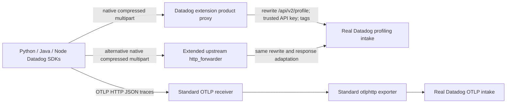

# Continuous Profiling implementation

**Backend update, 2026-09-20:** Authenticated CPU flamegraphs contain the known Python, Java and Node workload functions. Per-Collector attribution and trace/profile correlation remain unverified.

[Current authenticated readback and limits](https://github.com/dineshg13/opentelemetry-collector-contrib/blob/dinesh.gurumurthy/poc-all-products/research/implementation/backend-readback/README.md). Earlier dated test evidence below is retained.

This implementation supplies real Python, Java and Node profiling applications, immutable SDK
dependency pins, Docker builds, two Collector configurations and isolated kind deployments.
Backend CPU flamegraphs are now verified; per-Collector attribution and trace links remain incomplete.
Local fixture acknowledgements and real intake acceptance are recorded separately.

## Implemented path



Profiles remain opaque multipart outside Collector telemetry pipelines. Both proxy implementations
are in the shared component change, with no new `pkg/trace` import: `datadogextension` delegates
HTTP route handling to the enhanced `httpforwarderextension`. Both replace the Agent upload path
with `/api/v2/profile`, override caller credentials with the Collector's key, preserve compressed
attachments and normalize intake 202 to SDK-facing 200. No Datadog receiver or native trace route
is configured. Explicit ordinary OTLP pipelines remain Collector-owned.

The workload runs a named CPU loop (`profile_hot_loop` / `profileHotLoop`) repeatedly. Java uses
the real agent's HTTP client/server instrumentation; Python and Node create SDK spans explicitly.
An uploaded profile must show these application stacks in Datadog before claiming product success.
Trace/profile navigation is a separate check and remains unverified until inspected in Datadog.

## SDK coverage and configuration

| Runtime SDK exercised | Native profile payload | Ordinary traces |
| --- | --- | --- |
| Python `ddtrace==4.13.0rc1`, CPython 3.12.13 arm64 | Real native pprof and code provenance multipart | `OTEL_TRACES_EXPORTER=otlp`, HTTP/JSON; real trace batches observed |
| Java `dd-java-agent==1.66.0`, Temurin 21.0.8+9 arm64 | Real JFR multipart | `DD_TRACE_OTEL_ENABLED=true`, `DD_TRACE_OTEL_EXPORTER=otlp`, `DD_OTLP_TRACES_ENDPOINT` and protocol; contract evidence below |
| Node `dd-trace==6.16.0`, Node 24.18.0 arm64 | Real native `@datadog/pprof==5.18.1` multipart | `OTEL_TRACES_EXPORTER=otlp`, HTTP/JSON; real trace batches observed |

The inspected source commits differ from these runtime releases; the historical
[product report](../../products/continuous-profiling/README.md) records source pins. The Node
release tag is `ac687e81bdd1d75acf2e0629bb960d4b49db91d9`. Python wheels and all dependencies
have hashes in `apps/python/requirements.txt`; Java's downloaded JAR is SHA-256 checked in its
Dockerfile; the full Node dependency graph and package integrity hashes are in its lockfile.
All builds target Linux arm64, matching this kind cluster. These Python wheel hashes intentionally
do not claim amd64 portability.

The OTLP capability is an actual export path in these SDKs, distinct from the OpenTelemetry API
bridge. For Java, the `DD_TRACE_OTEL_ENABLED` gate enables standard `OTEL_*` aliases; this example
also sets the explicit Java exporter flags. Never set `DD_TRACE_AGENT_PROTOCOL_VERSION`, which
can supersede OTLP selection in Python/Node. Logs and metrics pipelines are explicitly available
in both Collector examples, but these profiling apps do not emit application logs/metrics through
the SDK, so that capability is **not runtime validated here**. SDK diagnostic stdout is Kubernetes
process output, not claimed OTLP log delivery. Runtime metrics, SDK instrumentation telemetry and
remote configuration are disabled because this workload only needs local profiling configuration.

No inspected SDK produces OTLP profiles. The standard OTLP receiver's profile signal is a separate
format; it cannot accept these native pprof/JFR multipart requests. This forwarding implementation
therefore keeps its Datadog-specific path, headers and response compatibility explicit.

## Build and reproduce

From this directory, build all images with `bash build.sh`. Then run the contract test (Docker and
localhost access required):

```sh
python3 tests/verify_apps.py --output /tmp/profile-contract.json
```

This executes all three built SDK images, verifies non-empty native profile attachments and real
OTLP JSON spans, rejects ordinary native trace requests, and tests `DD_PROFILING_ENABLED=false`.
Its HTTP fixture is only a test tool; it is absent from every final configuration and manifest.
The shared component tests separately validate byte preservation, route matching, authentication,
202-to-200 adaptation, backend errors and extension enable/disable behavior.

The coordinator builds the actual Collector distribution with the shared implementation. Use
[datadog-extension.yaml](config/datadog-extension.yaml) or
[http-forwarder.yaml](config/http-forwarder.yaml) independently. Both need `DD_SITE` and
`DD_API_KEY`; the extension additionally uses `DD_HOSTNAME` as the Collector host identity.
The configured site is the real organization site (the available test key belongs to
`us5.datadoghq.com`). Credentials are injected from the existing Kubernetes secret into the
Collector only. The SDK application pods never receive API keys.

The coordinator owns the namespace, secret and Collector services. Once those are ready:

```sh
kubectl config current-context  # must be kind-otel-dd
kind load docker-image --name otel-dd ddot-profile-python:poc ddot-profile-java:poc ddot-profile-node:poc
kubectl --context kind-otel-dd apply -f kind/applications.yaml
# Independent app names and Collector destination for the other implementation (requires PyYAML):
python3 kind/render_alternative.py | kubectl --context kind-otel-dd apply -f -
kubectl --context kind-otel-dd -n ddot-poc get pods -l ddot-product=continuous-profiling
```

The main app manifest targets `collector.ddot-poc.svc.cluster.local`; rendered alternative apps
target `collector-http-forwarder.ddot-poc.svc.cluster.local`. Both expose product HTTP port 8126
and OTLP HTTP port 4318. Pod readiness only proves the application initialized. Allow multiple
upload intervals, then verify Collector/backend evidence and inspect profiles by services
`ddot-profile-python`, `ddot-profile-java`, `ddot-profile-node`, environment `poc`, version `1`.
Distinguish alternative runs by time window or set `DD_VERSION` per deployment before comparing.

## Disablement and alternatives

Set `products.continuous_profiling.enabled: false` in the Datadog extension. This removes the
managed route and its discovery advertisement; requests cannot egress through that route. It
does not remotely stop the SDK's local sampling. Set `DD_PROFILING_ENABLED=false` on each app to
stop sampling/uploading, leaving ordinary OTLP tracing enabled. A neutral Collector configuration
can omit both proprietary product forwarding and the Datadog extension.

In the generic alternative, retain the route and set `disabled: true`; deleting the entire route
table would restore the old forwarder's unrestricted single-origin behavior. Route disablement
does not disable the explicitly configured OTLP pipelines.

| Alternative | Advantages | Remaining limitations |
| --- | --- | --- |
| Datadog extension | Explicit product opt-in, site/key policy, discovery, shared product configuration | Extension metadata infrastructure remains vendor-specific; workload container tag resolution and Agent fan-out are not implemented |
| Extended upstream HTTP forwarder | Small reusable HTTP primitive; exact route and status policy visible in config; no Agent product logic | Site/path/header policy must be supplied explicitly; no automatic discovery or dynamic origin tag lookup |

Recommend the Datadog extension for shared SDK product endpoints and per-product configuration;
its implementation reuses the generic forwarder. The generic alternative is viable for profiling
alone because these locally enabled SDK profilers do not require `/info` to upload. Both currently
use static additional tags. Neither claims Agent-equivalent container-origin enrichment, multi-site
fan-out, or broad historical SDK compatibility.

## Evidence and remaining checks

[sdk-contract.json](evidence/sdk-contract.json) records the real Python/Node local executions;
[java-contract.json](evidence/java-contract.json) records Java after fixing the image's non-root
JAR read permissions. The fixture is explicitly identified in the evidence, with raw profile
attachment sizes, selected OTLP batches, SDK exit codes and disabled results. No API key is recorded.

Kind rollout, real backend acceptance for each forwarding alternative, and product UI/query
evidence belong in the combined deployment record. Until those are present this product remains
incomplete. An API key permits intake authentication, but profile search/flamegraph and
trace-correlation verification require authorized organization UI or query access; an HTTP 2xx
alone cannot establish those outcomes.
