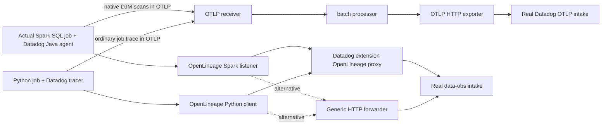

# Data Jobs Monitoring implementation

Status: real OpenLineage jobs run in kind through both Collector alternatives, with real
US5 intake responses of **201**. Actual Spark 4 SQL execution with Datadog Java 1.66.0
produces native DJM spans through OTLP and OpenLineage through the product proxy. Local
semantic tests pass. The native Spark image built and all four Spark kind jobs completed:
both proxy alternatives and both SDK-disabled controls. Product UI, lineage/performance
joining and long-running job updates remain unverified or blocked.
This product is **incomplete**, not a completed end-to-end result.

Product PR: [#15](https://github.com/dineshg13/opentelemetry-collector-contrib/pull/15).



## What is implemented and executed

`app.py` reads a small CSV, writes an aggregate JSON result, emits real OpenLineage
START/COMPLETE events with one stable run UUID and input/output datasets, and creates an
ordinary Datadog Python trace through that SDK's actual OTLP writer. This is a manual
OpenLineage job, not evidence of native Python DJM instrumentation. The Python SDK does
not become a Spark SDK because a custom job span exists.

`spark_app.py` runs an actual local Spark SQL aggregation. With `dd-java-agent` installed
in its JVM and `DD_DATA_JOBS_ENABLED=true`, the native instrumentation emits application,
SQL, job and stage data. The local Collector test received 16 OTLP spans, including six
with `span.type=spark`, `_dd.djm.enabled=1`, Spark task metrics, `_dd.spark.*` histogram
fields and SQL plan attributes. The integrated Java OpenLineage listener emitted two
events, with Datadog-managed run facets including `_dd.ol_intake.emit_spans`. Disabling
the native DJM SDK feature produced zero Spark spans and zero lineage events while seven
ordinary auto-instrumented OTLP spans remained. These tests supersede the original
research's untested native Spark and trace-type-loss conclusions for this specific path.

`DjmSparkWorkload.java` implements the same real SQL computation directly in Java for a
smaller deployable image. It compiled successfully against Spark 4.0.0. `build_spark.py`
assembles a Java-only image from the pinned runtime's JARs and scripts, without embedding
Python or a second JDK. After removing a duplicate JAR layer and exporting directly to a
Docker archive, the image built successfully and ran inside kind through both proxies.
Each enabled Spark job emitted two managed lineage events accepted with HTTP 201; both
SDK-disabled controls computed the same result with no native DJM startup or lineage
events. Exact image and run identities are in [kind-spark-jobs.json](evidence/kind-spark-jobs.json).

| Component | Executed version / location |
| --- | --- |
| Datadog Python SDK | `ddtrace==4.13.0rc1`, Python 3.12.13; built container and kind |
| OpenLineage Python SDK | `1.45.0`; built container and kind |
| Apache Spark / PySpark | `4.0.0`, Py4J `0.10.9.9`; isolated host runtime and Java-only Spark kind image |
| Datadog Java agent | `1.66.0`; actual Spark JVM |
| OpenLineage Spark integration | `openlineage-spark_2.13:1.45.0`; actual Spark listener |
| JVM | Microsoft OpenJDK 21.0.11 on host; Temurin 21.0.8 JRE executed in kind |
| JavaScript SDK | No native DJM instrumentation found in the pinned source; no native DJM runtime claimed |

The Python and Java source release commits are respectively
`c280552330bb906df23b2963d6457a8d23fb81de` and
`a099fffb31657bb6e8b4d04ee741491f3480829d`, separate from the original research HEADs.
`requirements.txt` pins all Python dependencies. The Java agent SHA-256 is
`5f0eb51160fade367d97404624561b6666f7475fb1453a7a73237eb643e398d8`; OpenLineage Spark JAR
SHA-256 is `de887d1acfc0b890915071da4fff1bd2862a0e104b0df46b1e475009d1ea7a3c`.
Original SDK repositories remain unchanged.

## Configuration and alternatives

[config/datadog-extension.yaml](config/datadog-extension.yaml) and
[config/http-forwarder.yaml](config/http-forwarder.yaml) are complete configurations
validated with the actual Collector distribution. They receive ordinary traces through
the standard OTLP receiver and export through OTLP HTTP. There is no Datadog receiver,
native trace proxy, Datadog trace exporter, connector or embedded Trace Agent.

Both product HTTP implementations rewrite `/openlineage/api/v1/lineage` to
`https://data-obs-intake.${DD_SITE}/api/v1/lineage?api-version=2`, preserve gzip JSON,
supply Collector-owned Bearer credentials and static host/environment metadata, and
preserve the upstream response. The applications contain no API key. The generic
forwarder is explicitly configured with `compression_algorithms: []` and a bounded route
table. The Datadog extension delegates transport to that generic implementation and adds
product-owned discovery and configuration. No `pkg/trace` dependency was necessary.

Both alternatives were exercised independently against real US5 intake by the Python
OpenLineage jobs and native Java Spark jobs. The extension is recommended for the combined deployment because its
single `products.data_jobs_monitoring.enabled` setting updates the route and discovery
together. The generic component is a viable upstream alternative when explicit operator
ownership of those route details is preferred. Shared implementation and precise limits
are documented [here](../shared/README.md).

The Java OTLP path requires both `DD_TRACE_OTEL_ENABLED=true` and
`OTEL_TRACES_EXPORTER=otlp`, plus an explicit
`OTEL_EXPORTER_OTLP_TRACES_ENDPOINT=http://collector:4318/v1/traces`. These examples use
`http/json`, verified with the released SDK. Native Spark OpenLineage transport derives its
Agent HTTP URL from `DD_AGENT_HOST` and `DD_TRACE_AGENT_PORT`, so set those as well as
`DD_TRACE_AGENT_URL` to the product listener. Include the OpenLineage Spark integration
JAR; an enable flag does not install its classes.

## Reproduce the deployed lineage jobs

From this directory, after the coordinator installs the combined Collectors:

```sh
docker build -t ddot-djm-python:poc .
kind load docker-image --name otel-dd --nodes otel-dd-worker ddot-djm-python:poc
python3 kind/render_jobs.py > /tmp/ddot-djm-jobs.json
kubectl --context kind-otel-dd apply -f /tmp/ddot-djm-jobs.json
kubectl --context kind-otel-dd -n ddot-poc wait --for=condition=complete \
  job/djm-python job/djm-python-alternative --timeout=120s
python3 kind/render_jobs.py --sdk-disabled > /tmp/ddot-djm-disabled.json
kubectl --context kind-otel-dd apply -f /tmp/ddot-djm-disabled.json
```

The generator creates only scoped `ddot-poc` jobs and labels them
`app.kubernetes.io/part-of: ddot-products-poc`. Four jobs completed: both enabled jobs got
201 for START and COMPLETE, and both producer-disabled controls sent no lineage while
running the ordinary traced computation. The producer control is the example application's
`DJM_LINEAGE_ENABLED` setting. For native Spark, SDK collection is controlled separately
by `DD_DATA_JOBS_ENABLED`. [kind-lineage.json](evidence/kind-lineage.json) records exact
run/trace IDs and outcomes without credentials. These HTTP acknowledgements establish
intake acceptance, not product UI correctness.

## Native Spark reproduction

Install the pinned local test runtime and artifact:

```sh
uv pip install --target /tmp/ddot-poc-spark-runtime --cache-dir /tmp/ddot-poc-spark-cache pyspark==4.0.0
curl -fL -o /tmp/ddot-openlineage-spark_2.13-1.45.0.jar \
  https://repo.maven.apache.org/maven2/io/openlineage/openlineage-spark_2.13/1.45.0/openlineage-spark_2.13-1.45.0.jar
python3 verify.py --collector /tmp/ddot-poc-build/collector/ddot-products-collector \
  --spark-runtime /tmp/ddot-poc-spark-runtime \
  --openlineage-jar /tmp/ddot-openlineage-spark_2.13-1.45.0.jar \
  --output /tmp/djm-spark-contract.json
```

`--java-agent` and `--java-home` override the documented existing artifact/runtime paths.
The verifier uses the actual Collector OTLP pipeline and proxy, checks final Spark span
types, DJM markers and native lineage facets, then repeats with DJM disabled. It uses an
explicit local capture fixture and never reports that fixture as a Datadog backend.
The native SDK's Java 21/OpenLineage module-access warning is addressed by an explicit
`--add-opens=java.base/java.security=ALL-UNNAMED` in the final test/build commands.

Build and deploy the Java-only variant. The builder writes a Docker archive without
loading a duplicate host image:

```sh
python3 build_spark.py
kind load image-archive --name otel-dd --nodes otel-dd-worker /tmp/ddot-djm-spark.tar
kubectl --context kind-otel-dd apply -f kind/spark.yaml
kubectl --context kind-otel-dd -n ddot-poc wait --for=condition=complete job/djm-spark --timeout=180s
python3 kind/render_spark.py --alternative > /tmp/ddot-djm-spark-alternative.json
kubectl --context kind-otel-dd apply -f /tmp/ddot-djm-spark-alternative.json
python3 kind/render_spark.py --sdk-disabled > /tmp/ddot-djm-spark-disabled.json
python3 kind/render_spark.py --alternative --sdk-disabled > /tmp/ddot-djm-spark-alternative-disabled.json
kubectl --context kind-otel-dd apply -f /tmp/ddot-djm-spark-disabled.json -f /tmp/ddot-djm-spark-alternative-disabled.json
```

The Spark manifest targets only `otel-dd-worker` to avoid duplicating a large image on both
kind nodes. It sets `runAsUser: 65534` because Hadoop needs an existing passwd entry
(`nobody` in this base image), and `workingDir: /tmp` because Spark 4 writes an `artifacts`
directory under its working directory. Standalone Docker runs need equivalent
`--user 65534:65534 --workdir /tmp` options. These settings fixed observed startup failures;
no root user or writable SDK installation is needed. The four final Spark jobs completed
with count 3 and total 60, Java OTLP export enabled, and two native lineage events per
enabled job. The two SDK-disabled jobs sent none. Both real intake paths returned 201.
See [kind-spark-jobs.json](evidence/kind-spark-jobs.json) and
[spark-build.json](evidence/spark-build.json).

An earlier native host Spark job also ran through a temporary port-forward to the kind
Collector and real US5 destinations, recorded in
[native-spark-kind.json](evidence/native-spark-kind.json). The port-forward was closed.
Retained Collector trace logs contain batch counts only, so they cannot identify each
run's individual Spark spans; semantic span evidence comes from the isolated local
Collector test. Neither the application logs nor intake 201 responses prove product UI
correctness or lineage/performance joining.

## Validation and disablement

`python3 verify.py --collector /tmp/ddot-poc-build/collector/ddot-products-collector
--output /tmp/djm-lineage-contract.json` exercises the built Python image in three cases:
enabled, producer disabled and Collector route disabled. It verifies event lifecycle,
run identity, datasets, gzip, exact path/query rewriting and Collector-owned authentication.
The disabled route returns 404, while the ordinary OTLP job span still passes. Results are
in [lineage-contract.json](evidence/lineage-contract.json); native Spark results are in
[spark-contract.json](evidence/spark-contract.json).

Set `extensions.datadog.products.data_jobs_monitoring.enabled: false` to close only the
extension-managed lineage route. For the generic alternative, set `disabled: true` on
that route and remove its `/info` advertisement. Keep the explicit route table; an empty
table restores the legacy unrestricted single-origin behavior. These route gates do not
stop native Spark spans in an independently configured OTLP pipeline or stop SDK overhead.
Disable native SDK collection with `DD_DATA_JOBS_ENABLED=false` where required. The
extension cannot create, remove or dynamically configure trace pipelines.

## Remaining limits

The Java SDK source preserves `span.type`, `_dd.partial_version` and completion markers in
its OTLP writer. However `LongRunningTracesTracker.flushAndCompact` still checks
`features.supportsLongRunning()`. The shared proxy correctly advertises
`long_running_spans:false`: backend semantics for repeated OTLP span updates have not
been established. Short completed Spark jobs work locally; live long-running job views
need an SDK/backend capability contract and verification before this flag can be enabled.

Product readback is blocked by missing authenticated UI or application-key read access. Verify actual job/performance visibility,
task metric/histogram interpretation, lineage-to-performance joining, executor coverage
outside `local[2]`, failures and structured streaming before calling DJM complete. Native
OpenLineage's `emit_spans:false` contract means lineage cannot substitute for missing Spark
performance spans. JavaScript and Python native DJM product support remain unestablished;
the successful PySpark workload is Java SDK instrumentation of its JVM.

Source anchors: Java `Agent.configureDataJobsMonitoring`,
`AbstractDatadogSparkListener.setupOpenLineage`, `OtlpTraceJson.writeSpan`, and
`LongRunningTracesTracker.flushAndCompact` at the pinned source commits in the
[original investigation](../../products/data-jobs-monitoring/README.md).
