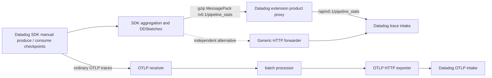

# Data Streams Monitoring implementation

Status: all three SDK images build and emit linked DSM checkpoint statistics alongside
ordinary OTLP traces. Actual Collector forwarding and enable/disable tests pass locally.
Kind image loading encountered a full Docker filesystem; deployment and real backend
topology/readback remain incomplete. Product PR:
[#18](https://github.com/dineshg13/opentelemetry-collector-contrib/pull/18).

This implements the SDK statistics path using the existing shared HTTP forwarding work.
It does not replace Agent broker checks, schema-registry collection, remote Kafka actions
or backend topology processing. There is no Datadog receiver or embedded Trace Agent.



## Workloads and coverage

| Runtime | Implemented and executed | Deliberate limit |
| --- | --- | --- |
| Python `ddtrace==4.13.0rc1`, Python 3.12.13 | Public producer/consumer checkpoints, carrier injection/extraction, native SDK aggregation/compression/upload; four linked points in two iterations; manual backlog maximum values 12 and 8; four OTLP spans | Offset observations are manual fixture values, not measured broker state |
| Java agent `1.66.0`, Temurin 21.0.8 | Public manual checkpoint API under active Datadog `@Trace` spans; two aggregated pathway points, transaction call, four OTLP spans; absent discovery prevents DSM | No automatic Kafka client or schema-registry instrumentation exercised |
| JavaScript `dd-trace==6.16.0`, Node 24.18.0 | Public manual checkpoint and transaction APIs, carrier propagation, two aggregated pathway points, four OTLP spans | No broker plugin or schema extraction exercised |

Each application transfers the real SDK carrier between its producer and consumer calls
in the same process, with a short delay. This is a deterministic manual-instrumentation
example, not a Kafka broker simulator. It uses topic `poc-orders`; use the `ddot-dsm-python`,
`ddot-dsm-java` and `ddot-dsm-node` service names to locate the generated traffic. No
application contains API credentials. Python `periodic()` and Node `onInterval()` are
internal SDK flush hooks used only to make a short-lived workload deterministic; the SDK
still owns serialization, compression and HTTP sending. Java flushes through its shutdown
hook after its aggregation queue drains.

Ordinary tracing is enabled and explicitly selects `OTEL_TRACES_EXPORTER=otlp` with
`OTEL_EXPORTER_OTLP_TRACES_PROTOCOL=http/json`. Java also needs
`DD_TRACE_OTEL_ENABLED=true` to interpret the standard OpenTelemetry configuration.
Set `OTEL_EXPORTER_OTLP_TRACES_ENDPOINT` to the Collector's `/v1/traces` endpoint. Do not
set `DD_TRACE_AGENT_PROTOCOL_VERSION`, which disables OTLP in Python/Node. DSM uses the
separate `DD_TRACE_AGENT_URL` product listener. All three languages actually emitted OTLP;
the tests do not infer it from the configuration flags.

Java independently probes `/v0.4/traces` during Agent capability discovery when `/info`
does not advertise native trace ingestion. The observed MessagePack probe contains only
two empty arrays. The Collector truthfully rejects this probe with 404; DSM and OTLP
continue. No native application spans were exported or accepted. Advertising a nonexistent
native trace endpoint merely to hide this probe would be incorrect.

Pins and build dependencies: Python versions are in `apps/python/requirements.txt`;
Java's Dockerfile verifies agent JAR SHA-256
`5f0eb51160fade367d97404624561b6666f7475fb1453a7a73237eb643e398d8`; Node's
`package-lock.json` pins dependency tarball integrities. Their source release commits are
Python `c280552330bb906df23b2963d6457a8d23fb81de`, Java
`a099fffb31657bb6e8b4d04ee741491f3480829d`, and Node
`ac687e81bdd1d75acf2e0629bb960d4b49db91d9`. These are released runtimes, separate from
the later original research HEADs. Source SDK checkouts remain unchanged.

## Collector alternatives

Both [Datadog extension](config/datadog-extension.yaml) and
[generic forwarder](config/http-forwarder.yaml) are complete configurations, validated
with the coordinator's actual OCB Collector binary. Both use HTTPS real Datadog destinations
selected by `DD_SITE`, provide `DD-API-KEY` from the Collector environment, add explicit
host/environment metadata, preserve opaque gzip bytes and relay backend status.
The generic configuration explicitly sets `compression_algorithms: []`; the Datadog
extension guarantees that setting internally. No deployed configuration uses a test
server. Shared source dependency: `68c9ee0df2c` plus subsequent shared fixes in the
combined branch; see [shared implementation](../shared/README.md).

The shared Datadog extension delegates HTTP transport to the generic extension and adds
bounded Datadog product routing and discovery. Recommend it for the combined deployment:
one explicit `data_streams_monitoring.enabled` setting controls both upload and discovery.
The independent generic alternative is useful when operators prefer explicit route ownership
and a vendor-neutral component. It needs an exact rewrite from `/v0.1/pipeline_stats` to
`/api/v0.1/pipeline_stats`, header configuration and a truthful static `/info` response.
Neither approach decodes or merges sketches. No `pkg/trace` import was needed.

Both configurations have only ordinary OTLP trace pipelines. Schema-bearing spans and
pathway-to-trace correlation require separate semantic/backend validation; successful
statistics upload is not proof of those features. Static host/environment tags are not
dynamic per-container identity resolution. Additional-intake fan-out and signed remote
configuration are not implemented.

## Build and kind deployment

From this directory:

```sh
docker build -t ddot-dsm-python:poc apps/python
docker build -t ddot-dsm-java:poc apps/java
docker build -t ddot-dsm-node:poc apps/node
kind load docker-image --name otel-dd ddot-dsm-python:poc ddot-dsm-java:poc ddot-dsm-node:poc
python3 kind/render_jobs.py > /tmp/ddot-dsm-jobs.json
kubectl --context kind-otel-dd apply -f /tmp/ddot-dsm-jobs.json
kubectl --context kind-otel-dd -n ddot-poc wait --for=condition=complete \
  job/dsm-python job/dsm-java job/dsm-node --timeout=120s
```

The coordinator creates `ddot-poc` and deploys the combined Collector first. Jobs use Service
`collector` on ports 8126 and 4318. The discovered real site is `us5.datadoghq.com` and the
coordinator owns the `datadog-api-key` Secret; applications do not mount it. Jobs have
distinct names and the label `app.kubernetes.io/part-of: ddot-products-poc`.

For an independently deployed `collector-http-forwarder` Service:

```sh
python3 kind/render_jobs.py --alternative > /tmp/ddot-dsm-alternative.json
kubectl --context kind-otel-dd apply -f /tmp/ddot-dsm-alternative.json
```

For SDK disable controls, add `--sdk-disabled`; it generates separate job names and sets
`DD_DATA_STREAMS_ENABLED=false` while leaving OTLP tracing active. Do not recreate existing
Jobs by deleting unrelated resources; delete/reapply only these named PoC Jobs when a rerun
is required. A completed Job proves execution, not backend DSM topology.

## Tests and disablement

The executed tests are checked in under `evidence/`:

- `sdk-python.json` and `sdk-java-node.json`: all three built SDK applications directly
  against an explicitly local wire fixture; enabled and disabled modes, plus Java discovery.
- `collector-contract.json`: all three real SDK containers through the actual Collector's
  generic proxy and OTLP receiver/batch/exporter to a local fixture; verifies backend path,
  configured credential replacement, metadata, preserved gzip, linked hashes and nonempty
  latency sketch bytes. Seven cases passed, including SDK disablement and Java discovery.
- `collector-disabled.json`: actual Collector route disabled, HTTP 404 and discovery removal,
  no DSM delivery, and four ordinary OTLP spans preserved. This used the equivalent installed
  Python runtime after Docker exhausted its disk capacity.

Run the SDK tests with a Python environment containing `msgpack==1.2.2`; no Datadog credentials
are used or inspected:

```sh
python3 tests/verify_apps.py --output /tmp/dsm-sdk.json
python3 tests/verify_apps.py \
  --collector /tmp/ddot-poc-build/collector/ddot-products-collector \
  --output /tmp/dsm-collector.json
python3 tests/verify_apps.py \
  --collector /tmp/ddot-poc-build/collector/ddot-products-collector \
  --languages python --proxy-disabled --output /tmp/dsm-disabled.json
```

The optional `--python-runtime /tmp/ddot-research-python-runtime` uses the already-installed
real Python SDK instead of Docker. Tests decode MessagePack to assert producer/consumer
hash linkage and sketch presence, but do not claim numerical sketch accuracy, transaction
analytics or backend aggregation. Test endpoints are never deployment destinations.

For native Datadog disablement set
`extensions.datadog.products.data_streams_monitoring.enabled: false`, restart the Collector
and verify `/info` excludes `/v0.1/pipeline_stats`, its POST returns 404, and ordinary OTLP
traces continue. The shared Datadog component tests cover the route/discovery gate; real
kind validation is coordinated separately. For the generic alternative set `disabled: true`
on the DSM route and remove its advertised endpoint from `/info`. Keep the route table:
removing every route would restore the legacy unrestricted single-origin forwarder mode.
These route controls do not stop SDK-side checkpoint overhead or remote applications
configured to upload directly elsewhere; SDK enablement is a separate setting.

## Remaining blockers

At the implementation checkpoint, image loading failed on `otel-dd-worker` with
`no space left on device` under containerd; `/var/lib/docker` was on a 388 GiB filesystem
with zero free bytes. The coordinator owns scoped cleanup and deployment retries. The
successful image builds and local Collector tests are retained; no unrelated images or
workloads were deleted by this product agent.

A real API key is available, but product readback needs an authenticated DSM UI session or
an application key with relevant read access. Still verify real intake acceptance, produced
service/topic topology, edge latency and throughput, backlog interpretation, transaction
visibility, and trace/schema correlation. HTTP 2xx alone does not establish those outcomes.

Full broker collection needs actual broker/schema-registry endpoints and credentials, plus
the event-platform cluster/schema protocol that the Agent integrations produce. Existing
`kafkametricsreceiver` can supply standard Kafka metrics, but that does not implement the
proprietary cluster/schema/action payloads. No broker was provisioned by this bounded SDK
statistics implementation. That wider collection/control surface remains unimplemented,
and this report does not claim full Agent DSM replacement.

The detailed original protocol investigation is [here](../../products/data-streams-monitoring/README.md).
