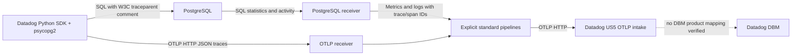

# Database collection and OTLP trace correlation

**Implemented; Datadog DBM product behavior remains blocked.** This PoC extends the
upstream PostgreSQL receiver and runs real Datadog Python database instrumentation.
Query samples carry the same full trace ID and query span ID as SDK OTLP spans.
Database metrics and top-query logs remain OpenTelemetry signals. They are not a
supported substitute for Datadog DBM event payloads or evidence of its database UI.

This implementation supersedes the native-receiver recommendation in the earlier
[research report](../../products/database-monitoring/README.md). It uses no Datadog
receiver, trace connector, exporter, or embedded Trace Agent.



## Receiver change

`querySampleTraceContext` keeps existing valid `application_name` traceparent
precedence, then extracts a standard `traceparent='...'` SQL-comment field before
obfuscation. It reuses the already-present `go-sqllexer` dependency, now a direct
import, to distinguish real comments from strings, identifiers and dollar-quoted
literals. Invalid, duplicate, nested and truncated comment contexts are rejected.
Both leading and trailing comments work. Only valid W3C trace/span IDs become log
context; database service and other vendor comment keys are not imported.

The existing query-sample feature remains opt-in. The ordinary receiver tests now
check SQL-comment-to-emitted-log IDs and confirm SQL values/context are removed from
`db.query.text`. Parser tests cover precedence, encoded keys/values, invalid IDs,
ambiguity, PostgreSQL quoted strings, nested comments and no-context behavior.

No new Agent dependency was introduced. PostgreSQL receiver already depends on
`pkg/obfuscate`; that existing dependency remains. No `pkg/trace` code is imported.
The [sqlcommenter format](https://google.github.io/sqlcommenter/spec/) is the neutral
contract; this is not a parser for proprietary database-monitoring payloads.

## Reproduce in kind

Use the combined branch's actual Collector build and deployment instructions first.
The component must be rebuilt with this branch's PostgreSQL receiver change.
Then, from repository root:

```sh
python3 research/implementation/database-monitoring/deploy.py
```

The script checks `kind-otel-dd`, builds `ddot-dbm-python:poc`, imports node-platform
images and creates only these `ddot-poc` resources: `dbm-postgres-init`,
`dbm-postgres-password`, `dbm-postgres`, and `dbm-python`. The database uses disposable
`emptyDir` storage. It does not use the unrelated `fake-datadog-postgres` deployment.
Its generated password is sent on stdin and never recorded in the repository.

Merge [collector.yaml](collector.yaml) into the combined configuration, adapting its
existing processor/exporter IDs. Add this environment variable to the Collector:

```yaml
- name: DBM_POSTGRES_PASSWORD
  valueFrom:
    secretKeyRef:
      name: dbm-postgres-password
      key: password
```

The dedicated monitor receives `pg_monitor`; application queries use a separate
`dbm_app` login. Both share a disposable PoC password. `pg_stat_statements` is loaded
at startup and installed in `dbm` and `postgres`. Query samples run every 2 seconds;
top queries run every 10 seconds. Query-plan execution is disabled explicitly.

`app.py` loads **Datadog** psycopg instrumentation, runs `SELECT pg_sleep(3)` and
records the actual SQL comment emitted by its cursor. It sets no trace IDs itself.
It asserts the SDK selected its OTLP writer, then exports ordinary traces to
`collector:4318/v1/traces` using HTTP/JSON. It does not use a native APM fallback.

With detailed debug export enabled in the combined Collector:

```sh
python3 research/implementation/database-monitoring/verify.py --output research/implementation/database-monitoring/kind-results.json
python3 research/implementation/database-monitoring/verify-disabled.py
```

The first check intersects IDs from actual SDK SQL comments, collected query-sample
logs and received database spans, and checks PostgreSQL metrics/top queries. The
second executes the same SDK and database with propagation disabled and asserts
both completed queries contain no traceparent comment. These are local integration
checks, not backend product readback.

Executed on 2026-09-19 at 22:01:53 UTC: **11 exact query-span context matches** across
the real SDK, database query samples and Collector OTLP spans; PostgreSQL metrics and
top-query events were also present. At 22:02:05 UTC, the disabled workload completed
two real queries with **zero SQL trace contexts** while keeping OTLP configured.
See [kind results](kind-results.json), [disabled results](disabled-results.json), and
[build/runtime versions](build-results.json). The PostgreSQL component's full unit
test suite passed. Datadog DBM product readback remains unverified.

Disable database collection by removing both explicit DB pipelines and its receiver.
Disable SDK injection independently with `DD_DBM_PROPAGATION_MODE=disabled`.
An extension cannot create or remove these Collector pipelines dynamically.
There is no DBM-specific HTTP route or extension toggle in this implementation;
the database receiver and SDK own these independent controls.
Normal APM traces continue when only DBM propagation is disabled.

## SDK coverage and prerequisites

| SDK | Ordinary trace transport | SQL correlation | Validation |
| --- | --- | --- | --- |
| Python `4.13.0rc1`, psycopg2 `2.9.11` | `OTEL_TRACES_EXPORTER=otlp`, full `OTEL_EXPORTER_OTLP_TRACES_ENDPOINT`, protocol `http/json` | `DD_DBM_PROPAGATION_MODE=full` injects the query span's W3C traceparent in SQL | Real SDK + PostgreSQL workload deployed in kind; see results artifacts |
| Java `1.66.0` / inspected master | Requires `DD_TRACE_OTEL_ENABLED=true` and `OTEL_TRACES_EXPORTER=otlp`; shared work validates OTLP | Ordinary JDBC statements inject SQL context. Prepared PostgreSQL statements require `DD_DBM_TRACE_PREPARED_STATEMENTS=true` and write `_DD_`-prefixed `application_name`, unsupported by this neutral receiver | Source coverage only for database execution |
| JavaScript `6.16.0` / inspected master | Shared work validates `OTEL_TRACES_EXPORTER=otlp`, HTTP/JSON endpoint | `DD_DBM_PROPAGATION_MODE=full`, `pg` unnamed statements inject SQL traceparent; named/prepared queries intentionally omit execution context | Source coverage only for database execution |

Python runtime wheel and current SDK source are different snapshots; exact pins are
in [the source table](../../products/database-monitoring/README.md#evidence-and-source-versions)
and [runtime manifest](../../python-runtime.json). No source repository was modified.
For Java prepared statements, a neutral SDK change to write raw W3C context to a
supported carrier, or a separately explicit vendor adapter, is still necessary.
Neither generic PostgreSQL logs nor copied Agent DBM logic resolves that carrier gap.

## Remaining DBM contract

The Datadog Agent database checks produce independently typed `dbm-samples`,
`dbm-metrics`, `dbm-activity`, `dbm-metadata`, `dbm-health`, and
`dbm-column-statistics` event-platform batches. Those carry query signatures,
normalization, database instance identity, database/application association, plan
signatures, metadata and product-specific aggregation. SDK APM context alone cannot
produce them. Existing upstream collection provides useful building blocks, but
its OTLP logs and metric schemas do not establish those wire contracts.

A supported OTLP-to-DBM backend mapping or an agreed, isolated exporter contract and
real DBM UI/API readback are needed before this is a working Datadog DBM product.
The available API key supports intake transport tests; authenticated product readback
is not available. No mock is used in this deployment, and no HTTP success or ready
pod is reported as complete DBM behavior. Query plan collection, additional DBMSs,
prepared Java execution and actual Java/JavaScript database runtimes remain unverified.
