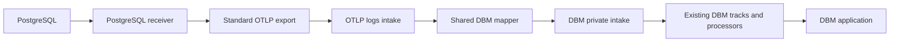

# PostgreSQL DBM through backend OTLP intake

Approved implementation direction: 2026-09-22. The user approved logs intake and
shared DBM mapping, implementation with tests, and a separate commit per milestone.

## Objective and boundaries

Deliver PostgreSQL receiver -> standard OTLP -> OTLP logs intake -> shared DBM
mapping -> DBM private intake -> existing DBM processors -> real DBM application.
Keep ordinary PostgreSQL metrics on the existing metrics intake path. Keep
Datadog-specific encoding out of the Collector receiver and exporters.

Core acceptance covers database identity, query metrics, activity, obfuscated full
query text (FQT), and trace correlation. Execution plans are a separate opt-in
milestone. Complete Agent metadata, health, and column-statistics parity is not
claimed by this initial implementation.

Preserve existing work. Use isolated branches/worktrees. Do not modify production
or merge a default branch. Never expose credential values. Do not post generated
issue/PR comments. Commits disclose assistance using an Assisted-by trailer.

## Architecture

The receiver currently emits query samples and top-query statistics as OTLP logs.
The backend entry point is `domains/otel/apps/apis/otlp-intake-logs`, using the
product-routing pattern also present in `otlp-intake-metrics`.

Reuse `domains/database-monitoring/shared/libs/intake` and its
`PrivateIntakeService.SubmitPrivateIntakePayload` contract. It takes a JSON array,
trusted org ID, and optional explicit track. Prefer explicit tracks:

| Data | Track |
| --- | --- |
| Query interval statistics | `dbmmetrics` |
| Complete activity snapshot | `dbmactivity` |
| FQT and collected execution plans | `databasequery` |

## Milestones and commits

Each implementation milestone includes meaningful tests, validation results, and
its own commit. Cross-repository milestones have separately identified commits.

| ID | Deliverable | Required validation |
| --- | --- | --- |
| M0 | Persist this approved plan and execution ledger | Recorded base commits and clean isolated worktrees |
| M1 | Versioned neutral OTLP contract and representative fixtures | Fixtures validate types, units, identities, interval semantics, and snapshot boundaries |
| M2 | Receiver counter correctness | Database/role identity, first observation, reset, eviction, restart, and calls-based execution tests |
| M3 | Opt-in complete query statistics and bounded activity snapshots | Real PostgreSQL collection tests; top-N coverage, empty/failed/truncated snapshots, batching and correlation metadata tests |
| M4 | Shared backend DBM mapper | Existing decoder-compatible golden fixtures; signatures, units, identity, grouping, FQT and trace mapping tests |
| M5 | Private intake publishing and logs routing | Org gates, mixed traffic, explicit tracks, array encoding, org range, payload limits, error and replay tests |
| M6 | End-to-end core DBM verification | Actual receiver and OTLP intake to real DBM readback, accurate counts, trace link, enable/disable and restart tests |
| M7 | Opt-in execution plans | Bounded EXPLAIN collection, obfuscation/signature tests, backend plan readback |

## Receiver contract and neutral changes

- Keep source counters keyed by database instance, native database/user identity,
  and native query ID. Preserve native IDs without lossy numeric conversion.
- Initial observations and resets establish new baselines. Do not emit lifetime
  totals or retain stale pre-reset high-water marks. Use calls to identify actual
  execution, and retain interval start/end and explicit units.
- Emit deltas at the source; never differentiate those deltas again in intake.
- Provide an opt-in statistics stream before top-N presentation filtering.
  Safety caps must report truncation and observed/emitted counts explicitly.
- Define a bounded neutral activity snapshot in one OTLP LogRecord, including
  activity rows and connection summaries. The DBM consumer derives gauges and
  blocking graphs per snapshot; arbitrary request fragments are not equivalent.
- Preserve collection/record IDs through retries. Keep collection time distinct
  from query start time. Empty successful collection, failure, and truncation are
  distinguishable.
- Retain obfuscated SQL, safe structured metadata, and validated W3C context.
  Do not export raw literals or unrestricted SQL comments. Document any new
  receiver-specific fields as experimental rather than claiming standard semantic
  conventions.

## Backend mapping and routing

- Add pure validation/mapping/encoding in `domains/otel/libs/go/dbm`.
- Reuse DBM normalization and signature utilities from
  `domains/database-monitoring/shared/libs/sqlobfuscation`; prove compatibility
  when the source SQL has already been obfuscated.
- Group compatible metric rows by instance, database, role, normalized signature,
  and collection interval. Do not infer collection boundaries from OTLP requests.
- Preserve activity snapshots. Validate disjoint metrics chunk semantics with the
  existing consumers, including equivalent normalized queries across chunks.
- Map validated context and service metadata to the current DBM association
  contract; verify the real trace link, including trace-ID width and flags.
- Add supported-event routing under an org-scoped flag, disabled by default.
  Match scope, event name, and schema. Keep normal logs behavior when disabled.
  Make retaining original records in ordinary logs an explicit validation option.
- Use authenticated intake org identity and existing service authentication.
  Typed private-intake methods enforce JSON arrays, validate org range, and select
  explicit tracks. Validate caller authorization and destination provisioning.

## Reliability gate

The current private-intake proto exposes no deduplication field; `koutris_id` is
tracing context only. A successful empty RPC response does not by itself prove
per-record processing or durability.

Test timeout after acceptance, partial success across tracks, replay, ordering,
and Collector retries. Establish supported idempotency before claiming accurate
totals under replay. If existing DBM processing lacks it, implement the smallest
explicit ingestion-contract change and record its rollout dependency. Do not
substitute a per-pod cache or assume exactly-once delivery.

## Validation and rollout

Run focused receiver tests, mapper/decoder fixtures, publisher/router/processor
tests, and Rapid checks for modified services. Follow repository BUILD generation
rules. Run only one Bazel command at a time. Use `/tmp` for isolated worktrees and
large build outputs because the main filesystem has limited free space.

Use a real PostgreSQL workload and Collector, then a local/staging intake and
isolated staging test deployment with an authorized DBM-enabled org. Verify:

1. Database and expected queries appear in DBM.
2. Calls, rows, durations, waits, and connection counts match generated activity.
3. Activity, query metrics, FQT, and traces have compatible identities/signatures.
4. A sampled query links to the actual OTLP trace.
5. Resets, restarts, split batches, and retries do not inflate totals.
6. Feature disablement restores ordinary ingestion behavior.
7. Opt-in plans are actually visible after the core milestone succeeds.

Backend acceptance, healthy pods, local mocks, and tests are separate evidence
levels. Record exact versions, timestamps, commands, and backend records. Label
unavailable external access or incomplete verification precisely.

## Reference checkouts

- Collector combined PoC: `bd0a0f74bd1dac9ec16730d94a85ccf47850ce82`.
- `dd-source`: `d024bd26da94402e7d22bc2a72f633ca4100e27c`.
- DBM consumers in `dd-go`: `7c3c4d798dae935eff498631bf561c3eeee4fe35`.
- Agent PostgreSQL check in `integrations-core`:
  `916e4f4364609494986417f9a5efc4b3b0281e52`.

Execution branches:

- Collector: `dinesh.gurumurthy/poc-dbm-otlp-intake`, `/tmp/ddot-dbm-otlp`.
- Backend: `dinesh.gurumurthy/dbm-otlp-intake`, `/tmp/dd-source-dbm-otlp`.

The versioned copy of this plan and the execution ledger live under
`research/implementation/database-monitoring/otlp-intake/` on the Collector
execution branch. The copy in the original checkout is a convenient cross-reference.
