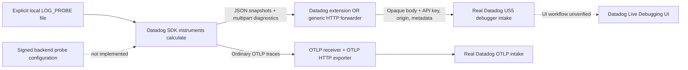

# Live Debugging implementation

**Backend update, 2026-09-20:** Actual snapshots with the exact probe ID and captured locals are stored for both forwarding alternatives. Backend trace correlation, diagnostics readback, signed remote configuration and UI-managed probes remain unverified.

[Current authenticated readback and limits](https://github.com/dineshg13/opentelemetry-collector-contrib/blob/dinesh.gurumurthy/poc-all-products/research/implementation/backend-readback/README.md). Earlier dated test evidence below is retained.

**Real SDK snapshots and diagnostics reach Datadog through both forwarding
alternatives. The complete product remains blocked on signed remote configuration
and trace correlation/diagnostic/control readback.** This deployment uses a real local probe installed
by Datadog Python `4.13.0rc1`, actual captured function state, and ordinary OTLP traces.
It does not emulate probe installation, synthesize snapshots or acknowledge requests
without a real upstream response.

This implementation supersedes the research-only adapter in the earlier
[report](../../products/live-debugging/README.md). The actual shared component code
is described in [shared implementation](../shared/README.md). No Datadog receiver,
Trace Agent, or new `pkg/trace` dependency is used.



## Run

Build and deploy the combined Collector distribution first. It must include the
changed `datadog` and `http_forwarder` extensions. The coordinator deploys independent
`collector` and `collector-http-forwarder` services in `ddot-poc`, each using real
Datadog destinations and the server-side API key Secret.

```sh
python3 research/implementation/live-debugging/deploy.py
```

This builds `ddot-debugger-python:poc`, imports its node-platform archive into
`otel-dd-worker`, and deploys `debugger-python` and `debugger-python-http-forwarder`.
The node selector limits image storage to that worker. No key is passed to SDK pods.
The workload and probe file are synthetic and checked in; captured function arguments
and return values are the actual values produced by `workload.calculate`.

[collector.yaml](collector.yaml) is the standalone Datadog extension configuration;
[collector-http-forwarder.yaml](collector-http-forwarder.yaml) is the independently
constructed generic alternative. Both keep ordinary traces on standard OTLP. Their
HTTP product paths send to `debugger-intake.${DD_SITE}/api/v2/debugger`, with the
legacy v1 logs path mapped separately to the logs intake. Opaque multipart bodies,
upstream statuses, origin, request IDs and configured tags are preserved or added by
the proxy. No pipeline is created implicitly by an extension.

`DD_DYNAMIC_INSTRUMENTATION_ENABLED=true` and
`DD_DYNAMIC_INSTRUMENTATION_PROBE_FILE=/app/probes.json` enable the SDK's existing
local configuration loader. `DD_TRACE_AGENT_URL` points only product uploads/discovery
to the selected proxy. `OTEL_TRACES_EXPORTER=otlp` and the explicit `/v1/traces`
endpoint select the Datadog SDK's OTLP writer; the application asserts that writer
configuration before beginning activity. Span IDs in output come from real SDK spans.

`app.py` observes the Python HTTP transport to count actual SDK snapshots/diagnostics
and record original HTTP response statuses. Its wrappers always call the original
request and response methods, leave bytes and headers untouched, and never generate
responses. Only bounded summary metadata is retained. Separate unit tests verify
payload identity and preservation of a real fixture's 429 response, error body and
Retry-After; that local fixture is not a deployment destination or backend evidence.

## Verify

Use the bounded SDK summaries and Collector counters after deployment:

```sh
python3 research/implementation/live-debugging/verify.py
python3 research/implementation/live-debugging/verify-disabled.py
```

The verifier requires actual captured snapshots with trace context and an `INSTALLED`
diagnostic for the expected probe. Run it within ten minutes of deployment so the
initial installation diagnostic remains in its observation window. It checks truthful
discovery, the missing RC endpoint's 404 response, and aggregate trace transport
counters filtered to the real Datadog exporter. SDK startup asserts the OTLP writer.
These aggregate counts do not identify individual debugger traces. Exact kind OTLP
span readback remains unverified: automatic approval review rejected the proposed
detailed logging because it would persist full payloads, and no logging change was made.

The verifier records real upload statuses separately from product verification. Results are in
[kind-results.json](kind-results.json), [disabled-results.json](disabled-results.json)
and [build-results.json](build-results.json). HTTP 202 proves intake transport
acceptance only; it does not prove the UI accepted or displayed this locally defined
probe or its snapshots.

At 22:15:12 UTC on 2026-09-19, the two alternatives had uploaded **191 and 190 real
captured, trace-correlated snapshots**, respectively, plus installation diagnostics;
every observed product response was **202**. Both SDK-disabled jobs completed five
activity iterations with **zero debugger uploads**. Two observation integrity tests
passed, and the built Collector validated all four enabled/disabled configuration files.

To run the observation tests against the same image:

```sh
docker run --rm --entrypoint python \
  -e DD_TRACE_ENABLED=false -e DD_DYNAMIC_INSTRUMENTATION_ENABLED=false \
  -v "$PWD/research/implementation/live-debugging:/tests:ro" -w /tests \
  ddot-debugger-python:poc -m unittest test_observation
```

## Disablement and alternatives

| Configuration | Default and behavior | Assessment |
| --- | --- | --- |
| Datadog extension | Product flags default false; `live_debugging.enabled: true` enables all four upload routes and discovery | Recommended for the combined deployment: central product allowlist, metadata and accurate discovery |
| Generic HTTP forwarder | Explicit exact upload routes plus `/info`, opaque compression settings, trusted headers, request IDs and query tags | Working reusable alternative; more configuration that must stay synchronized with discovery |
| SDK opt-out | `DD_DYNAMIC_INSTRUMENTATION_ENABLED=false` prevents local probe installation and snapshot/diagnostic uploads | Verified with real activity jobs against both Collectors; ordinary OTLP stays configured |

[collector-disabled.yaml](collector-disabled.yaml) and
[collector-http-forwarder-disabled.yaml](collector-http-forwarder-disabled.yaml)
show complete standalone disabled configurations. The generic example keeps its
route table and marks product routes `disabled: true`; removing the final route
would restore the extension's legacy single-origin forwarding mode. Both remove
product capabilities from `/info`, while ordinary OTLP remains independently enabled.
Shared tests cover disabled-route 404 behavior; the product's kind opt-out test covers
actual SDK inactivity. A proxy gate does not remove probes already installed in an
SDK or stop independently configured agentless traffic.

## Coverage and remaining control plane

| SDK | Ordinary traces | Dynamic instrumentation | This implementation's runtime evidence |
| --- | --- | --- | --- |
| Python `4.13.0rc1` | Real SDK OTLP HTTP/JSON writer | Local function LOG_PROBE, snapshots, captured state, diagnostics and correlation IDs | Actual kind execution through both alternatives |
| Java `1.66.0` and inspected master | Shared SDK checks verified OTLP with `DD_TRACE_OTEL_ENABLED=true` and `OTEL_TRACES_EXPORTER=otlp` | Source supports local probe files, snapshots, diagnostics, symbols, metric and span probes | Source coverage only for debugging; no Java debugging workload executed |
| JavaScript `6.16.0` and inspected master | Shared SDK checks verified OTLP HTTP/JSON | Source supports local probe files and LOG_PROBE; worker rejects other probe types; no symbol DB implementation found | Source coverage only for full debugging runtime |

Exact source snapshots and language differences are retained in the
[original source table](../../products/live-debugging/README.md#baseline-and-scope).
Python wheel `4.13.0rc1` is older than inspected `main`: this wheel uses Python HTTP
uploading, while newer source uses native uploader code. Runtime results apply to
this pinned wheel, not to an unbuilt current checkout. Symbol uploads, metric/span
probes, exception replay and code origin are not runtime-validated by this workload.

The signed control path remains missing. SDK `/v0.7/config` JSON requests cannot be
rewritten directly to the cloud's protobuf configuration endpoint. Agent core's RC
service manages client identity, targeting, signed roots/targets/files, caching,
acknowledgements and product capability state. No upstream Collector component in
this build supplies that service. The new `/info` does not advertise RC, and the
proxy rejects `/v0.7/config` rather than fabricating an empty successful result.

An explicitly designed signed RC service or an authorized real Agent-core relay and
Datadog UI/API access are required to install/manage probes from Datadog, retrieve
snapshots and verify UI behavior. Local probe success and intake 202 do not establish
that round trip. The existing repository checkouts remain untouched; no Agent product
engine is embedded to bypass this unresolved control-plane boundary.
