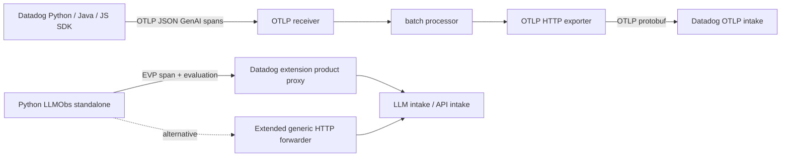

# LLM Observability implementation

**Backend update, 2026-09-20:** All eight language/mode/Collector workloads have matching LLM product records, correct token counts and expected input/output; both Python native evaluations have score 1. This verifies the deterministic core PoC, not every LLM feature.

[Current authenticated readback and limits](https://github.com/dineshg13/opentelemetry-collector-contrib/blob/dinesh.gurumurthy/poc-all-products/research/implementation/backend-readback/README.md). Earlier dated test evidence below is retained.

Status: real SDK workloads build and run in kind. Authenticated product queries now verify
the implemented deterministic LLM paths through both Collector alternatives. Broader
automatic instrumentation and product-feature coverage were not exercised.
Product PR: [#12](https://github.com/dineshg13/opentelemetry-collector-contrib/pull/12).

The ordinary trace path uses the SDK's own OTLP writer, the upstream OTLP receiver,
batch processor and OTLP HTTP exporter. It has no Datadog receiver, Datadog trace exporter,
connector or embedded Trace Agent. A separate Python mode exercises native LLM spans and
evaluations through the shared optional product HTTP proxy, with ordinary APM disabled.



## SDK coverage and exact switches

| Runtime exercised | OTLP configuration | Verified output |
| --- | --- | --- |
| Python `ddtrace==4.13.0rc1` | `OTEL_TRACES_EXPORTER=otlp`, `OTEL_EXPORTER_OTLP_TRACES_PROTOCOL=http/json`, explicit trace endpoint | Real `NativeWriter`; GenAI span with model, provider, input, output and numeric token counts |
| Java agent `1.66.0` | The same **plus `DD_TRACE_OTEL_ENABLED=true`** | Real `OtlpWriter`; two annotated Datadog spans with intact GenAI attributes |
| JavaScript `dd-trace==6.16.0`, Node `24.18.0` | Exporter and endpoint settings above, `DD_TRACE_ENABLED=true` | Real `OtlpHttpTraceExporter`; GenAI span with intact attributes |
| Python native LLM mode | `DD_APM_TRACING_ENABLED=false`, `DD_TRACE_ENABLED=false`, explicit `DD_TRACE_AGENT_URL`, agentless false | SDK LLM span and score evaluation through EVP; zero ordinary traces |

`DD_TRACE_OTEL_ENABLED` alone does not select OTLP export. Java needs it additionally
because that release gates interpretation of the OpenTelemetry environment settings.
Do not set `DD_TRACE_AGENT_PROTOCOL_VERSION`; Python/JavaScript give it precedence and
disable OTLP export. Python 4.13.0rc1 uses HTTP/JSON; the later researched Python HEAD also
supports HTTP/protobuf. The tests cover HTTP/JSON only. Logs and metrics were not exercised
by this LLM workload. SDK LLM auto-instrumentation, native Java/Node evaluations, experiments,
prompt management and Remote Configuration are outside these executed tests.

These are actual Datadog SDK applications, not replacement applications importing an
OpenTelemetry tracer provider. `app.py`, `app.cjs` and `LlmWorkload.java` manually generate
a deterministic chat operation with honest `custom` provider and `deterministic-poc` model
labels. They do not call or claim to measure a live model. Native LLM auto-instrumentation
is disabled in the OTLP applications to avoid duplicate native LLM submissions.

The GenAI fields and backend conversion control follow the
[Datadog OTLP instrumentation contract](https://docs.datadoghq.com/llm_observability/instrument/otel_instrumentation/).
The Collector exporter sends `dd-otlp-source: llmobs`; `service.name` identifies the
application. Product UI visibility, field mapping and evaluation correlation require
backend verification and cannot be inferred from a successful HTTP response.

## Build and deploy

From this directory:

```sh
docker build -t ddot-llm-python:poc .
docker build -f Dockerfile.java -t ddot-llm-java:poc .
docker build -f Dockerfile.node -t ddot-llm-node:poc .
kind load docker-image --name otel-dd ddot-llm-python:poc ddot-llm-java:poc ddot-llm-node:poc
kubectl --context kind-otel-dd -n ddot-poc apply -f deployment.yaml -f jobs.yaml
kubectl --context kind-otel-dd -n ddot-poc rollout status deployment/llm-python-otlp
kubectl --context kind-otel-dd -n ddot-poc rollout status deployment/llm-python-native
kubectl --context kind-otel-dd -n ddot-poc wait --for=condition=complete job/llm-java-otlp job/llm-node-otlp --timeout=120s
```

The coordinator creates namespace `ddot-poc`, builds the actual Collector distribution and
installs Service `collector` first. Applications use `collector:4318` for OTLP and
`collector:8126` for native products; applications have no Datadog API key. Collector
credentials come from a Kubernetes Secret. The discovered organization uses `DD_SITE=us5.datadoghq.com`;
the example configuration remains site-configurable. No final configuration references a
mock backend or needs an Agent sidecar. Health probes only establish application readiness;
completed jobs only establish that the application ran.

`collector.yaml` is a complete product configuration for the shared extended Datadog
extension. `collector-http-forwarder.yaml` is a complete independent generic-forwarder
alternative with explicit host/path allowlists, prefix rewrite and static discovery.
Both require the changed components in shared commit `68c9ee0df2c` or a descendant.
The generic configuration preserves gzip with `compression_algorithms: []` and rejects
unmatched routes. It requires `DD_HOSTNAME` for its explicit metadata header. The Datadog
extension derives vendor metadata centrally. Static product configuration needs no RC
server and basic evaluation telemetry does not require an application key.

To run the same native Python workload against the independent alternative:

```sh
kubectl --context kind-otel-dd -n ddot-poc set env deployment/llm-python-native \
  DD_TRACE_AGENT_URL=http://collector-http-forwarder.ddot-poc.svc.cluster.local:8126
kubectl --context kind-otel-dd -n ddot-poc rollout status deployment/llm-python-native
```

Restore `DD_TRACE_AGENT_URL` to `http://collector.ddot-poc.svc.cluster.local:8126` after
the alternative check. The coordinator owns both Collector deployments and records
upstream status, forwarding logs and backend evidence. Recommend the Datadog extension
for native compatibility because one per-product setting controls its bounded routes and
discovery; use the generic extension when explicit operator-maintained route configuration
is preferable. Both reuse standard Collector HTTP client/server code; neither imports
`pkg/trace` for forwarding. Shared component tests cover the changed forwarding behavior;
the actual native SDK-to-backend comparison is still pending deployment.

## Disablement

Set `extensions.datadog.products.llm_observability.enabled: false`. Restart the Collector
with that configuration and verify that native LLM POSTs return 404 and discovery stops
advertising EVP when no other enabled product needs it. CI can independently keep EVP
advertised; that must not reopen LLM routes. The generic alternative uses `disabled: true`
on each LLM route and removes its discovery endpoints, with other product routes retained.

OTLP ingestion is an independent explicit pipeline. To preserve ordinary APM while
disabling LLM conversion, add the processor from `disabled-otlp.yaml` to the trace pipeline
before `batch`. Verify `dd_llmobs_enabled=false` on exported spans and absence of new LLM
observations in the backend. A native route gate alone does not disable OTLP conversion.
Alternatively stop this PoC's LLM workloads. Neither route control can disable external
SDK direct-to-intake traffic in a separately configured application.

## Reproduce the local tests

```sh
python3 verify_sdk.py \
  --python-runtime /tmp/ddot-research-python-runtime \
  --java-agent /tmp/ddot-research-java-agent-1.66.0.jar \
  --java-home /usr/local/sdkman/candidates/java/current \
  --node-image ddot-llm-node:poc --output sdk-results.json
```

The paths above name previously installed runtimes and can be replaced with equivalent
locations. `requirements.txt` pins Python dependencies; `package-lock.json` pins Node
dependencies and tarball integrities. The Java Dockerfile checks the published agent JAR
SHA-256. [Python runtime provenance](../../python-runtime.json) and
[Java runtime provenance](../../java-runtime.json) record artifact provenance separately
from source HEAD. JS `6.16.0` corresponds to source tag commit
`ac687e81bdd1d75acf2e0629bb960d4b49db91d9`, which differs from the original researched HEAD.
Host wire tests used Microsoft OpenJDK 21.0.11; the container uses Temurin 21.0.8.

`verify_sdk.py` starts a loopback wire fixture only for tests, runs complete SDKs, parses
OTLP envelopes and asserts IDs and semantic fields, plus absence of native APM requests.
It also exercises real Python native span/evaluation emission. It does not build an Agent,
substitute a hand-written payload for SDK output, or label its HTTP replies as real backend
acceptance. [sdk-results.json](sdk-results.json) records the successful 2026-09-19 run.
The local test reused the profiling Node image containing the same pinned SDK before the
independent LLM Node image was built.

## Remaining evidence

Kind execution, both forwarding alternatives, product gates and explicit OTLP conversion
disable checks are recorded in the combined evidence. Authenticated September 20 queries
match all eight workload identities, observations, session tags and native score evaluations.
Node identity matching uses its emitted low 64 trace bits plus exact span ID; the original
OTLP trace ID is retained in `otel.trace_id` when LLM conversion assigns another trace ID.
Browser UI, real provider automatic instrumentation, Java/Node native evaluation paths and
other product features remain outside the verified deterministic PoC.

Source references for the selected writers: Python `ddtrace/internal/writer/writer.py`
and `ddtrace/internal/settings/_opentelemetry.py`; Java `WriterFactory.java`, `Config.java`
and `utils/config-utils/.../OtelEnvironmentConfigSource.java`; Node
`packages/dd-trace/src/opentracing/tracer.js` and `opentelemetry/trace/index.js`.
The source commit inventory and earlier native protocol analysis are in the
[product research](../../products/llm-observability/README.md).
