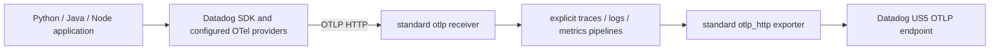

# Datadog SDK traces, logs and metrics over standard OTLP

**Backend update, 2026-09-20:** all three stored spans match emitted IDs, all three logs
retain matching trace/span IDs, and all three counters have value 3. See
[authenticated evidence](../evidence/backend-readback/sdk-signals.json).

This fixture exercises actual released Datadog SDKs and public OpenTelemetry APIs. All nine language/signal combinations pass semantic assertions after the actual built Collector's standard `otlp` receiver, `batch` processor and `otlp_http` exporter. No Datadog receiver or native ordinary telemetry fallback is configured. This is cross-product SDK transport coverage; it does not establish that every Datadog product consumes the exported data correctly.

| SDK runtime | Trace protocol | Log protocol | Metric protocol | Provider ownership |
| --- | --- | --- | --- | --- |
| Python ddtrace 4.13.0rc1, Python 3.12.13 | HTTP/JSON | HTTP/protobuf | HTTP/protobuf | Datadog trace writer; Datadog initializes installed OpenTelemetry SDK 1.44.0 providers/exporters for logs and metrics |
| Java dd-java-agent 1.66.0, OpenJDK 21.0.11 | HTTP/JSON | HTTP/JSON | HTTP/JSON | Datadog agent supplies API shims and OTLP implementations; only OpenTelemetry API/context 1.47.0 added to application |
| JavaScript dd-trace 6.16.0, Node 24.18.0 | HTTP/JSON | HTTP/protobuf | HTTP/JSON | Datadog initializes its providers/exporters; OpenTelemetry API 1.9.0 and API logs 0.208.0 added |

Each application generates one `poc.sdk.operation` span, one INFO log `ddot-signals-{language}`, and a `poc.sdk.counter` measurement of 3. The records carry `poc.language`. Local checks verify names/bodies, values and attributes, and that the log's trace ID **and** span ID match the emitted span. Generated IDs printed by applications support later authenticated readback. SDK/runtime resource metadata accompanies these synthetic records; the fixture reads no existing application data.



## Configuration and limitations

`verify.py:environment` is the executable configuration source. All three use `DD_TRACE_ENABLED=true`, `DD_TRACE_OTEL_ENABLED=true`, `DD_LOGS_OTEL_ENABLED=true`, `DD_METRICS_OTEL_ENABLED=true`, `OTEL_TRACES_EXPORTER=otlp`, and `OTEL_METRICS_EXPORTER=otlp`. Java/Node also use `OTEL_LOGS_EXPORTER=otlp`; the tested Python release does not accept that alias and uses its explicit Datadog logs gate. Each signal has its own `OTEL_EXPORTER_OTLP_{TRACES,LOGS,METRICS}_ENDPOINT` ending in `/v1/{traces,logs,metrics}` and explicit protocol from the table. Java's `DD_TRACE_OTEL_ENABLED` gate is necessary for these OpenTelemetry configuration aliases/API shims.

Python requires the pinned upstream OpenTelemetry SDK/exporter dependencies. Merely installing ddtrace and enabling its logs/metrics gates is insufficient. The fixture calls public APIs after `import ddtrace.auto`; it does not initialize a second competing provider. Java adds no upstream OpenTelemetry SDK. Node initializes Datadog before importing the OpenTelemetry APIs. Runtime metrics, profiling, AppSec, DSM, remote configuration and instrumentation telemetry are disabled to bound the test; the metric is an actual public API counter, not a runtime metric or fabricated OTLP envelope.

The Node 6.16.0 HTTP/JSON log path fails this correlated-log fixture: `http-json-logs-regression.json` records a successful trace and metric but no log after the Collector. The released log transformer turns trace/span IDs into Buffers, then its base serializer uses `JSON.stringify`, which represents them as objects rather than OTLP hex strings. HTTP/protobuf preserves these IDs and passes. No SDK patch is needed for the protocol combination above; HTTP/JSON correlated logs require correcting the released serializer. The fixture does not claim the precise failing HTTP status or that all uncorrelated JSON logs fail.

Python's inspected log/metric exporters support HTTP/protobuf or gRPC, not HTTP/JSON. gRPC was not exercised. Java emits a warning that native tracer metrics are ignored in favor of OTLP; the warning is preserved in the result. Default Agent capability discovery can still occur; successful ordinary telemetry here is demonstrated at the OTLP endpoint, and discovery requests are not evidence of native ordinary signal export.

Disabling `DD_LOGS_OTEL_ENABLED` and `DD_METRICS_OTEL_ENABLED` is tested independently of the ordinary trace path with `--disable-logs-metrics`. Collector receiver/exporter/pipeline ownership stays explicit: an extension cannot create or disable these pipeline components. Product-specific enable/disable coverage belongs to the separate product fixtures.

## Reproduce

Build the actual Collector with [the shared builder manifest](../collector/builder-config.yaml). Prerequisites: Python 3.12, `uv`, Node/npm, JDK 21, `curl`, and `sha256sum`. The host fixture avoids building duplicate container images during the documented kind node disk limit.

```sh
bash research/implementation/sdk-signals/bootstrap.sh /tmp/ddot-sdk-signals-runtime
python3 research/implementation/sdk-signals/verify.py \
  --collector /tmp/ddot-poc-build/collector/ddot-products-collector \
  --python-runtime /tmp/ddot-sdk-signals-runtime/python \
  --node-runtime /tmp/ddot-sdk-signals-runtime/node \
  --java-agent /tmp/ddot-sdk-signals-runtime/java/dd-java-agent-1.66.0.jar \
  --java-api-dir /tmp/ddot-sdk-signals-runtime/java \
  --java-home "$JAVA_HOME" \
  --output /tmp/ddot-sdk-signals-local.json
```

The local fixture starts a real Collector with temporary loopback-only receiver/exporter addresses. Its in-memory capture checks exporter semantics; it is deliberately a local test and is never presented as real backend verification. Rerun the command with `--disable-logs-metrics` to check disable gates. `--javascript-logs-protocol http/json` reproduces the released Node regression and exits unsuccessfully because the expected log is missing.

For kind, the combined PoC must already be deployed in context `kind-otel-dd`, namespace `ddot-poc`, with service `collector`, HTTP OTLP on 4318 and internal counters on 8888. The shared deployment supplies real Datadog credentials via its Kubernetes Secret. The script neither retrieves credentials nor modifies shared resources. It verifies readiness, opens loopback-only port-forwards, sends the reviewed synthetic workloads, and records only aggregate counters and workload IDs:

```sh
python3 research/implementation/sdk-signals/verify-kind.py \
  --python-runtime /tmp/ddot-sdk-signals-runtime/python \
  --node-runtime /tmp/ddot-sdk-signals-runtime/node \
  --java-agent /tmp/ddot-sdk-signals-runtime/java/dd-java-agent-1.66.0.jar \
  --java-api-dir /tmp/ddot-sdk-signals-runtime/java \
  --java-home "$JAVA_HOME" \
  --output /tmp/ddot-sdk-signals-kind.json
```

The destination verified from the scoped deployment is `https://otlp.us5.datadoghq.com`. Aggregate counters include concurrent product activity, so counter deltas are not exact per-workload backend attribution. Full telemetry payload logging is not enabled. An authenticated Datadog query/UI check is still required to confirm the resulting records and product behavior; no application-key/UI access was available to this fixture.

## Evidence and sources

- [Local enabled checks](local-results.json): actual SDK -> actual Collector -> local semantic capture, including log/span correlation.
- [Local disabled checks](disabled-results.json): log/metric gates off, ordinary OTLP trace retained, no application log/metric output.
- [Kind run](kind-results.json), 2026-09-19 22:25:53 UTC: all three SDK processes exited successfully through the ready shared Collector. Each language window added one OTLP log record, one or two accepted metric points, and accepted spans. Real Datadog exporter sent counters increased for all signals with no refused/failed counter deltas. Concurrent activity prevents exact per-workload attribution; authenticated record/product readback remains unverified.
- [Node HTTP/JSON regression](http-json-logs-regression.json): actual released SDK negative result, retained separately from the passing protocol configuration.
- Python source baseline `d6ab482ea3fb3c8666e75ac1905a3325b8f80098`; runtime release tag `c280552330bb906df23b2963d6457a8d23fb81de`. Provider/exporter setup: [logs.py](https://github.com/DataDog/dd-trace-py/blob/d6ab482ea3fb3c8666e75ac1905a3325b8f80098/ddtrace/internal/opentelemetry/logs.py), [metrics.py](https://github.com/DataDog/dd-trace-py/blob/d6ab482ea3fb3c8666e75ac1905a3325b8f80098/ddtrace/internal/opentelemetry/metrics.py).
- Java source baseline `7b903a53644abc39f55b2fb21283546ae9801f35`; runtime release tag `a099fffb31657bb6e8b4d04ee741491f3480829d`. [OtlpLogsService](https://github.com/DataDog/dd-trace-java/blob/7b903a53644abc39f55b2fb21283546ae9801f35/dd-trace-core/src/main/java/datadog/trace/core/otlp/logs/OtlpLogsService.java), [OtlpMetricsService](https://github.com/DataDog/dd-trace-java/blob/7b903a53644abc39f55b2fb21283546ae9801f35/dd-trace-core/src/main/java/datadog/trace/core/otlp/metrics/OtlpMetricsService.java).
- Node source baseline `d62655e12494634bb53f8c0cd440f087b004ca63`; runtime release tag `ac687e81bdd1d75acf2e0629bb960d4b49db91d9`. Released [log transformer](https://github.com/DataDog/dd-trace-js/blob/ac687e81bdd1d75acf2e0629bb960d4b49db91d9/packages/dd-trace/src/opentelemetry/logs/otlp_transformer.js) and [base serializer](https://github.com/DataDog/dd-trace-js/blob/ac687e81bdd1d75acf2e0629bb960d4b49db91d9/packages/dd-trace/src/opentelemetry/otlp/otlp_transformer_base.js).
- Executed Collector distribution version `0.161.0-poc`, contrib source baseline `16fa3257d56c299e115a558b1a668018a39990d5`, with shared PoC changes from the combined branch. Java artifact checksums are in `java-sha256.txt`; Python pins and Node integrity lock are committed alongside the fixture.

Source inspection and runtime evidence are distinct: source HEADs explain behavior; the versions in the table are the artifacts actually executed. Nothing in this matrix upgrades an incomplete product to verified end-to-end status.
