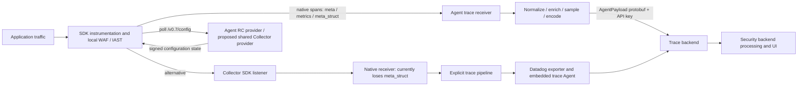

# Application Security through the Collector

**The current native receiver is not a complete Application Security path.** A real
Python WAF event passed through the unmodified HTTP forwarder, then lost its detection
payload when replayed through the unmodified Datadog receiver. HTTP 200 and an
`appsec.event=true` attribute are insufficient evidence that a usable security event survived.
There is no separate generic AppSec upload route that can repair this trace translation.

This report covers SDK WAF detection/blocking, API Security schemas, RASP context and
IAST vulnerability reporting. Software composition analysis uses additional SDK dependency
telemetry; its complete backend ingestion is outside the validated WAF/IAST trace path.
Do not interpret this report as product-complete validation of every security SKU.

## Sources and evidence

| Implementation | Inspected commit / version | Runtime exercised |
| --- | --- | --- |
| Collector contrib | `16fa3257d56c299e115a558b1a668018a39990d5`; receiver module `v0.161.0`, Agent dependencies `v0.83.1` | Actual local `datadogreceiver` factory and shared unmodified `http_forwarder` factory harness |
| Python, `~/dd/dd-trace-py` main | `d6ab482ea3fb3c8666e75ac1905a3325b8f80098` | Separate published `ddtrace==4.13.0rc1`, tag commit `c280552330bb906df23b2963d6457a8d23fb81de`; Python 3.12.13, Flask 3.1.3, msgpack 1.2.2 |
| Java, `~/dd/dd-trace-java` master | `7b903a53644abc39f55b2fb21283546ae9801f35` | Source inspection only |
| JavaScript, `~/dd/dd-trace-js` master | `d62655e12494634bb53f8c0cd440f087b004ca63` | Source inspection only |
| Agent, `~/dd/datadog-agent` main | `761050392a732097645b76d9845d36629f1ef3dc` | Source inspection only; no Agent binary executed |

Paths below are relative to the indicated repository. The wheel predates the Python
research commit; its execution is independent corroboration, not execution of source HEAD.
The Collector embeds released Agent modules, not the inspected Agent checkout. Changes
between those versions need compatibility testing before claiming shared behavior.

## Current and proposed architecture



The forwarder can carry native trace bytes to a real Agent unchanged, including its
responses. That is a viable transport bridge with the Agent retained. Direct forwarding to
the backend is a different protocol: native SDK MessagePack is not the Agent's authenticated,
compressed protobuf `AgentPayload`. Rewriting only the URL or injecting an API key is insufficient.

Recommended direction: repair and verify an explicit native trace receiver/exporter path,
with the Datadog extension as the managed configuration/discovery/RC entry point. Reuse
existing trace-Agent code where appropriate, rather than inventing another AppSec processor
inside an HTTP proxy. Until compatibility is proven, retain the real Agent for production
security reporting and managed RC.

## SDK behavior and differences

All three SDKs execute detection in the application process. HTTP request/response and
sensitive-operation instrumentation supplies WAF addresses or IAST taint/sink information.
Blocking is an SDK action in the application's request flow; the Collector does not inspect
application traffic or decide synchronously whether to block it.

| Concern | Python | Java | JavaScript |
| --- | --- | --- | --- |
| Local activation | `DD_APPSEC_ENABLED=true`; separate `DD_IAST_ENABLED=true` | Same environment variables / corresponding `dd.*` properties; `ProductActivation` distinguishes disabled/inactive/enabled | Same environment variables; `appsec.enabled` and `iast.enabled` init configuration |
| Remote activation | Unset AppSec flag can register ASM_FEATURES when RC is enabled; explicit false prevents this activation | `AppSecConfigServiceImpl` subscribes activation/rules; static custom rules alter subscriptions | `Activation.fromConfig`: unset is ONECLICK, true ENABLED, false DISABLED |
| WAF event data | Current defaults use `meta_struct.appsec`, not legacy `_dd.appsec.json` | `GatewayBridge` emits legacy `_dd.appsec.json` on service-entry span **and** structured `appsec` on root | `reportAttack` emits `_dd.appsec.json`; auxiliary stack/body data uses `meta_struct` |
| IAST data | Current default `meta_struct.iast`; legacy JSON branch exists | `Reporter.getOrCreateVulnerabilityBatch` sets structured `iast` through `setDataTop`; stack events use structured metadata | IAST formatter/reporting uses `_dd.iast.json`; related stack context can use `_dd.stack` |
| API Security / RASP | `_dd.appsec.s.*` gzip/base64 schema values; RASP WAF metrics and stack metadata | Schema derivatives from WAF through `AppSecSpanPostProcessor`/request context; RASP and IAST stacks are structured | API Security WAF derivatives; `stack_trace.js` structured `_dd.stack`, reporter can collect structured request body |
| Native protocol | AppSec/IAST default to v0.4 MessagePack; explicit API override can still choose v0.5 | `DDAgentFeaturesDiscovery` defaults to configured protocol or v0.4; v0.5/v1 protocols exist and negotiate supported endpoints | Agent writer uses `/v${version}/traces`, PUT and MessagePack; explicit v0.5 encoder exists, v0.4 carries structured metadata |
| Executed here | Real local WAF, forwarder upload, exact-byte receiver replay | None | None |

Python source anchors:

- `ddtrace/internal/settings/asm.py: ASMConfig`: default local AppSec false, independent IAST,
  `_use_metastruct_for_triggers=True`, `_use_metastruct_for_iast=True`. The production references
  inspected do not turn these off in response to `span_meta_structs:false`.
- `ddtrace/appsec/_processor.py: AppSecSpanProcessor`, WAF invocation, metadata, actions and keep;
  `_asm_request_context.py: flush_waf_triggers`; `_iast/_iast_request_context.py:
  _create_and_attach_iast_report_to_span`; `_iast/processor.py: AppSecIastSpanProcessor`.
- `ddtrace/appsec/_trace_utils.py: _asm_manual_keep` sets USER_KEEP, decision maker `-5` and
  ASM trace-source bit; `_api_security/api_manager.py` encodes schema derivatives.
- `ddtrace/internal/writer/writer.py: _resolve_api_version`, Agent writer construction. The v0.5
  encoder cannot carry structured metadata. Do not override to v0.5 for this path.
- `ddtrace/appsec/_remoteconfiguration.py: enable_appsec_rc`, callback and activation;
  `_capabilities.py` defines advertised security capabilities.

Java source anchors:

- `internal-api/src/main/java/datadog/trace/api/InstrumenterConfig.java` parses activation;
  native-image-builder branch disables AppSec/IAST there. This is not proof that every
  native-image/runtime/framework combination is supported.
- `dd-java-agent/appsec/src/main/java/com/datadog/appsec/gateway/GatewayBridge.java` request
  end processing, `appsec.event`, `_dd.appsec.enabled`, `Tags.ASM_KEEP`, structured/JSON event data.
- `dd-java-agent/appsec/src/main/java/com/datadog/appsec/config/AppSecConfigServiceImpl.java`:
  ASM_FEATURES, ASM_DD, ASM_DATA and ASM listeners/capabilities; custom rules restrict updates.
- `dd-java-agent/appsec/src/main/java/com/datadog/appsec/api/security/AppSecSpanPostProcessor.java`;
  `dd-java-agent/agent-iast/src/main/java/com/datadog/iast/Reporter.java`: vulnerabilities and stacks.
- `dd-trace-core/src/main/java/datadog/trace/common/writer/ddagent/TraceMapperV0_4.java`:
  `MetaStructWriter` packs each structured entry as MessagePack bytes. `TraceMapperV0_5` and
  `TraceMapperV1` are distinct formats; a trace acceptance test cannot cover all of them.
- `communication/src/main/java/datadog/communication/ddagent/DDAgentFeaturesDiscovery.java`;
  `communication/src/main/java/datadog/communication/http/OkHttpUtils.java` request metadata;
  `dd-trace-core/src/main/java/datadog/trace/common/writer/ddagent/DDAgentApi.java` upload/response.

JavaScript source anchors (under `packages/dd-trace/src/`):

- `config/supported-configurations.json`, `appsec/activation.js`, `appsec/index.js: enable`;
  handlers subscribe HTTP/body/response/auth channels, `RuleManager.loadRules`, RASP and API
  Security configuration. `appsec/iast/index.js` owns IAST startup.
- `appsec/reporter.js: reportAttack`, `reportRequestBody`; `appsec/stack_trace.js`;
  `appsec/iast/tags.js`; `span_format.js`; `encode/0.4.js: AgentEncoder`.
- `appsec/remote_config.js: enable`, `enableWafUpdate`, `disableWafUpdate`: signed-product
  subscriptions and activation, custom rules preventing WAF RC updates.
- `exporters/agent/writer.js: makeRequest`, encoder selection and response sampling-rate update;
  `standalone/tracesource_priority_sampler.js` and `standalone/product.js`.

SDK requests carry `Content-Type: application/msgpack`, `X-Datadog-Trace-Count`, language,
interpreter/version, tracer-version and available container/entity identity headers. They use
`DD_TRACE_AGENT_URL` or language host/port equivalents to select a local HTTP Agent; SDK-to-Agent
traces do not require the backend API key. The local Python capture verified those headers,
including `Datadog-Client-Computed-Top-Level` and `Datadog-Entity-Id`. Do not expose an unauthenticated
Agent-compatible listener to untrusted callers; ordinary Collector listener/network controls apply.

`DD_APM_TRACING_ENABLED=false` is a security standalone mode, not a switch that removes the
trace transport. Python `internal/settings/standalone.py` and sampling processing, Java
`AsmStandaloneSampler`, and JavaScript `TraceSourcePrioritySampler` retain security-designated
traces and permit a low-rate liveness signal. Preserve `_dd.apm.enabled`, `_dd.p.ts`,
`_dd.p.dm` and priority metadata with their semantics. Independent head/tail sampling or generic
attribute truncation can discard required security evidence even after receiver preservation is fixed.

## Agent path, responsibilities and Collector placement

Start at `pkg/trace/api/endpoints.go`: v0.3/v0.4/v0.5/v0.7 and v1.0 trace handlers are
registered; no dedicated generic AppSec upload handler appears. `api.go: handleTraces`
decodes native payloads, extracts identity and request metadata, records receive/drop counters,
responds with sampling hints and sends payloads for processing. The Agent is not running an
application WAF in this path; that work already happened in the SDK.

| Agent responsibility / source | Why it matters | Collector placement |
| --- | --- | --- |
| `/info`, `pkg/trace/api/info.go`: true structured-span capability and endpoint discovery | SDK protocol choice and RC availability must reflect reality | One shared SDK-facing listener/discovery owner; advertise only implemented capabilities |
| Native decode and chunk/root metadata, `api.go`, `converter.go` | Preserve security structures, trace identity, priority, origin and source | Receiver/native compatibility path; `converter.go` also converts structured bytes for v1 indexed spans |
| `pkg/trace/agent/agent.go: Process/ProcessV1` normalization, filters, global/container/version tags, top-level computation, obfuscation/truncation | Native payload and service/entity semantics differ from a plain proxy | Reuse compatible receiver/exporter trace pipeline; test each filter and transform on security events |
| `truncator.go: isStructuredMetaKey` excludes serialized structured tags from generic truncation | Truncating JSON can make an apparently preserved legacy event unusable | Preserve exemption or equivalent product-aware behavior; opaque structures require an agreed mapping |
| `PrioritySampler.Sample`, `Agent.sample`, single-span sampling and analytics extraction | Respect SDK security USER_KEEP; maintain expected trace source/billing behavior | Existing sampling/trace processing where compatible; no unconditional second sampling pass |
| `Agent.getAnalyzedEvents`, `pkg/trace/event` and concentrator | Generic APM analytics extraction and aggregation exist; these are not a demonstrated dedicated AppSec parser | Reuse existing APM processing as needed; do not invent an AppSec log extraction responsibility |
| `pkg/trace/writer/trace.go: WriteChunks/serialize` | Groups tracer chunks into AgentPayload with host, environment, Agent version, sampling rates; protobuf and compression | Existing Datadog trace exporter/writer |
| `pkg/trace/writer/sender.go: sender.do` | Site/destination, `DD-Api-Key`, retries/backpressure | Existing exporter, with independently configured credentials |
| RC handler/provider described below | Remote activation, WAF updates, blocking data and status acknowledgements | Shared Datadog extension RC integration or forwarding to a real Agent RC provider |

The ordinary trace writer sends compressed protobuf to
`https://trace.agent.<site>/api/v0.2/traces` (default `trace.agent.datadoghq.com`, configured
endpoint overrides supported). `writer/tracev1.go: TraceWriterV1` uses the same destination
with prepared indexed tracer payloads inside the protobuf AgentPayload; v1 SDK input still
requires decoding, compaction and envelope construction. Backend security ingestion consumes
the security-bearing traces. Backend
parsing, retention, entitlements and UI correlation were not inspected or exercised here; the
expected experience needs usable detections/vulnerabilities, service/env/version, request and
trace context, API schemas where enabled, and correctly applied remote rules.

The upstream Datadog exporter already calls `exp.agent.OTLPReceiver.ReceiveResourceSpans`
(`exporter/datadogexporter/traces_exporter.go: consumeTraces`) and constructs a trace Agent.
It is a candidate for required processing, but it cannot reconstruct `MetaStruct` already
lost by the receiver. Mapping an opaque security structure into OTel attributes and back needs
an explicit contract and tests; copying scalar tags alone is not evidence of compatibility.

### Remote configuration and return path

`comp/trace/agent/impl/run.go: runAgentSidekicks` attaches `/v0.7/config` to the `pkg/trace`
receiver when Agent RC is enabled. `cmd/trace-agent/config/remote/config.go: ConfigHandler`
reads SDK JSON `ClientGetConfigsRequest`, normalizes service/env and enriches container tags,
then invokes the core Agent config fetcher over its authenticated IPC connection. It returns
SDK configuration JSON, 204 when appropriate, or real error statuses. This is not an identity
proxy from SDK JSON to backend JSON.

`pkg/config/remote/service/service.go` and `pkg/config/remote/api/http.go` maintain backend
configuration state and fetch protobuf via `/api/v0.1/configurations` at the configured RC
base URL supplied to `NewService`. The backend request uses
`DD-Api-Key`; application-key/PAR-JWT variants exist for other contexts and must not be
invented as a normal SDK requirement. The Agent provider includes target/cache/state handling;
SDK requests carry products, capabilities, runtime/service identity, cached state and application
status. Responses include signed targets/configuration material. SDKs apply rules/configuration
and report state on subsequent polls.

ASM_FEATURES (activation/features), ASM_DD (Datadog rules), ASM_DATA (blocking data), and ASM
(custom rules/exclusions) are distinct subscriptions. Local bundled rules can detect attacks
without RC; remote enablement, managed rule updates and remotely configured protections cannot
be claimed from that test. Shared provider design must preserve the signed protocol and
product enablement policy. It must not arbitrarily delete fields from a signed response.

## Four concrete approaches

| Approach | Correctness and SDK compatibility | Configuration / maintenance | Principles decision |
| --- | --- | --- | --- |
| Existing `http_forwarder` configuration | Preserves native body and responses to a **real Agent**; executed with Python WAF and local capture. Direct backend routing cannot manufacture AgentPayload, sampling or RC provider semantics. | Small config, one fixed upstream; retains Agent deployment. | Valid bridge; not proof of Agent replacement or standalone AppSec backend delivery. |
| Extend HTTP forwarder | Routing, discovery and identity enrichment alone still leave native transformation/sampling/RC. Encoding AgentPayload inside it would become another trace processor. | Product-specific state, protocol migrations, difficult disablement on mixed APM bodies. | Reject as the owner of AppSec data processing; shared transport improvements may still be useful. |
| Add Datadog extension proxy/control support | Good place for per-product policy, shared discovery and RC provider selection; can route native traces to a private receiver. Current extension metadata HTTP server is not a complete native SDK product gateway. | One configuration entry point, but explicit dependency API/private target and capability policy require implementation. | Recommend control/ingress only. Moving sampling/decoding here needs explicit architecture approval under principles 2/4. |
| Repair native receiver + existing pipeline/exporter; compare OTLP | Reuses Collector signal pipeline and trace Agent in exporter. Current structured data loss blocks compatibility. OTLP traces carry attributes, but upstream SDKs do not supply a WAF/IAST or managed security RC. Datadog SDK OTLP variants need independent exact-field tests. | More work initially: bidirectional structure, priority, identity and limits contract; greatest reuse afterward. | Preferred implementation investigation, conditional on accepting non-proxy processing under principle 4. No product-complete OTLP support claimed. |

A proxy-only interpretation of principle 2 cannot satisfy this product's existing wire path.
The required native decoding, sampling, backend serialization and remote state exceed HTTP
forwarding plus metadata enrichment. Principle 4 provides a possible parity rationale, owned
jointly by the OTel Agent and SDK/security teams; the coordinator must preserve this as an
explicit architecture decision, not silently classify AppSec as forwarding-only.

## Configuration contract and disablement

The canonical model is [shared configuration](../../shared/configuration.md). The following
is a **proposal**, not current valid Collector configuration:

```yaml
extensions:
  datadog:
    products:
      application_security:
        enabled: false
        modes: [native_traces]
        pipelines:
          native_traces: traces/native
```

Default false. Enabling requires a verified native pipeline, a listener/discovery owner and
an RC provider when managed activation/rules are requested. A pipeline reference does not
instantiate receivers, processors or exporters. Native traces carrying several products must
be exported once through the shared pipeline, not once per enabled product. Reject unsupported
modes, unverified component capability combinations and missing required dependencies at startup.
An opt-in should not turn known payload loss into a warning-only startup.

The flag controls managed ingress/control/extraction within the feature. It does **not**
disable an already-running SDK WAF, remove SDK instrumentation, or suppress fields in an
independently configured trace/OTLP pipeline. SDK configuration remains authoritative for local
WAF execution. Blocking all native traces would also break APM; removing AppSec fields while
retaining ordinary traces needs product-aware transformation and tests, outside proxy-only
scope. RC shared with other products must constrain security subscriptions/capabilities while
preserving signed-response integrity. All product flags false also does not stop the existing
Datadog extension's own fleet metadata traffic. A neutral deployment must omit proprietary
components, as described in the shared contract.

## Executed prototypes

### Native receiver fixture

[prototype/main.go](prototype/main.go) instantiates the actual, unmodified Datadog receiver,
binds a local HTTP listener, posts a MessagePack v0.4 security payload and captures its emitted
`pdata.Traces`. It also calls `/info`, `/v0.7/config` and an unsupported path. It uses released
Agent protobuf dependencies from the receiver module, not a hand-written substitute for the
receiver. The checked-in [result](prototype/result.json) establishes:

- Scalar `_dd.appsec.json`, `_dd.iast.json`, `_dd.appsec.s.req.body`, keep priority,
  `_dd.apm.enabled` and propagated source/decision tags survive this fixture.
- `meta_struct.appsec`, `meta_struct.iast`, and `meta_struct._dd.stack` disappear.
- `/info` reports `span_meta_structs:false` and no RC route.
- `/v0.7/config` returns 200 with an empty body; an invented AppSec path also returns 200.
  These are catch-all responses, not successfully applied remote configuration or uploads.
- The native trace response is `{}`, not the real Agent's live sampling feedback.

Reproduce from the repository root with Go as required by `prototype/go.mod`:

```sh
cd research/products/application-security/prototype
go run .
```

Dependencies and permission for loopback listeners are required. The experiment run used
`GOCACHE=/tmp/ddot-research-go-cache` and the existing Go module cache. Source repositories
were not changed. The check deliberately asserts the observed loss; a receiver fix must update
this research assertion into a preservation expectation.

### Real Python SDK, then exact-payload replay

[python_waf.py](python_waf.py) starts the **unmodified shared forwarder** and a local capture
server. A child process loads actual `ddtrace.auto` and Flask, sends one local request with
`User-Agent: dd-test-scanner-log`, closes the response and shuts down the tracer. This exercises
real instrumentation, native WAF detection, serialization and SDK transport. RC and telemetry
are disabled for the bounded fixture; this does not validate their behavior.

Observed: HTTP application response 200, 11 spans in one captured upload containing three
trace chunks, one WAF event, `_dd.appsec.waf.version=2.0.0`, bundled rules `1.18.0`.
The security span has `appsec.event=true`, priority 2, `_dd.p.dm=-5`, `_dd.p.ts=02`,
`meta_struct.appsec.triggers` and **no** `_dd.appsec.json` fallback. API schema scalar values
also appear. A 200 application response is expected for this log-only scanner rule; blocking
was not tested.

Replaying those exact captured bytes through the receiver produces
[python-replay-result.json](prototype/python-replay-result.json): marker/priority/schema
scalars remain but `appsec` trigger content is gone. This demonstrates loss of an actual
SDK-generated detection, not merely hypothetical stack metadata loss. The receiver's false
structured capability does not solve that compatibility issue. The fixture capture endpoint
advertises false too, but no claim is made that the wheel fetched `/info` during this short run.

Reproduce with isolated packages (the tested versions are pinned here):

```sh
python3 -m pip install --target /tmp/appsec-runtime ddtrace==4.13.0rc1 flask==3.1.3 msgpack==1.2.2
# Build the shared forwarder once; its README documents the exact component harness.
cd research/shared/forwarder
go build -o /tmp/appsec-forwarder .
cd ../../products/application-security
PYTHONPATH=/tmp/appsec-runtime PYTHONDONTWRITEBYTECODE=1 python3 python_waf.py \
  --forwarder /tmp/appsec-forwarder --output /tmp/appsec-capture
cd prototype
go run . --payload /tmp/appsec-capture/payload-0.msgpack
```

The execution environment instead reused coordinator-installed ddtrace dependencies at
`/tmp/ddot-research-python-runtime`, adding Flask/msgpack under `/tmp/ddot-research-appsec-python`.
[python-validation.json](python-validation.json) records a small durable input summary. Raw
MessagePack payloads remain temporary; the script regenerates them from a controlled local app.

### Evidence boundary

| Claim | Status |
| --- | --- |
| Python SDK executes WAF and sends an actual security event through current forwarder | **Locally verified**, published wheel listed above |
| Actual receiver preserves all security structures | **Disproved** by synthetic payload and actual Python payload replay |
| Forwarder to a retained Agent works with managed security | Code-supported transport option; real Agent/backend/RC run still needed |
| Java / JavaScript security reporting through Collector | Source traced; no SDK runtime execution |
| IAST vulnerabilities, RASP stack linkage, API Security backend inventory, blocking | Source traced; not complete runtime/backend validation |
| Authenticated security backend ingestion and UI correlation | **Unverified**; no backend API credentials/test org available |
| RC activation/rule update/acknowledgement and disablement | Source traced; no live provider/backend execution |
| Datadog SDK OTLP or an upstream-only security solution | No product-complete support demonstrated |

## Follow-up work and owners

1. **P0 — SDK/security + receiver owners:** agree on native security compatibility fixtures for
   each language; include current structured-only Python/Java IAST, RASP stacks, API schemas,
   128-bit trace identity, source and standalone metadata. Repair receiver loss and reject
   unsupported native paths truthfully. Re-run this prototype before advertising support.
2. **P0 — OTel Agent + exporter/security backend:** decide whether native preservation uses a
   documented pdata mapping or a separate native-compatible ingestion path; verify reconstruction,
   normalization/truncation exceptions and USER_KEEP semantics through actual backend protobuf.
   This is the non-proxy scope decision under the principles.
3. **P1 — Shared extension/RC owners + SDK teams:** implement one listener, honest `/info`,
   provider-backed `/v0.7/config`, service/container enrichment, signed state and status propagation.
   Test ASM_FEATURES/rules/data updates and remote activation separately from local rules.
4. **P1 — Configuration owners:** enforce mode/pipeline compatibility and documented disable
   boundaries. Decide how mixed native APM payloads support unequivocal proprietary disablement;
   extension-only route flags cannot promise global suppression.
5. **P1 — Product QA/backend owners:** supply a nonproduction Datadog org/site/API key with
   security entitlements and RC access; run each SDK/framework fixture and verify detection detail,
   vulnerability reports, API inventory, stack linkage and trace correlation in backend/UI.
   No application key is assumed necessary for native trace submission; read/API validation may
   require separately scoped access.
6. **P2 — SDK owners:** validate more frameworks/platforms and explicit v0.5/v1/OTLP behavior,
   standalone mode, rate limits, shutdown/retries and maximum payloads. The single Python Flask
   case is not a language-wide or product-wide compatibility certification.

Research and prototype work is complete within local-access limits. Backend/API access, complete
Java/JavaScript runtime fixtures, live RC and a resolved native compatibility design are the
remaining blockers to an end-to-end support claim. No production receiver/extension code was changed.
