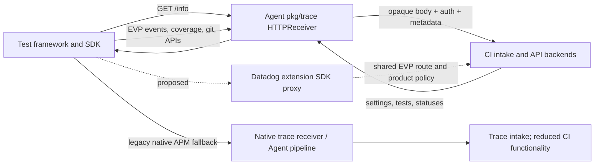

# CI Visibility / Test Optimization through the Collector

The native CI path fits the principles' HTTP proxy plus enrichment boundary. The SDK
creates test events, coverage, git data and optimization requests; the Agent's EVP proxy
forwards those bytes and returns backend responses. **Current `http_forwarder` configuration
alone cannot replace the Agent for this product.** Discovery, prefix removal, multiple
backend destinations, credentials and product policy need an additional implementation.

Recommend a CI route group in the proposed Datadog extension SDK proxy, using shared EVP
infrastructure. A dedicated CI receiver translating into OTLP would add unnecessary semantic
conversion and would still need an HTTP control proxy. This is a research recommendation,
not an implemented Collector product switch or authenticated Datadog validation.

## Scope and versions

This report covers SDK test visibility and test optimization. CI provider pipeline-event
collection by other tools is a different producer, outside this SDK investigation. The
principles call the product **CI Visibility**; the SDKs also call it **Test Optimization**.

| Inspected source | Commit |
| --- | --- |
| Python `main` | `d6ab482ea3fb3c8666e75ac1905a3325b8f80098` |
| Java `master` | `7b903a53644abc39f55b2fb21283546ae9801f35` |
| JavaScript `master` | `d62655e12494634bb53f8c0cd440f087b004ca63` |
| Agent `main` | `761050392a732097645b76d9845d36629f1ef3dc` |
| Collector contrib `main` | `16fa3257d56c299e115a558b1a668018a39990d5` |

Runtime evidence uses the separately installed **Python `ddtrace==4.13.0rc1`**, release
source `c280552330bb906df23b2963d6457a8d23fb81de`, and `pytest==8.3.5`. It does **not** execute
Python main. Additional real Java manual-API evidence uses agent **1.66.0**, release source
`a099fffb31657bb6e8b4d04ee741491f3480829d`, not Java master. The JavaScript component checks
execute files from the pinned checkout with explicit stubs; they do not load the full tracer.
Agent findings are source inspection. The historical Java experiment did not record its
Java/javac runtime version; do not infer it from the coordinator shell inventory or the
separate profiling test. Record `java -version` and `javac -version` when reproducing it.

## Current and proposed path



The backend and SDK own test selection, known-test history, retry decisions and test
management. The Agent does not compute these in the EVP path. Settings requests are
ordinary synchronous product API calls, **not** `/v0.7/config` Remote Configuration.
Backend-managed live debugging and failed-test replay introduce separate debugger dependencies.

## Language behavior

### Python: distinguish the default and legacy implementations

The pinned default pytest entry point selects `ddtrace/testing/internal/pytest/plugin.py`;
`DD_PYTEST_USE_NEW_PLUGIN=false` selects the deprecated implementation. `pytest --ddtrace`
enables the test integration. The new `SessionManager` builds `TestCycleWriter`,
`TestCoverageWriter` and `APIClient`; test/session/module/suite lifecycles and coverage are
collected in the SDK. `BackendConnectorSetup.detect_setup` chooses agentless or EVP.
Agentless requires `DD_API_KEY`, uses `DD_SITE` and optional `DD_CIVISIBILITY_AGENTLESS_URL`.
Proxy mode uses `DD_TRACE_AGENT_URL`, host/port variables, or a Unix socket/default Agent
address. `/info` must advertise **exactly** `/evp_proxy/v4/` or `/evp_proxy/v2/`; v4 wins and
enables gzip. Missing discovery/EVP raises `SetupError`: this new transport does not fall
back to the APM writer. `config.default_env` is queried when needed. [P1]

New event and coverage writers use the selected EVP prefix consistently. Events are
MessagePack `{version:1, metadata, events}` with test event version 2 and module/suite/session
end event version 1. Coverage is multipart with `coverage1.msgpack` containing
`{version:2, coverages}`, plus `event.json`; IDs link tests/suites/sessions and coverage.
The SDK supplies service, environment, CI/git, runtime and framework metadata. Preserve
opaque bytes, integer IDs, compression, multipart boundaries and request content types. [P2]

The legacy `ddtrace/internal/ci_visibility/recorder.py` instead chooses agentless, EVP, or
`REQUESTS_MODE.TRACES` fallback. It probes v4 to enable gzip and uses v4 for its settings
client, but event/coverage and git constants still use **v2**. Thus a listener advertising
v4 must also support v2 for installed legacy clients. The legacy report-upload writer has
a separate inconsistency: `/api/v2/cicovreprt` lacks an EVP prefix and uses
`citestcov-intake`, whereas the new implementation uses `ci-intake` and its selected prefix.
Do not silently normalize this difference into a claim of report compatibility; confirm with
the Python team whether legacy support is intended or a fix is needed. [P3]

The new HTTP client negotiates gzip responses, decodes them, retries network/5xx/429/bad-JSON
errors and reads `X-RateLimit-Reset` for throttling. Known-test pagination, skip decisions,
git requirements, test management and coverage-report toggles are interpreted by the SDK.
Python also has an optional test-log submission path to `http-intake.logs` `/api/v2/logs`:
the pinned pytest plugin's `DD_LOGS_INJECTION` path uses the active connector (EVP or direct),
while explicit `DD_AGENTLESS_LOG_SUBMISSION_ENABLED` requires agentless mode. It needs
explicit scope/policy if exposed alongside CI. [P1, P2, P4]

### Java

Load `dd-java-agent.jar` with `-javaagent` and `DD_CIVISIBILITY_ENABLED=true` (or corresponding
`-Ddd.civisibility.enabled=true`). `CiVisibilitySystem.start` initializes build/test event
handlers, manual session API and coverage instrumentation. Test-framework/build integrations
provide session/module/suite/test events; coverage class transformation or JaCoCo remains
SDK/build-process work. Build-child IPC is local SDK infrastructure, not a Collector endpoint.
Agentless is separately selected with `DD_CIVISIBILITY_AGENTLESS_ENABLED=true` and API key. [J1]

`WriterFactory` discovers Agent capabilities and switches from `DDAgentWriter` to
`DDIntakeWriter` for CI when EVP or agentless is available; otherwise it explicitly logs
limited functionality. `DDAgentFeaturesDiscovery` prefers v4 then v2; v4 permits content
encoding headers. `CiTestCycleMapperV1` creates MessagePack CI events and
`CiTestCovMapperV2` creates multipart coverage. `DDEvpProxyApi` posts to the advertised
prefix and sets `X-Datadog-EVP-Subdomain`; `DDIntakeApi` is the authenticated direct path. [J2]

`BackendApiFactory`/`EvpProxyApi` provide independent synchronous clients for the API and
`ci-intake`. `ConfigurationApiImpl` fetches settings, skippable tests, **flaky tests**, known
tests and test-management tests. `GitDataApi` searches commits/uploads multipart packfiles.
`CoverageReportUploader` sends compressed report parts to `ci-intake` `/api/v2/cicovreprt`.
The HTTP layer preserves/decompresses gzip responses and retry/error semantics. Failed-test
replay can enable `DebuggerConfigBridge`; native CI proxy support alone does not validate
that debugging feature. [J3]

### JavaScript

Use the CI entry point, for example `NODE_OPTIONS=--require=dd-trace/ci/init` with a supported
test runner. Loading ordinary tracing with a CI flag is not equivalent to this entry point.
`ci/init.js` sets `isCiVisibility`, chooses agent-proxy/agentless or worker exporters and
honors explicit `DD_CIVISIBILITY_ENABLED=false`. It defaults enabled when loaded even though
the general config key's default is false. Agentless requires an API key. Jest, Mocha,
Cucumber, Playwright and Vitest integration hooks and worker aggregation are SDK-side. [S1]

`AgentProxyCiVisibilityExporter` fetches `/info` before selecting the writer. It finds the
highest advertised EVP version, treats v2+ as compatible, **downgrades v3 to v2**, and enables
gzip for v4+. Without EVP it uses the APM `AgentWriter` and discards coverage. Event and
coverage writers strip the SDK API-key header in proxy mode and set the respective subdomain.
`AgentlessCiVisibilityEncoder` and `CoverageCIVisibilityEncoder` produce the native MessagePack
event and multipart coverage formats, with session/module/suite/test relationships. [S2]

The exporter separately calls settings, skippable suites/tests, known tests, test management
and git APIs, and waits for git upload before skip retrieval where needed. Report uploads use
`ci-intake`; screenshot/video uploads use binary bodies, API routes containing numeric IDs,
and **query parameters** (`idempotency_key`, `captured_at_ms`). Query fidelity therefore matters.
Failed-test replay separately discovers `/debugger/v1/input` and uses a debugger logs writer.
Do not describe core CI event transport as complete coverage of media or replay. [S3]

## Required HTTP route inventory

All rows are POST unless noted. Backend URLs use HTTPS and the configured Datadog site;
the table shows the backend subdomain and path **after** stripping `/evp_proxy/v2` or `/v4`.
In proxy mode the SDK's `X-Datadog-EVP-Subdomain` selects the destination; the Agent supplies
`DD-API-KEY`. Direct SDK mode supplies its own API key. No application key is required by
the inspected CI API client implementations.

| Purpose | Subdomain / backend path | Body and return path | Language coverage |
| --- | --- | --- | --- |
| Discovery | local GET `/info` | JSON endpoints and default environment; feature negotiation | All; language differences above |
| Test events | `citestcycle-intake` `/api/v2/citestcycle` | MessagePack envelope; success/error status | All |
| Per-test/suite coverage | `citestcov-intake` `/api/v2/citestcov` | Multipart MessagePack + JSON; optional request gzip | All |
| Settings | `api` `/api/v2/libraries/tests/services/setting` | JSON request/response toggles and git requirements | All |
| Skip candidates | `api` `/api/v2/ci/tests/skippable` | JSON tests/suites, coverage metadata, correlation ID | All; granularity varies |
| Known tests | `api` `/api/v2/ci/libraries/tests` | JSON test inventory, pagination | All |
| Flaky tests | `api` `/api/v2/ci/libraries/tests/flaky` | JSON inventory | Java explicit client; not found as equivalent route in Python/JS inspected clients |
| Test management | `api` `/api/v2/test/libraries/test-management/tests` | JSON disabled/quarantined/attempt-to-fix properties | All |
| Git search | `api` `/api/v2/git/repository/search_commits` | JSON commit IDs | All |
| Git upload | `api` `/api/v2/git/repository/packfile` | Multipart metadata + binary packfile | All |
| Coverage reports | `ci-intake` `/api/v2/cicovreprt` | Multipart gzip report + event JSON | All current main paths; Python legacy mismatch above |
| Test media | `api` `/api/v2/ci/test-runs/{traceId}/media` or `/api/v2/ci/test-suites/{sessionId}/{suiteId}/media` | Raw image/video + query metadata | JS inspected implementation; no cross-language equivalence asserted |
| Test logs | `http-intake.logs` `/api/v2/logs` | JSON, optional gzip | Python new implementation inspected; explicit additional feature |
| Failed-test replay | local debugger route(s), debugger backend routing | Separate debugger payload/protocol | Java/JS source integrations; cross-product validation outstanding |

The route inventory is a candidate **allowlist**, not permission to expose an unrestricted
EVP proxy. The same `api` subdomain serves other products: matching subdomain alone cannot
enforce CI disablement. Validate path, method and media ID/query constraints too. Shared
git paths may have multiple owning products; keep explicit ownership and dependency policy.

## What the Agent actually does

`pkg/trace/api/endpoints.go` registers `/evp_proxy/v1/` through `/v4/`, and
`HTTPReceiver.evpProxyHandler` checks `EVPProxy.Enabled` before stripping the selected prefix.
`pkg/trace/config/config.go` defaults EVP enabled and maximum payload to 10 MiB;
`comp/trace/config/impl/setup.go` reads `evp_proxy_config.enabled`, `dd_url`, `api_key`,
`additional_endpoints`, `max_payload_size`, and timeout. This is shared EVP enablement,
not a dedicated CI Agent toggle. [A1]

`evpProxyTransport.RoundTrip` performs the following responsibilities. [A1]

| Responsibility | Necessary in Collector path / proposed owner |
| --- | --- |
| Validate subdomain/path/query; strip EVP prefix; construct `https://{subdomain}.{site}{path}` | Shared extension proxy; restrict further by enabled product route group |
| Set API key, optionally per additional endpoint; discard arbitrary inbound headers | Extension credential/egress policy; replace incoming keys rather than append |
| Preserve allowed `Content-Type`, `Content-Encoding`, `Accept-Encoding`, `User-Agent`, CI provider and EVP origin headers | Shared proxy; preserve binary/multipart/gzip contract |
| Set `Via`, host, default env; derive container ID and normalized container tags | Shared metadata provider; local container/workload attribution must be supported or explicitly absent |
| Enforce payload size, configured write/request deadline and `X-Datadog-Timeout`; record forwarding metrics | Proxy transport limits and Collector telemetry; media limits need product-team review |
| Forward to main/additional destinations; return **main** response and discard secondary responses | Proxy if dual shipping is selected; control answers must never be arbitrarily merged |
| Relay backend status, headers and body | Required synchronous behavior for settings, selection, retries and git; a queued Collector exporter acknowledgment is insufficient |

`info.go:makeInfoHandler` derives discovery from endpoint registration and publishes allowed
EVP headers/default environment plus Agent state. At this pinned Agent version the EVP
entries have no `IsEnabled` predicate: `/info` may still advertise them when the EVP handler
returns 405 because the feature is disabled. The proposed Collector contract intentionally
requires capability filtering **and** request rejection; avoid copying that inconsistency. [A1]

No CI event decoding, aggregation, sampling or rewriting occurs in the EVP forwarder.
Legacy fallback is different: `/v0.4/traces` or `/v0.5/traces` enters native trace decoding,
normalization, filtering, obfuscation/truncation, metadata, sampling and stats computation in
`pkg/trace/agent/agent.go:Process`; `TraceWriter` sends native Agent payloads to trace intake
(`/api/v0.2/traces`, default `trace.agent.{site}`). That path cannot be represented as a
transparent raw CI upload. Reusing it requires the APM/trace pipeline parity work and still
does not supply coverage/settings APIs. [A2]

## Concrete Collector options

| Option | Correctness and SDK compatibility | Configuration, maintenance and principles |
| --- | --- | --- |
| Current `http_forwarder` direct to Datadog | One fixed scheme/host, unchanged path, no discovery or subdomain routing. Real Python test confirms missing discovery and direct EVP 404 against a strict fixture. Cannot provide complete native CI. | Small YAML; unsuitable as standalone replacement. It can relay to an **actual Agent or compatible gateway** which retains missing responsibilities. Agentless event-only forwarding is possible with a matching raw destination, but one SDK override does not solve all intake/API domains. |
| Extend generic forwarder | Route matching, prefix rewrite, authoritative header replacement, faithful response handling and a separate discovery/policy provider can make transport viable. | Generic mechanics are reasonable upstream candidates. Datadog-specific discovery, metadata, secrets and product rules still need ownership; encoding all this as YAML per language/version is error prone. Do not claim it is existing configuration. |
| Datadog extension SDK proxy — recommended | Shared `/info` and v2/v4 EVP semantics, bounded CI data/control routes, key/enrichment policy. Preserves native bytes and synchronous responses. | Moderate vendor-specific implementation; central `enabled` flag meets principles and reuses shared product machinery. Current extension's HTTP server serves metadata, not this ingress. No production implementation in this branch. |
| Dedicated CI receiver / current Datadog receiver | Current receiver advertises native traces and translates them; it has no CI EVP route. New CI-to-OTLP conversion would have to preserve envelope event types, 64-bit linkage and coverage, and separately implement API return paths. | Highest new schema/translation burden without an upstream native CI signal. Not justified for forwarding-only CI. Receiver/pipeline remains appropriate only for deliberately supported legacy APM fallback. |

Collector evidence: `extension/httpforwarderextension/{config.go,extension.go}`
(`forwardRequest` replaces only host/scheme and adds headers); `receiver/datadogreceiver/receiver.go`
(`getEndpoints`, `handleInfo`, `handleTraces`); `extension/datadogextension/internal/httpserver/httpserver.go`
(`NewServer`, metadata handler). Use [shared forwarder findings](../../shared/README.md) for
cross-product response/header/compression limitations; ordinary HTTP success is not backend validation.

## Proposed configuration contract

Canonical proposal: [shared configuration](../../shared/configuration.md). This YAML is a
design sketch, **not currently accepted** by the Datadog extension:

```yaml
extensions:
  datadog:
    api:
      key: ${env:DD_API_KEY}
      site: datadoghq.com
    native_sdk_proxy:
      enabled: false
      endpoint: 127.0.0.1:8126
    products:
      ci_visibility:
        enabled: false                 # absent/default is false
        modes: [native_proxy]
service:
  extensions: [datadog]
```

`native_proxy` owns no telemetry pipeline. The extension validates required listener,
credential/site, metadata provider policy, route availability and content/response support
before startup. Register v2 and v4 only when the corresponding contract works; v4 requires
gzip-preserving ingress and response behavior. API/optimization calls are part of the basic
CI route group, because returning a fabricated success or omitting their responses silently
changes test behavior. Optional logs/media/replay/report compatibility must have explicit
scope and dependencies; do not announce complete support based only on event ingestion.

If an implementation additionally supports legacy fallback, configure
`modes: [native_proxy, native_traces]` and `pipelines: {native_traces: traces/ci}` referencing
an **explicitly configured and verified** receiver/processor/exporter pipeline. The extension
cannot create that pipeline implicitly, and the current receiver is not proof of CI UI parity.

`enabled:false` registers no CI upload/control paths, makes no managed CI egress and starts
no CI workers. Shared `/info` may advertise EVP for another enabled product, so matching CI
requests must still be rejected even after SDK capability caching. Block route families
and control requests rather than only event uploads. A configured independent trace pipeline
or SDK agentless mode is outside this flag's enforcement boundary; neutral deployment omits
proprietary paths. A shared mixed-product trace pipeline needs explicit product-aware policy
before promising suppression of CI fields. Current Datadog extension metadata traffic is
also separate from this proposed product toggle.

## Executed prototype and limitations

See [prototype instructions](prototype/README.md), [Python harness](prototype/validate.py)
and [JavaScript component checks](prototype/check-js-components.cjs).
The harness launches the **unmodified Collector `http_forwarder`** via the shared executable.
It compares a direct fixed backend with an explicitly separate research compatibility
adapter and a strict mock backend. The adapter is not the Agent or Datadog extension.

The real Python legacy pytest run produced test/session/module/suite events, decoded
multipart coverage, and real settings/skippable/known-test/test-management/git-search/
packfile requests through the forwarder plus adapter. The settings fixture enables these
features but returns empty candidate sets: actual test skipping, quarantine, flake detection,
retry behavior and history matching are **not** validated. Direct forwarding triggers legacy
APM fallback; the default new plugin only queries `/info`, then proceeds with uninstrumented
tests (exit zero) after setup fails. Both plugins reach all core CI/API/git route families
when the adapter is present.
Synthetic probes verify response status/body/`Retry-After`, authoritative API key handling,
unrelated-product rejection and disabled CI without egress. They do not validate SDK retry
timing, all response headers or production backpressure/limits.

The real Java 1.66.0 agent plus public manual CI API produced decoded test/module/suite/session
events and settings/known/skippable/test-management/git-search/packfile requests through the
same forwarder + adapter. This does not exercise JUnit/build instrumentation or automatic
coverage. JavaScript executes four real discovery-module cases and two real writer
request-construction cases with network/encoder/base-class stubs; full JS tracer dependencies
are not installed in its checkout.
No source repositories were changed. No Datadog credential/site entitlement is available:
backend acceptance, indexed test/coverage records, git association and product UI behavior
remain unverified for **all** languages.

## Implementation sequence and decisions

1. SDK/Test Optimization team confirms the supported feature/version matrix, Python legacy
   report-upload behavior, new-plugin requirement, and ownership of logs/media/replay.
2. OTel Agent/Collector team implements shared optional SDK listener, discovery, v2/v4 EVP
   routing, authoritative credentials, enrichment, limits and synchronous response fidelity;
   generic forwarder improvements can be contributed upstream separately.
3. Add CI allowlists and explicit disablement; test shared EVP with CI disabled and LLM
   enabled, stale discovery, wrong subdomain, gzip/multipart, errors, redirects, rate-limit
   headers, large packfiles and query-bearing media. Avoid turning one enabled product into
   arbitrary backend API access.
4. Run full pinned Java JUnit/build integration and JS runner plus Python legacy/default
   matrices against actual Agent behavior and the Collector implementation. Include negative
   dependency/config validation, response compression and optimization decisions, not only
   upload status.
5. With a test Datadog org/API key and CI product access, verify correlated test sessions,
   coverage, git, known/skip/quarantine/retry settings and reports in the backend/UI. Record
   release-specific supported capabilities; keep unsupported extras explicitly off.

## Primary source references

Each reference below is scoped to the commit table, with representative immutable links.
Paths mentioned in the report are relative to that repository.

- **P1:** [`ddtrace/testing/internal/http.py`](https://github.com/DataDog/dd-trace-py/blob/d6ab482ea3fb3c8666e75ac1905a3325b8f80098/ddtrace/testing/internal/http.py),
  `pytest/entry_point.py`, `pytest/plugin.py`, `session_manager.py`: transport selection,
  enablement, gzip, response/retry behavior.
- **P2:** [`ddtrace/testing/internal/writer.py`](https://github.com/DataDog/dd-trace-py/blob/d6ab482ea3fb3c8666e75ac1905a3325b8f80098/ddtrace/testing/internal/writer.py),
  `api_client.py`, `git.py`, `test_data.py`: events/coverage/control/git/report formats.
- **P3:** [`ddtrace/internal/ci_visibility/recorder.py`](https://github.com/DataDog/dd-trace-py/blob/d6ab482ea3fb3c8666e75ac1905a3325b8f80098/ddtrace/internal/ci_visibility/recorder.py),
  `writer.py`, `encoder.py`, `_api_client.py`, `git_client.py`, `constants.py`,
  `ddtrace/internal/evp_proxy/constants.py`: legacy selection, v2 constants and report discrepancy.
- **P4:** [`ddtrace/testing/internal/logs.py`](https://github.com/DataDog/dd-trace-py/blob/d6ab482ea3fb3c8666e75ac1905a3325b8f80098/ddtrace/testing/internal/logs.py).
- **J1:** [`CiVisibilitySystem.java`](https://github.com/DataDog/dd-trace-java/blob/7b903a53644abc39f55b2fb21283546ae9801f35/dd-java-agent/agent-ci-visibility/src/main/java/datadog/trace/civisibility/CiVisibilitySystem.java),
  adjacent `CiVisibilityServices.java`, `CiVisibilityCoverageServices.java`,
  `dd-trace-api/.../config/CiVisibilityConfig.java`: bootstrap/instrumentation/dependencies.
- **J2:** [`WriterFactory.java`](https://github.com/DataDog/dd-trace-java/blob/7b903a53644abc39f55b2fb21283546ae9801f35/dd-trace-core/src/main/java/datadog/trace/common/writer/WriterFactory.java),
  `dd-trace-core/.../civisibility/writer/ddintake/{CiTestCycleMapperV1,CiTestCovMapperV2}.java`,
  `.../common/writer/ddintake/{DDEvpProxyApi,DDIntakeApi}.java`,
  `communication/.../ddagent/DDAgentFeaturesDiscovery.java`: wire transport.
- **J3:** [`ConfigurationApiImpl.java`](https://github.com/DataDog/dd-trace-java/blob/7b903a53644abc39f55b2fb21283546ae9801f35/dd-java-agent/agent-ci-visibility/src/main/java/datadog/trace/civisibility/config/ConfigurationApiImpl.java),
  `.../git/tree/GitDataApi.java`, `.../coverage/report/CoverageReportUploader.java`,
  `communication/.../{BackendApiFactory,EvpProxyApi}.java`, `internal-api/.../intake/Intake.java`.
- **S1:** [`ci/init.js`](https://github.com/DataDog/dd-trace-js/blob/d62655e12494634bb53f8c0cd440f087b004ca63/ci/init.js),
  `packages/dd-trace/src/{plugin_manager,proxy,exporter}.js`, test-runner plugin packages.
- **S2:** [`agent-proxy/index.js`](https://github.com/DataDog/dd-trace-js/blob/d62655e12494634bb53f8c0cd440f087b004ca63/packages/dd-trace/src/ci-visibility/exporters/agent-proxy/index.js),
  `agentless/{writer,coverage-writer}.js`, `src/encode/{agentless-ci-visibility,coverage-ci-visibility}.js`.
- **S3:** [`ci-visibility-exporter.js`](https://github.com/DataDog/dd-trace-js/blob/d62655e12494634bb53f8c0cd440f087b004ca63/packages/dd-trace/src/ci-visibility/exporters/ci-visibility-exporter.js),
  `ci-visibility/requests/{get-library-configuration,upload-coverage-report,upload-test-screenshot}.js`,
  `intelligent-test-runner/get-skippable-suites.js`, `early-flake-detection/get-known-tests.js`,
  `test-management/get-test-management-tests.js`, `exporters/git/git_metadata.js`.
- **A1:** [`pkg/trace/api/evp_proxy.go`](https://github.com/DataDog/datadog-agent/blob/761050392a732097645b76d9845d36629f1ef3dc/pkg/trace/api/evp_proxy.go),
  adjacent `endpoints.go`, `info.go`; `pkg/trace/config/config.go`, `comp/trace/config/impl/setup.go`.
- **A2:** [`pkg/trace/agent/agent.go`](https://github.com/DataDog/datadog-agent/blob/761050392a732097645b76d9845d36629f1ef3dc/pkg/trace/agent/agent.go),
  `pkg/trace/api/api.go`, `pkg/trace/writer/trace.go`, `pkg/trace/config/config.go`.
