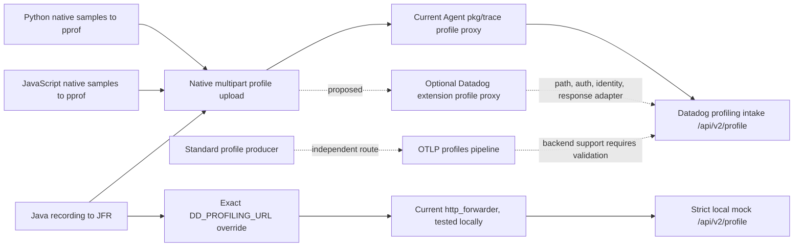

# Continuous Profiling through the Collector

Status: all three SDKs and the Agent inspected; **real Python and Java profile uploads
executed through the unmodified current `http_forwarder` to a strict local mock**.
Java's exact profiling URL override provides a configuration-only transport path. Default
Python/Java/JavaScript Agent upload URLs require path rewriting. No authenticated Datadog
intake, profile UI, trace correlation, JavaScript runtime, or production proxy implementation
was validated. The distinction matters: the mock's 202 proves transport, not product success.

Recommendation: provide an optional native profile proxy in the Datadog extension, sharing
transport and identity services with the other products. Preserve compressed multipart bodies;
rewrite the upload URL, supply trusted identity and credentials, and retain Agent response
compatibility. In parallel, the OTel and Profiling teams should pursue upstream OTLP profiles.
OTLP profile support does not make native pprof/JFR uploads wire-compatible with OTLP.

## Versions and evidence

All source paths below are relative to these repositories and commits. Source repositories
were inspected without edits or dependency installation.

| Source | Pin |
| --- | --- |
| [Collector contrib](https://github.com/open-telemetry/opentelemetry-collector-contrib/tree/16fa3257d56c299e115a558b1a668018a39990d5) | `16fa3257d56c299e115a558b1a668018a39990d5` |
| [Python main](https://github.com/DataDog/dd-trace-py/tree/d6ab482ea3fb3c8666e75ac1905a3325b8f80098) | `d6ab482ea3fb3c8666e75ac1905a3325b8f80098` |
| [Java master](https://github.com/DataDog/dd-trace-java/tree/7b903a53644abc39f55b2fb21283546ae9801f35) | `7b903a53644abc39f55b2fb21283546ae9801f35` |
| [JavaScript master](https://github.com/DataDog/dd-trace-js/tree/d62655e12494634bb53f8c0cd440f087b004ca63) | `d62655e12494634bb53f8c0cd440f087b004ca63` |
| [Agent main](https://github.com/DataDog/datadog-agent/tree/761050392a732097645b76d9845d36629f1ef3dc) | `761050392a732097645b76d9845d36629f1ef3dc` |
| Python **executed release**, distinct from main | `ddtrace==4.13.0rc1`, tag commit `c280552330bb906df23b2963d6457a8d23fb81de`; CPython 3.12.13, Linux aarch64; native `ddup.is_available=True` |
| Java **executed release**, distinct from master | `dd-java-agent-1.66.0.jar`, tag commit `a099fffb31657bb6e8b4d04ee741491f3480829d`; upload origin version `1.66.0~a099fffb31`; Microsoft OpenJDK/javac **21.0.11** |
| OTLP receiver source inspected in local Go module cache | `go.opentelemetry.io/collector/receiver/otlpreceiver@v0.161.1-0.20260917142259-65d9c38b188c` |

The Python release and main both call `ddog_prof_Endpoint_agent` and have the same
`_get_endpoint` agentless TODO. Their libdatadog dependencies differ: the release pins
`v37.0.0`, main pins `v43.0.0` in `src/native/Cargo.toml`; the observed path suffix and payload
encoding below are runtime evidence for the release. Java's `getFinalProfilingUrl` precedence
was checked at both the release and master commits. Neither release test proves every behavior
of the newer source pin. No Agent binary was run; Agent main is a reference contract, not the
version linked by the Collector prototype. The shared executable imports the current forwarder.

## Architecture and coverage



The last arrow is a capability investigation, not an assertion that the native intake accepts
OTLP. A standard producer needs an OTLP-capable destination or a validated exporter/mapping.

| SDK | Collection and payload | Native Agent route | Current forwarder to native intake | Validation |
| --- | --- | --- | --- | --- |
| Python | Native stack/CPU/wall, memory/heap, locks, exceptions, optional PyTorch; multipart event plus compressed pprof and optional provenance | `/profiling/v1/input` | **No** with normal Agent config; endpoint path in forwarder config cannot rewrite it; Agent URL path is prepended to native suffix in executed release | Real native collection/upload; two path failures at mock |
| Java | Runtime-selected JFR/ddprof controllers; multipart `event.json` + compressed `main.jfr` | `/profiling/v1/input` | **Yes, narrow transport path** with exact `DD_PROFILING_URL=http://collector:port/api/v2/profile`, forwarder origin pointing to intake and egress key/static headers; ordinary Agent config still fails | Real JFR upload; default-path failure and exact-URL success at mock |
| JavaScript | Native `@datadog/pprof` wall/CPU and heap/allocation, optional timeline events; multipart event + `<type>.pprof` | Hardcoded `/profiling/v1/input` | **No** with inspected `AgentExporter`; only URL scheme/host/port or Unix socket are used, not supplied pathname; no equivalent profiling URL override here | Source only; full Node/native binding run remains unverified |

All three have native profiling implementations. Availability of each sample type still
depends on SDK version, platform/runtime, flags and native bindings. This table does not claim
every profiler supports every OS, JDK or Node version. No inspected path emits OTLP profiles.

## SDK behavior

### Python

`ddtrace/internal/settings/profiling.py:ProfilingConfig` defaults profiling off; enable with
`DD_PROFILING_ENABLED=true` and `ddtrace-run` (`ddtrace/bootstrap/preload.py` imports profiling
auto), or use `ddtrace.profiling.Profiler().start()`. `Profiler` builds collectors and a
scheduler in `ddtrace/profiling/profiler.py:_ProfilerInstance`; collector availability is
checked and unavailable collectors can be omitted. `scheduler.py:Scheduler.flush` snapshots
collectors then calls `ddup.upload`. The normal upload interval is 60 seconds; shutdown flush
is used in the short experiment. Serverless scheduling has its own flush behavior.

`ddtrace/internal/datadog/profiling/ddup/_ddup.pyx:_get_endpoint/upload` obtains the tracer's
Agent URL (normally `DD_TRACE_AGENT_URL` / Agent host and port), sets runtime ID/process ID,
maps span IDs to endpoints and attaches endpoint counts. `dd_wrapper/src/uploader_builder.cpp:
UploaderBuilder::build` serializes the native profile and creates a libdatadog exporter with
`ddog_prof_Endpoint_agent`; `uploader.cpp:Uploader::upload_unlocked` adds code provenance,
internal profiler metadata, process tags and, on main, profiler settings information before
`ddog_prof_Exporter_send_blocking`. Service/env/version/runtime are profile tags. The native
uploader handles cancellation and timeouts; no profile parsing, symbol conversion or sample
aggregation occurs in the Agent proxy.

The configuration exposes `DD_PROFILING_AGENTLESS`, but the inspected native uploader has an
explicit agentless TODO and always chooses `Endpoint_agent`. Do **not** infer an operational
agentless/direct upload URL from the presence of that flag. Executed release evidence:
`DD_TRACE_AGENT_URL=http://collector/api/v2/profile` sends
`/api/v2/profile/profiling/v1/input`, not `/api/v2/profile`.

The real upload contained `DD-EVP-ORIGIN: dd-trace-py`, release version header,
`multipart/form-data`, `event.json` with `family:python`, `version:4`, `tags_profiler`, and
zstd-compressed `profile.pprof` plus `code-provenance.json` (magic `28b52ffd`). The client uses
the Agent to supply the backend API key. Upload code checks libdatadog's result/error variant;
it does not consume an RC/configuration response body. Our Python process exited zero without
the harness's upload-error text match even after the mock rejected the request with 404.
Therefore SDK exit status/log silence is explicitly **not** a success criterion.

### Java

`dd-trace-api/src/main/java/datadog/trace/api/config/ProfilingConfig.java` defines
`DD_PROFILING_ENABLED` (false by default), URL, agentless, period and timeout controls.
`agent-profiling/.../agent/ProfilingAgent.java:run` verifies enablement/environment and API-key
format, creates `CompositeController`, `ProfileUploader` and `ProfilingSystem`. The controller
chooses OpenJDK/Oracle JFR and Datadog profiler implementations according to runtime support;
recordings are collected and combined on the SDK side. Optional SDK JFR scrubbing precedes
upload on main. The Collector should not reimplement these collectors or decode JFR merely to
forward it.

`internal-api/.../Config.java:getFinalProfilingUrl` uses, in order:

1. Exact `DD_PROFILING_URL`, regardless of agentless flag.
2. With `DD_PROFILING_AGENTLESS=true`, `https://intake.profile.<DD_SITE>/api/v2/profile`.
3. Agent URL plus `/profiling/v1/input` (special handling accommodates Unix Agent sockets).

`agent-profiling/profiling-uploader/.../ProfileUploader.java:makeRequest/RecordingDataAdapter`
sends chunked multipart containing `event.json` (`family:java`, `version:4`, start/end,
attachments, `tags_profiler`, optional process tags) and `main.jfr`. It sets `DD-EVP-ORIGIN:
dd-trace-java` and version headers. `CompressingRequestBody` supports off/gzip/LZ4/zstd;
default on selects zstd (native-image compatibility selects gzip). The runtime test observed
zstd JFR. `communication/.../http/OkHttpUtils.java:prepareRequest` adds Java language metadata,
container/entity identity, and an API key **only if agentless is true and a key is present**.
For the tested exact-URL mode, agentless remained false and the forwarder supplied the key.

`ProfileUploader.handleResponse` accepts HTTP 2xx, reports 404 without a key as an Agent
compatibility problem, and optionally analyzes oversized JFR on 413. It closes the response
and releases recording data. There is no profile-specific response configuration to relay.
Uploader queue/running limits and upload timeouts remain SDK-owned.

### JavaScript

`packages/dd-trace/src/config/supported-configurations.json` defines `DD_PROFILING_ENABLED`
(false/true/auto; default false, also `profiling` initialization option), exporter default
`agent`, profiler default `space,wall`, 65-second upload period and 60,000ms upload timeout.
`src/profiler.js` reacts to configuration publication: explicit true starts, false stops,
auto uses SSI heuristics. This supports locally configured profiling without an RC provider;
remote configuration of the SDK is a separate capability, not required to transport manually
enabled profiles. `profiling/config.js:buildProfilingRuntime` selects available profilers and
exporters; `profiling/profiler.js` serializes and compresses the snapshots.

`profiling/exporters/event_serializer.js:getEventJSON` emits `family:node`, `version:4`,
attachments, start/end, tags, endpoint counts, process tags, optional custom attributes and
profiler/runtime information. `AgentExporter.export` wraps the event and `<type>.pprof` files
in multipart, supplies origin/version and `exporters/common/docker.js` identity headers, and
hardcodes `path: '/profiling/v1/input'`. Its URL parsing copies only scheme/hostname/port, or
`socketPath` for Unix. Changing `DD_TRACE_AGENT_URL` pathname therefore cannot select the
backend profile path. No API key injection or agentless profiler exporter appears in this
path; the profiler's file exporter is not a backend transport.

`sendRequest` rejects status >=400; export retries network errors, 429 and >=500 with backoff,
while other HTTP errors reject. It accepts 202 and drains/logs the response body without
interpreting profile configuration. Socket timeout destroys the request in the inspected main
source. Preserve this response behavior and bounded request duration in any replacement proxy.

## Agent path and required Collector behavior

Start at Agent `pkg/trace/api/endpoints.go`: `/profiling/v1/input` has a profile handler and
profiling-specific timeout but **no product `IsEnabled` predicate**. `api.go:buildMux`
registers it on the running trace receiver and wraps version/state response headers.
`info.go:makeInfoHandler` advertises visible enabled endpoints, including profiling. The
profile upload code traced above does not gate manually enabled upload on `/info` negotiation.
That does not mean other SDK products can omit `/info` on a shared listener.

| Agent responsibility / source | Behavior to preserve | Collector placement |
| --- | --- | --- |
| `profiles.go:profilingEndpoints/mainProfilingURL`; `config/endpoints.go`; `comp/trace/config/impl/setup.go` | Site-derived `https://intake.profile.<site>/api/v2/profile`, full `apm_config.profiling_dd_url` override, per-destination keys; deprecated `v1/input` destination warning | Datadog policy layer owns backend selection and validated credentials; generic HTTP client owns TLS/proxy settings |
| `profiles.go:multiTransport.RoundTrip` | Replace complete destination URL and Host, set `DD-API-KEY`; no request body format conversion | Small native profile route adapter plus generic streaming transport |
| `profiles.go:profileProxyHandler` | Additional tags: Agent host, default env, Agent version, Fargate orchestrator and explicit profile tags | Shared identity provider; preserve tag meaning/precedence, do not fabricate Agent version for Collector |
| `profiles.go:newProfileProxy`; `idprovider.go`, container helpers | Resolve SDK container origin to tags, normalize and set `X-Datadog-Container-Tags`; set `X-Datadog-Additional-Tags`, Via and forwarding headers | Shared origin identity/tag service; a remote gateway's hostname must not masquerade as workload host |
| `profiles.go:multiTransport` | Primary plus optional additional endpoints; bounded body buffering only for fan-out, default 50MiB; primary response returned; secondary responses drained; deterministic target ordering when main skipped | Optional shared fan-out primitive with per-product destination config; not required for single destination but required for configured parity |
| `profiles.go:multiTransport` deferred response adaptation | Convert upstream 202 to 200 for historical client compatibility | Profile-specific response adapter; modern inspected Java/JS accept 202 but old clients remain a compatibility contract |
| `api.go:getConfiguredProfilingRequestTimeoutDuration` | Default receiver deadline 5 seconds, configurable `apm_config.profiling_receiver_timeout` | Explicit ingress/deadline policy, coordinated with SDK upload periods and network conditions |
| `profiles.go:newProfileProxy/profilingTransport/handleProxyError` | 47-second idle connection timeout to avoid intake's 60-second race; close/flush damaged connections; 408/503/502 error mapping; telemetry | Reusable transport lifecycle where possible, product-tested error/timeout adaptation and metrics |
| `api.go`, `info.go` | Agent version/state response fields and truthful discovery | Shared Datadog listener/discovery; profiling upload has no additional required RC request/response path |
| Opaque reverse proxy | Multipart/pprof/JFR/provenance and correlation labels pass unchanged; no sample aggregation, symbol processing or pprof-to-JFR conversion | Keep outside pdata pipeline for native mode; sample collection and encoding stay in SDK, interpretation stays in backend |

`apm_config.profiling_send_to_main_endpoint=false` skips the implicit destination; additional
endpoints can remain active. It is not equivalent to disabling profiling. With no valid targets
the profile handler returns 500. A proposed Collector product-disable control should instead
remove/reject the managed route and suppress its discovery entry and egress work.

For the product experience, the native intake must accept the authenticated payload for the
target organization/site; SDK service/env/version and runtime/process identity must survive;
host/container metadata must describe the workload. Flamegraphs and code provenance require
backend interpretation of the attachments. Profile/trace navigation additionally requires an
independent working APM path and preserved span/runtime/endpoint relationships. A profile
upload alone does not establish trace ingestion or correlation.

## Concrete architecture choices

| Approach | Correctness and compatibility | Configuration / maintenance / principles | Decision |
| --- | --- | --- | --- |
| Existing `http_forwarder` configuration only | One origin; path/query retained, egress URL path ignored. Java exact-URL mode successfully transports real JFR to the backend-shaped mock; normal native routes fail. Static metadata only, no profile response adaptation or fan-out | Smallest change, upstream component and ordinary config. Requires Java-only override and a dedicated origin/listener; arbitrary shared SDK traffic cannot all target profiling intake | Useful narrow proof/option for Java single-host/static tags, subject to backend validation; not universal SDK support |
| Extend upstream `http_forwarder` | Explicit path routing/rewrite, response fidelity and configurable status adaptation can close HTTP gaps. Dynamic origin tags and Datadog destination/discovery policy still require another component | Reusable generic improvements fit upstream; a large catalog of Datadog switches in a neutral forwarder would couple product policy to generic code | Coordinate generic changes upstream; do not duplicate Datadog policy in every route |
| Optional proxy in Datadog extension | Can exactly preserve native uploads for all three SDKs, centralize credential/site, enrich origin tags, serve discovery and normalize response status; currently unimplemented | Shared router/transport/identity, independent product flags; no Collector pipeline required for opaque uploads. Fits externally produced HTTP+metadata principle | Recommended native mode, using generic transport pieces and Agent-tested protocol fixtures |
| OTLP profiles receiver/pipeline or native format-converting receiver | OTLP receiver really supports profiles, but accepts OTLP messages, not these native multipart pprof/JFR requests. Datadog exporter factory currently has traces/metrics/logs only. Converter would need JFR/pprof/event/provenance/correlation semantics and validated backend export | Upstream standardized profiling is valuable under principle 3. A proprietary converting receiver is substantially larger and risks field loss; standard collection is a separate path | Pursue OTLP upstream with Profiling team. Do not block opaque native forwarding on conversion; do not claim a drop-in path today |

The pinned OTLP receiver's `factory.go` registers `xreceiver.WithProfiles`, with HTTP path
`/v1development/profiles`; `otlp.go` registers profile gRPC/HTTP receivers when a profile
consumer exists. Collector contrib `exporter/datadogexporter/factory.go:newFactoryWithRegistry`
has no profile consumer. Current upstream specifications describe profiles as **Alpha**, with
resource/scope and trace/span relationships, distinct serialization and compatibility mappings.
This is a promising standardization path, not evidence of Datadog ingestion support.
[OpenTelemetry Profiles specification](https://opentelemetry.io/docs/specs/otel/profiles/)
(checked 2026-09-19).

No native profile receiver was added. A receiver that only forwards opaque bodies would
duplicate routing/auth/enrichment while imposing a pipeline abstraction that does not model
multipart response semantics. If conversion is pursued, require explicit fidelity fixtures
for Java JFR, Python provenance/settings, JavaScript timeline/endpoint/custom labels, and
sample-to-trace links before treating it as equivalent.

## Configuration proposal

This is the [shared proposed contract](../../shared/configuration.md), **not working current
Datadog extension configuration**:

```yaml
extensions:
  datadog:
    products:
      continuous_profiling:
        enabled: false
        modes: [native_proxy]
```

All product entries default disabled. Enabling `native_proxy` must require the proposed shared
SDK listener, valid site/key/destination policy and identity strategy; fail invalid or missing
dependencies at startup. The extension registers the profile upload route, optional shared
discovery entry and outbound transport. It does not enable the SDK profiler. No profiles
pipeline reference is needed for opaque proxy mode, and no pipeline should be silently
instantiated. Do not accept an `otlp` profiling mode until producer/export/backend contracts
and explicit pipeline dependencies are established.

With `enabled:false`, reject managed profile requests even if an SDK keeps uploading, omit the
route from discovery, and create no profile outbound worker. Other products' shared listener
may remain running. The flag cannot stop an SDK configured to upload directly elsewhere, nor
does it disable unrelated trace telemetry or the existing extension's metadata traffic. A
neutral deployment can omit the proprietary extension; see shared configuration for this
boundary. This control is separate from Agent's skip-main-destination setting.

## Reproduction and observed results

Files: [probe.py](probe.py), [Python workload](python_workload.py),
[Java workload](ProfileWorkload.java), [current forwarder subtree](forwarder.yaml),
[recorded results](results.json). The harness launches the actual unmodified extension through
the [shared executable](../../shared/forwarder/README.md); it does not imitate forwarder code.
Only the backend is mocked. It parses multipart, requires the synthetic egress key, accepts
only `/api/v2/profile`, returns 202, and rejects other paths with 404. Uploads contain real
native profiler attachments, not handwritten payload fixtures. No real key or external
backend is used. All listeners bind loopback and select ephemeral ports.

Prerequisites: Python 3.12, native `ddtrace` wheel for the platform, JDK/javac 21, the Java agent
jar, and the built shared forwarder. Installs must stay outside source repositories:

```sh
python -m pip install --target /tmp/ddot-research-python-runtime ddtrace==4.13.0rc1
curl --fail --location \
  https://repo.maven.apache.org/maven2/com/datadoghq/dd-java-agent/1.66.0/dd-java-agent-1.66.0.jar \
  --output /tmp/ddot-research-java-agent-1.66.0.jar
sha256sum /tmp/ddot-research-java-agent-1.66.0.jar
# Expected: 5f0eb51160fade367d97404624561b6666f7475fb1453a7a73237eb643e398d8
# Build /tmp/ddot-research-forwarder following research/shared/forwarder/README.md.
python research/products/continuous-profiling/probe.py \
  --forwarder /tmp/ddot-research-forwarder \
  --python-runtime /tmp/ddot-research-python-runtime \
  --java-agent /tmp/ddot-research-java-agent-1.66.0.jar \
  > /tmp/continuous-profiling-results.json
```

The recorded environment used `/home/bits/.local/share/mise/installs/python/3.12/bin/python`
(version 3.12.13) and `/usr/local/sdkman/candidates/java/current/bin/java`, with `java -version`
reporting Microsoft OpenJDK **21.0.11**, even
though another environment inventory found JDK 25. The recorded JSON contains the resolved
executable, exact version output, commands, sanitized SDK-only environment and jar digest.
The JDK path chosen by a different shell may differ; check the captured runtime, not inventory.

For each Java case the harness runs `javac -d <temporary-dir> ProfileWorkload.java`, then
`java -javaagent:/tmp/ddot-research-java-agent-1.66.0.jar -cp <temporary-dir> ProfileWorkload`.
It sets `DD_PROFILING_ENABLED=true`, `DD_PROFILING_START_DELAY=0`,
`DD_PROFILING_UPLOAD_PERIOD=1`, `DD_PROFILING_AGENTLESS=false`, and local Agent URL. The positive
case additionally sets `DD_PROFILING_URL=http://127.0.0.1:<forwarder-port>/api/v2/profile`.
Tracing, telemetry and RC are disabled to isolate profiling; service/env/version are explicit.
Python runs the direct `Profiler` API and flushes on stop. Inherited `DD_*` values are removed
before the test environment is built. Ordinary proxy/site environments and gateways still need
their own tests; this is a local transport probe.

| Executed case | Actual mock path | Outcome |
| --- | --- | --- |
| Python ordinary Agent URL | `/profiling/v1/input` | Real event/pprof/provenance arrived, mock 404: current forwarder did not use configured egress path |
| Python Agent URL with backend path | `/api/v2/profile/profiling/v1/input` | Real upload arrived, mock 404: URL override prepended to Agent suffix |
| Java ordinary Agent URL | `/profiling/v1/input` | Real event/JFR arrived, mock 404 and SDK upload error |
| Java exact profiling URL | `/api/v2/profile` | Real event/JFR arrived with injected key/static tags, mock 202, SDK process completed without upload error |
| Explicit response probe | `/api/v2/profile` | Forwarder returned backend 202 unchanged; no Agent 202-to-200 adaptation |

The harness asserts the real SDK exits, profile multipart family/path/status, injected key,
and nontrivial binary attachment presence. It records upload body digest, attachment byte
lengths/magic and event metadata. It does not decode sample values or validate backend profile
semantics. Java source and observed acceptance support 202 compatibility for the tested release;
this does not justify removing the Agent's compatibility rewrite for all older SDKs.

`compression_algorithms: []` in the current config preserves opaque ingress compression; the
per-file zstd encoding inside multipart is independently opaque. Egress endpoint includes
`/api/v2/profile` deliberately: the failures demonstrate that configuring the destination path
does not rewrite inbound paths. Static tags are a single-host test approximation, not container
tagger parity. HTTPS/site resolution, API-key authorization, backend acceptance and profile UI
are untested. No JavaScript native modules were installed and no JavaScript runtime claim is
made. No production Collector tests were needed because production code was not changed.

## Completion checkpoint and implementation work

Product owner: OTel Team + Profiling Team. Research branch:
`dinesh.gurumurthy/poc-continuous-profiling`. Complete locally: language/Agent code tracing,
four architecture options, config contract, current forwarder negative and positive real SDK
experiments. PR creation and authenticated backend completion depend on coordinator-tracked
human-authored PR sections and backend access; no issue/PR comments were generated.

1. **OTel + Profiling:** agree exact native contract and shared route ownership. Implement
   `/profiling/v1/input` to site-native `/api/v2/profile` with key replacement, opaque body,
   response adaptation and safe lifecycle. Reuse Agent fixtures without importing its daemon.
2. **OTel Agent + infrastructure metadata owners:** define host/container identity precedence
   for host-local and gateway deployments; reuse shared origin providers. Specify Collector
   version tags without impersonating Agent metadata. Decide optional fan-out/skip-main parity.
3. **SDK teams:** execute current-pin Python/Java builds and a full native JavaScript runtime;
   exercise multipart chunking/compression, old-client 202 compatibility, 413/429/5xx, timeout,
   cancellation, reconnects and large uploads. Current release tests remain useful baselines.
4. **Profiling backend + OTel:** provide nonproduction credentials/site and verify searchable
   profiles, real sample types, provenance, container identity and trace navigation for all
   languages. Exact action blocking product-complete validation: supply authorized test org
   credentials and ability to inspect resulting profiling/APM records.
5. **OTel + Profiling upstream owners:** validate standard OTLP producer/receiver/exporter
   support and native metadata mappings, then decide whether a Datadog profile exporter or
   backend OTLP intake is the appropriate extension. Current datadogexporter cannot complete
   this pipeline; no direct native-multipart-to-OTLP compatibility is assumed.

Before shipping the proposed product flag: disabled-route rejection and no profile egress,
truthful discovery, identity tests, backpressure/size limits, response fidelity, and real
backend records are required. These remain implementation acceptance criteria, not claims
about this research prototype.

## Primary source entry points

These pinned links expand abbreviated Java package paths used above; adjacent files and
symbols are named in the corresponding sections.

- [Python profiler setup](https://github.com/DataDog/dd-trace-py/blob/d6ab482ea3fb3c8666e75ac1905a3325b8f80098/ddtrace/profiling/profiler.py),
  [native endpoint choice](https://github.com/DataDog/dd-trace-py/blob/d6ab482ea3fb3c8666e75ac1905a3325b8f80098/ddtrace/internal/datadog/profiling/ddup/_ddup.pyx),
  [exporter construction](https://github.com/DataDog/dd-trace-py/blob/d6ab482ea3fb3c8666e75ac1905a3325b8f80098/ddtrace/internal/datadog/profiling/dd_wrapper/src/uploader_builder.cpp).
- [Java profiler startup](https://github.com/DataDog/dd-trace-java/blob/7b903a53644abc39f55b2fb21283546ae9801f35/dd-java-agent/agent-profiling/src/main/java/com/datadog/profiling/agent/ProfilingAgent.java),
  [recording controller selection](https://github.com/DataDog/dd-trace-java/blob/7b903a53644abc39f55b2fb21283546ae9801f35/dd-java-agent/agent-profiling/src/main/java/com/datadog/profiling/agent/CompositeController.java),
  [profile request/response](https://github.com/DataDog/dd-trace-java/blob/7b903a53644abc39f55b2fb21283546ae9801f35/dd-java-agent/agent-profiling/profiling-uploader/src/main/java/com/datadog/profiling/uploader/ProfileUploader.java),
  [URL selection](https://github.com/DataDog/dd-trace-java/blob/7b903a53644abc39f55b2fb21283546ae9801f35/internal-api/src/main/java/datadog/trace/api/Config.java),
  [request headers](https://github.com/DataDog/dd-trace-java/blob/7b903a53644abc39f55b2fb21283546ae9801f35/communication/src/main/java/datadog/communication/http/OkHttpUtils.java).
- [JavaScript native profile request](https://github.com/DataDog/dd-trace-js/blob/d62655e12494634bb53f8c0cd440f087b004ca63/packages/dd-trace/src/profiling/exporters/agent.js),
  [event payload](https://github.com/DataDog/dd-trace-js/blob/d62655e12494634bb53f8c0cd440f087b004ca63/packages/dd-trace/src/profiling/exporters/event_serializer.js),
  [runtime selection](https://github.com/DataDog/dd-trace-js/blob/d62655e12494634bb53f8c0cd440f087b004ca63/packages/dd-trace/src/profiling/config.js).
- [Agent registration](https://github.com/DataDog/datadog-agent/blob/761050392a732097645b76d9845d36629f1ef3dc/pkg/trace/api/endpoints.go),
  [profile forwarding/enrichment/response adaptation](https://github.com/DataDog/datadog-agent/blob/761050392a732097645b76d9845d36629f1ef3dc/pkg/trace/api/profiles.go),
  [profiling configuration setup](https://github.com/DataDog/datadog-agent/blob/761050392a732097645b76d9845d36629f1ef3dc/comp/trace/config/impl/setup.go).
- [Current forwarder implementation](https://github.com/open-telemetry/opentelemetry-collector-contrib/blob/16fa3257d56c299e115a558b1a668018a39990d5/extension/httpforwarderextension/extension.go),
  [Datadog exporter signal factory](https://github.com/open-telemetry/opentelemetry-collector-contrib/blob/16fa3257d56c299e115a558b1a668018a39990d5/exporter/datadogexporter/factory.go),
  [OTLP receiver profile factory](https://github.com/open-telemetry/opentelemetry-collector/blob/65d9c38b188c/receiver/otlpreceiver/factory.go).
