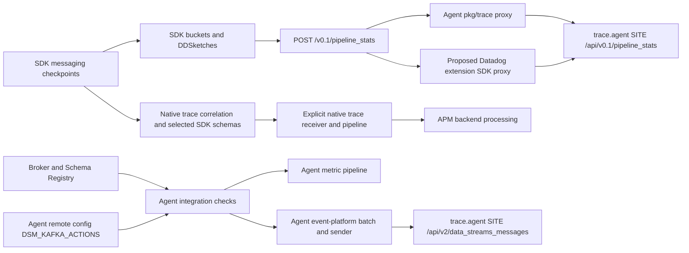

# Data Streams Monitoring: SDK stats proxy and Agent collection

**Implementation update (2026-09-19):** [runnable DSM implementation](../../implementation/data-streams-monitoring/README.md)
now builds Python 4.13.0rc1, Java 1.66.0 and JavaScript 6.16.0 applications with actual
SDK manual checkpoints and ordinary OTLP traces. Full SDK enabled/disabled tests and the
actual Collector's generic forwarding/OTLP pipeline tests passed. Both product Collector
configurations validate. This supersedes the source-only JavaScript and native-trace-path
limitations below for the exercised workload. Kind loading hit a full Docker filesystem;
real backend topology and trace/schema correlation remain unverified.

The SDK pathway-statistics upload is an opaque HTTP proxy candidate. Full DSM also includes
Agent broker collection, cluster/schema metadata, remote Kafka actions, and SDK trace
correlation. Those are separate data paths. The principles keep Agent-originated collection
in the Agent; adding an SDK statistics proxy must not claim to replace it.

The unmodified `http_forwarder` can relay DSM traffic to an existing Agent. It cannot directly
replace the Agent's backend path rewriting, discovery or metadata lookup through configuration
alone. Real Python and Java SDK experiments below demonstrate these boundaries with local
mocks. No authenticated Datadog backend or product UI was validated.

## Sources and evidence levels

Inspected on 2026-09-19, without modifying SDK/Agent/integration repositories:

| Source prefix used below | Repository and commit |
| --- | --- |
| P | `~/dd/dd-trace-py`, `d6ab482ea3fb3c8666e75ac1905a3325b8f80098` |
| J | `~/dd/dd-trace-java`, `7b903a53644abc39f55b2fb21283546ae9801f35` |
| N | `~/dd/dd-trace-js`, `d62655e12494634bb53f8c0cd440f087b004ca63` |
| A | `~/dd/datadog-agent`, `761050392a732097645b76d9845d36629f1ef3dc` |
| I, supplemental collection source | `~/dd/integrations-core`, `916e4f4364609494986417f9a5efc4b3b0281e52` |
| C | Collector contrib `16fa3257d56c299e115a558b1a668018a39990d5` |

The real Python experiment uses the installed **4.13.0rc1 wheel**, release tag commit
`c280552330bb906df23b2963d6457a8d23fb81de`, not a build of P HEAD. The Java experiment uses
**dd-java-agent 1.66.0**, tag commit `a099fffb31657bb6e8b4d04ee741491f3480829d`, not J HEAD.
The released runtime results and inspected HEAD behavior are deliberately identified
separately. JavaScript has source evidence only: this checkout lacks installed dependencies
and built `vendor/dist`; no JavaScript application runtime is claimed.

## Architecture and ownership



The existing current-forwarder option inserts C's `http_forwarder` between SDK and Agent.
The proposed option replaces only the stats proxy box. Neither moves checkpoints or
DDSketch aggregation into the Collector. The SDK-to-broker context propagation arrow is
independent of the HTTP upload and cannot be repaired by a proxy if an integration fails to
inject/extract context.

## SDK behavior by language

| Concern | Python P | Java J | JavaScript N |
| --- | --- | --- | --- |
| Enablement | `DD_DATA_STREAMS_ENABLED=false` default; lazy processor when enabled | `dd.data.streams.enabled` / `DD_DATA_STREAMS_ENABLED`, false default; dynamic trace config and Agent capability must both permit reporting | `DD_DATA_STREAMS_ENABLED` / `dsmEnabled`, false default; global `DD_AGENTLESS_ENABLED` explicitly forces DSM off |
| Collection examples inspected | `internal/datastreams/{kafka,aiokafka,kombu,botocore,google_cloud_pubsub}.py`; public manual produce/consume checkpoints | Core manual API; Kafka/Confluent schema-registry hooks; other messaging instrumentation is version-specific | `datastreams/checkpointer.js`, messaging plugins including AWS and Kafka; plugin-specific coverage must be tested |
| Discovery | DSM processor directly sends fixed endpoint; no DSM `/info` gate in this implementation | `DDAgentFeaturesDiscovery` requires advertised `v0.1/pipeline_stats`; processor periodically revisits config/capability | DSM writer directly sends fixed endpoint; no DSM `/info` gate in this implementation |
| Upload | POST `/v0.1/pipeline_stats`, gzip level 1 over msgpack | Same endpoint, gzipped msgpack through `OkHttpSink` | Same endpoint, gzip level 1 over msgpack |
| Explicit HTTP metadata | `Datadog-Meta-Lang: python`, tracer version, msgpack and gzip | `prepareRequest`: `Datadog-Meta-Lang: java`, JVM version/interpreter/vendor; container/entity IDs when known; gzip/msgpack | `Datadog-Meta-Lang: javascript`, tracer version; common request injects container data; gzip/msgpack |
| Authentication | SDK stats writer does not require an API key; Agent supplies it | Same | Same |
| Response behavior | 404 logs unsupported Agent; other >=400 logs error; transport exceptions use Fibonacci retry, but HTTP 503 is not retried by this method | 404 produces `DOWNGRADED` and feature recheck; 4xx `BAD_PAYLOAD`; 5xx/I/O `ERROR`; DSM constructs sink with buffering disabled | Common request treats non-2xx as error; writer logs it; transport retry rules live in common request/retry, not a durable DSM queue |

Python processor uses `agent_config.trace_agent_url` (including `DD_TRACE_AGENT_URL`);
Java resolves the relative stats path against its configured Agent URL; JavaScript passes
its configured URL to the common request client. Treat the standard Agent base URL as the
supported deployment input: these SDKs have no common public setting selecting an arbitrary
DSM backend upload path. There is no supported uniform workaround of appending `/api` to
the current-forwarder egress URL; the actual extension ignores that path.

Source anchors:

- P `ddtrace/internal/settings/_config.py` (`_data_streams_enabled`),
  `ddtrace/internal/datastreams/__init__.py` (`data_streams_processor`),
  `ddtrace/data_streams.py` (`set_produce_checkpoint`, `set_consume_checkpoint`),
  `ddtrace/internal/datastreams/processor.py` (`DataStreamsProcessor`, `_flush_stats`, `periodic`).
- J `internal-api/src/main/java/datadog/trace/api/Config.java` (`dataStreamsEnabled`),
  `dd-trace-api/src/main/java/datadog/trace/api/ConfigDefaults.java`,
  `communication/src/main/java/datadog/communication/ddagent/DDAgentFeaturesDiscovery.java`
  (`V01_DATASTREAMS_ENDPOINT`, `supportsDataStreams`),
  `dd-trace-core/src/main/java/datadog/trace/core/datastreams/DefaultDataStreamsMonitoring.java`
  (`InboxProcessor`, `checkDynamicConfig`, `checkFeatures`),
  `dd-trace-core/src/main/java/datadog/trace/common/metrics/OkHttpSink.java`,
  `communication/src/main/java/datadog/communication/http/OkHttpUtils.java` (`prepareRequest`).
- N `packages/dd-trace/src/config/supported-configurations.json` and `config/index.js`,
  `packages/dd-trace/src/datastreams/{checkpointer,manager,processor,writer}.js`,
  `packages/dd-trace/src/exporters/common/{request,retry}.js`.

### Propagation and hashes

All three emit `dd-pathway-ctx-base64`: base64 of an eight-byte little-endian pathway hash
and two variable-length encoded millisecond epoch timestamps (pathway start, edge start).
Python uses zig-zag helpers; Java uses `VarEncodingHelper.encodeSignedVarLong`; JavaScript
uses its `encodeVarintInto`. These positive-epoch timestamps are the relevant interoperable
domain. No arbitrary-negative-integer cross-language decoder equivalence is claimed.
JavaScript emits a fixed 20-byte buffer; Python/Java construct variable-length bytes.

Python `DsmPathwayCodec.decode` and JavaScript `DsmPathwayCodec.decode` also accept legacy
binary `dd-pathway-ctx`, with fallback for base64 under that older key. Java's inspected
`DefaultPathwayContext.PathwayContextExtractor` recognizes the base64 key, case-insensitively.
Thus the old note's “base64-only” conclusion must not be extended to all languages.

Python uses FNV-1-64 over service/env/process hash and sorted tags, then node/parent hashes.
Java obtains a node hash from `DataStreamsTags`, then FNV-1 chaining; aggregation also has a
separate dataset-aware hash. JavaScript explicitly uses SHA-256 truncated to eight bytes,
sorted tags excluding `manual_checkpoint:true`, and optionally its propagation hash.
These differences do not imply a backend incompatibility: the downstream SDK treats the
already-computed parent hash opaquely. Do not recompute it in a receiver.

All three have protection against repeated same-direction checkpoints; the exact clock and
reset implementation differs. Java uses monotonic ticks for local latency and epoch time
for propagation; Python uses seconds and JavaScript nanosecond-valued numbers derived from
`Date.now`. The two clocks encode pathway-wide and immediately preceding-edge latency.

Sources: P `processor.py` (`DataStreamsCtx`, `DsmPathwayCodec`) and `encoding.py`;
J `dd-trace-core/.../datastreams/DefaultPathwayContext.java`,
`internal-api/.../datastreams/{DataStreamsTags,PathwayContext}.java`;
N `packages/dd-trace/src/datastreams/{pathway,encoding,processor}.js`.

### Aggregation, payload variation and transactions

The common outer envelope is gzipped msgpack, with `Stats` buckets and embedded serialized
DDSketch bytes for `PathwayLatency`, `EdgeLatency`, `PayloadSize`. Latencies are seconds;
payload sizes are bytes; bucket `Start` and `Duration` are nanoseconds. The default bucket is
10 seconds, but Python couples it to its configurable interval and Java has a bucket-duration
configuration. None of these inspected serializers emits the older Go note's dual
`TimestampType: current/origin` fields. A proxy must preserve the payload, including future
fields, without forcing a Go-specific schema.

| Payload detail | Python | Java | JavaScript |
| --- | --- | --- | --- |
| Top-level extras beyond service/env/version/lang/tracer version/stats | `Hostname`, optional `ProcessTags`; no `ProductMask` | `PrimaryTag`, `ProductMask`, optional `ProcessTags`; `Lang` in executed release is `jvm`, though HTTP header is `java` | `Tags`, conditional `ProcessTags`; no `ProductMask` in inspected serializer |
| Aggregation grouping | Current-time bucket and `(joined edge tags, hash, parent hash)` | Current-time bucket and service override, then aggregation hash, preserving dataset granularity | Current-time bucket and checkpoint hash key |
| Flush | Serializes/clears all buffered buckets | Worker queue; report flushes closed buckets, shutdown flushes all, service separation; large transaction buffers trigger reports | Serializes/clears buckets; timer or `flushInterval=0` flush-on-write |
| Backlogs | Produce/commit offsets, maximum observed per partition/group/cluster key | Generic tagged backlog, maximum observed | Generic sorted-tag backlog, maximum observed |
| Transactions | No transaction serializer/API found in inspected DSM processor | Binary `Transactions` and `TransactionCheckpointIds`, explicit API and configured extractors | Binary `Transactions` and registry snapshot `TransactionCheckpointIds`; explicit API |
| Other bucket records | None in inspected serializer | `SchemaRegistryUsages` and Kafka `Configs` | None beyond stats/backlogs/transactions in inspected serializer |

Transaction bytes in JavaScript are checkpoint byte + big-endian int64 nanosecond timestamp
+ one-byte identifier length + identifier bytes; checkpoint-name dictionary is separately
encoded. This is per-transaction data, so the old “never per-message data” statement is too
broad for current DSM. Preserve these opaque bytes. Java's equivalent source is
`internal-api/.../datastreams/TransactionInfo.java` and `core/datastreams/TransactionContainer.java`.

Python's native `DDSketch` wrapper delegates to `libdd_ddsketch` and encodes protobuf bytes
(`src/native/ddsketch.rs`). Java uses `Histogram.newLogHistogram()` backed by
`products/metrics/metrics-lib/.../DDSketchHistograms.java`: logarithmic gamma `1.015625`,
offset `1.8761281912861705`, collapsing store 1024, with `DDSketchHistogram.serialize()`.
Java skips payload-size observation when zero; Python/JavaScript record zero. JavaScript
uses vendored `LogCollapsingLowestDenseDDSketch.toProto()`. Its vendor build is absent here;
do not claim identical SDK mapping constants from the processor call alone.

The actual local prototype confirms nonempty sketch byte fields, not numerical quantile
accuracy, protobuf decoding or backend merge behavior. Sources for serialization:
P `DataStreamsProcessor._serialize_buckets`; J
`dd-trace-core/.../datastreams/{StatsBucket,StatsGroup,MsgPackDatastreamsPayloadWriter}.java`;
N `datastreams/processor.js` (`StatsPoint.encode`, `_serializeBuckets`, `trackTransaction`).

### Schema features, native traces and control paths

P Avro/Protobuf schema extractors attach `schema.definition`, ID, type and related fields to
an active span; N `plugins/schema.js` dispatches its schema extractors only when an active
span and DSM are enabled. Statistics proxying alone cannot deliver these span fields.
Preserve an explicit native trace pipeline for these schema features and pathway-to-trace
correlation. Dropping/sampling the relevant spans can lose the schema/correlation experience.

J's inspected Confluent schema-registry instrumentation calls
`reportSchemaRegistryUsage` on serialize/deserialize, producing bucket usage records.
There were no equivalent `schema.definition` Java instrumentation hits in this pinned tree;
do not assume the Python/JavaScript schema-span path is universal. Schema Registry definitions
also have a separate Agent integration path described below. Java manual pathway checkpoints
require active spans; transaction tracking can emit without a pathway checkpoint. This was
encountered and corrected in the executable experiment.

Sources: P `ddtrace/contrib/internal/{avro,protobuf}/schema_iterator.py`;
N `packages/dd-trace/src/plugins/schema.js` and `src/constants.js`;
J `dd-java-agent/instrumentation/confluent-schema-registry/confluent-schema-registry-4.1/src/main/java/datadog/trace/instrumentation/confluentschemaregistry/{KafkaSerializerInstrumentation,KafkaDeserializerInstrumentation}.java`.

J `dd-trace-core/.../TracingConfigPoller.java` advertises
`CAPABILITY_APM_TRACING_DATA_STREAMS_ENABLED` and applies `data_streams_enabled` from
`APM_TRACING` through `DynamicConfig`; DSM checks that state during reports. Static enablement
works without RC. A Collector implementing dynamic management must provide the shared
Agent-compatible `/v0.7/config` provider and authentic capability discovery, or explicitly
retain the Agent for it. A stats HTTP response is not that configuration protocol. P/N DSM
enable flags are static in the inspected paths; no equivalent DSM RC toggle was found.

## Agent: start at pkg/trace, then distinguish other collection

A `pkg/trace/api/endpoints.go` registers `/v0.1/pipeline_stats` without a product-specific
`IsEnabled` callback. It exists when the trace HTTP receiver is running, rather than behind
a universal DSM switch. `pkg/trace/api/info.go` builds advertised endpoints from that registry.
Invalid endpoint credentials produce a handler returning HTTP 500 “Pipeline stats forwarder
is OFF”; route advertisement by itself is not proof of functioning credentials.

A `pkg/trace/api/pipeline_stats.go` (`pipelineStatsEndpoints`, `pipelineStatsProxyHandler`,
`newPipelineStatsProxy`, `multiDataStreamsTransport.RoundTrip`) does the following:

1. Uses trace Agent `Endpoints`, normally `https://trace.agent.<site>`, with backend path
   `/api/v0.1/pipeline_stats`. `comp/trace/config/impl/setup.go` derives the main endpoint
   from site / `apm_config.apm_dd_url` and appends `apm_config.additional_endpoints`.
2. Proxies opaque request bytes. It does not parse msgpack, merge DDSketches, calculate lag,
   perform schema extraction or translate statistics to OTLP.
3. Uses `httputil.ReverseProxy.Rewrite`, `SetXForwarded`, sets `Via: trace-agent <version>`,
   resolves container identity/tags, normalizes `X-Datadog-Container-Tags`, and sets
   `X-Datadog-Additional-Tags` with `host`, `default_env`, `agent_version`, plus Fargate
   orchestrator when applicable. This pinned implementation does not contain the old
   Director's explicit User-Agent blanking.
4. Sets target Host and `DD-API-KEY` separately per destination. For multiple destinations,
   reads the body using `apiutil.NewLimitedReader(..., MaxRequestBytes)` and sends each;
   returns the primary response/error, drains/discards additional responses. The single
   destination branch does not use that multi-target body limiter. Do not attribute a
   universal size limit to this function alone; HTTP receiver limits are a separate layer.
5. Returns upstream status, headers and body through the reverse proxy; it has no DSM-specific
   retry/spool, and records `datadog.trace_agent.pipelines_stats` submission telemetry.

These are responsibilities for the proposed stats proxy: path/host mapping, API-key
selection, bounded transport, Agent-compatible enrichment, return path, optional configured
fan-out, and truthful discovery. SDK aggregation remains in the SDK and backend analytics
remain in the backend. Generic HTTP utilities may implement transport; Datadog policy and
identity lookup belong in the Datadog extension/provider.

### Agent integration metrics, cluster/schema/message events and remote actions

This path is outside `pkg/trace` and is the explicit source/scope conflict in the task's
“all products enabled through pkg/trace” assumption. The supplemental I source verifies
collection rather than inferring it from a forwarder registration:

- `kafka_consumer/.../config.py` defaults `data_streams_enabled` and
  `enable_cluster_monitoring` false; cluster monitoring enables DSM and all consumer-group
  lag collection. Broker/SASL/TLS/Schema Registry credentials are check-owned.
- `kafka_consumer/.../kafka_consumer.py` gathers broker high-watermarks and consumer offsets,
  emits `kafka.consumer_lag`, and with DSM computes `kafka.estimated_consumer_lag` from
  cached/interpolated broker timestamps. This is actual Agent-side lag computation; the
  old note's backend-derived lag explanation is not a complete collection model.
- `kafka_consumer/.../{cluster_metadata,connectors}.py` emits cluster/connector/schema-registry
  metadata as `data-streams-message` JSON. `ClusterMetadataCollector._emit_schema_registry_events`
  builds subject/schema/version/type/cluster fields and invokes
  `event_platform_event(..., "data-streams-message")`.
- `kafka_actions/.../check.py` (`_emit_message_event_deserialized`, `_emit_action_event`)
  emits selected messages, key/value/headers, offsets and schema IDs, and action outcomes
  correlated by `remote_config_id`. These are not pathway statistics or SDK schema-span blobs.

A Python-check bridge `pkg/collector/python/init.go` installs the event-platform callback;
`pkg/aggregator/sender.go` (`EventPlatformEvent`) and `aggregator.go`
(`handleEventPlatformEvent`) pass these events to the event-platform forwarder.
A `comp/forwarder/eventplatform/impl/pipelines_datastreams.go` registers event type
`data-streams-message`, JSON content type, config prefix `data_streams.forwarder.`, host
prefix `trace.agent.`, and track `data_streams_messages`.

`epforwarder.go` builds the HTTP-only passthrough pipeline, adds host/Agent-version (and
Fargate task ARN when available) metadata, batches JSON, applies configured compression,
and uses the shared HTTPSender queue/sender machinery. Queue saturation can drop an event
at `SendEventPlatformEvent`; this is not an SDK response path. The generated source of config
defaults is now `pkg/config/schema/yaml/core_schema.yaml`: batch wait `0.1s`, default
compression `zstd` level 6, additional endpoints and normal HTTP settings.
`comp/logs-library/client/http/destination.go` builds the v2 path
`/api/v2/data_streams_messages`, sets `DD-API-KEY`, content type/encoding, Agent User-Agent,
EVP origin/protocol and timestamp headers. Configured endpoint overrides may change the base.
This sender's delivery/error handling differs from the synchronous stats reverse proxy.

Remote Kafka actions are a third control surface: A
`cmd/agent/subcommands/run/command.go`, when Agent remote configuration is enabled, installs
`comp/core/autodiscovery/providers/datastreams/kafka_actions.go` (`NewActionsController`).
After a `kafka_consumer` configuration exists, it subscribes to `DSM_KAFKA_ACTIONS`, matches
broker configurations, copies allowlisted Kafka/Schema Registry auth, schedules one-off
`kafka_actions` checks (`run_once`, `remote_config_id`), and acknowledges/errors RC updates.
It is not the SDK `APM_TRACING` toggle or a `/v0.1/pipeline_stats` dependency.

Per the principles, keep all these Agent-originated collectors and broker actions in the
Agent. A Collector extension must not silently acquire broker credentials or instantiate
their collection/control loops when `sdk_stats_proxy` is enabled.

## Concrete Collector options

| Approach | Correctness and compatibility | Configuration / maintenance | Decision and owner |
| --- | --- | --- | --- |
| Current `http_forwarder`, egress existing Agent | Preserves SDK path; Agent supplies `/info`, routing, tags, keys, RC. Python/Java mock experiments support transport contract, not a real Agent E2E claim | Small configuration, retained Agent dependency; set `ingress.compression_algorithms: []` for opaque gzip | Useful relay now; Collector HTTP-forwarder owners + Agent |
| Current `http_forwarder`, egress backend | Real Python reaches wrong `/v0.1/pipeline_stats` despite egress `/api`; static headers possible, no local `/info`, tag lookup or fan-out; Java discovery cannot be satisfied by stats intake | No valid standalone configuration-only solution for standard SDKs | Reject as complete DSM support |
| Extend generic forwarder | Add generic route/path mapping and response-preserving reusable transport; route enablement possible. Datadog discovery/enrichment/RC still need providers | Moderate generic maintenance; avoid embedding DSM schema/broker logic in generic extension | Viable shared transport work if upstream owners agree; OTel component owners |
| Add Datadog extension SDK proxy | Implements exact opaque stats route + site/key/tag providers + shared discovery; optional native traces delegated explicitly; maintains language-specific support boundaries | One configuration entry point; new implementation, API/provider tests and lifecycle work required | Recommended for SDK stats; OTel/OTel Agent + DSM + SDK teams |
| Dedicated DSM receiver / upstream broker collection | Opaque stats receiver adds no useful OTLP processing and would duplicate proxy logic. `kafka_metrics` and `rabbitmq` receivers can collect ordinary broker metrics but lack DSM pathway propagation, schema/messages/actions and product contract | Collector pipelines are explicit and portable; backend product mapping requires DSM team agreement | Reuse upstream metrics for equivalent collection where possible; no full DSM parity claim; OTel + DSM |

Current C `extension/datadogextension/config.go` has API/hostname/http metadata-service
configuration, not a native SDK products/proxy API. `ClientConfig.ProxyURL` is outbound
transport proxy configuration, not an implemented DSM reverse proxy. See
[shared findings](../../shared/README.md) and [shared executable](../../shared/forwarder/README.md).

Concrete upstream candidates: C `receiver/kafkametricsreceiver/metadata.yaml` includes
`kafka.consumer_group.lag`, offsets, partition offsets and broker metrics; current type is
`kafka_metrics`. C `receiver/rabbitmqreceiver/metadata.yaml` contains queue/message metrics.
These can power neutral dashboards, but translating ordinary broker metrics cannot recreate
cross-service pathway hashes, per-edge DDSketches or broker message browsing. Schema/metric
mapping to DSM backend/UI is an explicit product-team follow-up, not established compatibility.

## Proposed enablement and disablement

Use the [shared proposed model](../../shared/configuration.md). This is design-only YAML;
the current extension rejects/does not implement these fields.

```yaml
extensions:
  datadog:
    api:
      site: datadoghq.com
      key: ${env:DD_API_KEY}
    http:
      endpoint: 127.0.0.1:9875
      path: /metadata
    native_sdk_proxy:
      enabled: false # enable explicitly together with a supported product
      endpoint: 127.0.0.1:8126
    products:
      data_streams_monitoring:
        enabled: false # safe default, independently opt in
        modes: [sdk_stats_proxy]
service:
  extensions: [datadog]
```

For enabled Python/JavaScript schema-span features or full trace correlation, enable the
shared `native_sdk_proxy` above and use:

```yaml
products:
  data_streams_monitoring:
    enabled: true
    modes: [sdk_stats_proxy, native_traces]
    pipelines:
      native_traces: traces/native
```

`traces/native` must already be explicitly defined with a suitable native trace receiver,
processing and Datadog export path outside the extension; the mapping is a validated
dependency, not a pipeline factory. A native trace upload needs receiver/Agent-equivalent
processing and backend mapping, not simply a path rewrite. `sdk_stats_proxy` alone promises
only statistics/transaction/usage records actually emitted by that SDK. The Java local
prototype creates spans for checkpoints, but stats transport does not prove trace processing.

Validate missing site/key, unsupported modes, duplicate/missing dependencies and listener
conflicts before startup. Bind the shared SDK listener once; add only enabled product routes
to `/info`, including the Agent state contract. Do not require RC for static DSM. If dynamic
Java DSM control is requested, require a real shared RC provider rather than advertising an
unimplemented endpoint. Tag resolution should use shared bounded metadata providers, not a
second per-product container cache. Additional destinations, if supported, require explicit
configuration and a documented primary-response/fan-out policy.

`enabled:false` must remove the managed stats route, its capability advertisement and its
managed DSM control features. It must not leave a catch-all route forwarding disabled DSM.
SDK-local collection, independently configured native trace pipelines, direct SDK exporters
and the separate Agent checks are outside that switch. Suppressing DSM tags already embedded
in shared native traces needs an explicit receiver/processor policy; do not promise global
product suppression from the proxy flag. Vendor-neutral Collector pipelines remain usable.

## Reproducible validation

The test programs live only in this research directory. They start the **actual unmodified**
C `httpforwarderextension` factory in the shared minimal host, not a full Collector service.
They use local ephemeral listeners and synthetic keys, with no backend credentials.
SDK fixtures exclude inherited `DD_`, `_DD_` and `OTEL_` settings before applying the explicit
test configuration; the Java fixture also excludes injected Java option environment variables.
Both TCP execution commands needed sandbox escalation because sandbox sockets were denied;
the authorized local-loopback executions succeeded. No production deployment was changed.

Build the executable using [shared instructions](../../shared/forwarder/README.md). A clean
Python environment needs the real SDK wheel and msgpack decoder. Example isolated install:

```sh
python -m pip install --target /tmp/ddot-dsm-python ddtrace==4.13.0rc1 msgpack==1.1.1
PYTHONPATH=/tmp/ddot-dsm-python python research/products/data-streams-monitoring/validate_python.py \
  --forwarder /tmp/ddot-research-forwarder --output /tmp/ddot-dsm-python-results.json
```

Executed environment used Python 3.12.13, the already-installed wheel at
`/tmp/ddot-research-python-runtime`, and msgpack 1.1.1 from `/tmp/ddot-research-ci-python`:

```sh
PYTHONPATH=/tmp/ddot-research-python-runtime:/tmp/ddot-research-ci-python \
  python research/products/data-streams-monitoring/validate_python.py \
  --output research/products/data-streams-monitoring/python-results.json
```

`sdk_emit.py` uses public Python produce/consume checkpoint APIs, then internal offset
accumulators and `periodic()` for a deterministic flush. It does not mock/patch the SDK
serializer or HTTP client. Kafka is not running; automatic integration instrumentation is
not tested. The generated configuration is equivalent to [current-forwarder.yaml](current-forwarder.yaml).

| Executed Python case | Observed result |
| --- | --- |
| Egress URL includes `/api`, ingress preserves compression | Backend still receives `/v0.1/pipeline_stats`; strict mock404 returns to SDK and logs unsupported Agent |
| Default ingress compression handling | Gzip decompressed and Content-Encoding removed; decoded msgpack remains valid, wrong path still404 |
| Separate minimal path adapter after unchanged forwarder | Adapter changes only path to `/api/v0.1/pipeline_stats`; same compressed bytes, static configured API key/metadata preserved; mock202 |
| Same adapter, backend503 | SDK logs503; exactly one stats HTTP request observed, no status-code retry |
| SDK flag false | Public APIs no-op, zero stats requests |

For each enabled case the capture decodes real msgpack and asserts service/env/version,
two parent-linked checkpoint points, six nonempty sketch byte fields, produce maximum
offset12 and commit8, base64 propagation hash, authentication/static metadata and gzip
semantics. [Recorded results](python-results.json) include body hashes, which change with
timestamps/process metadata and are not golden fixtures. The adapter is a bounded local
experiment, not an implemented Datadog extension or substitute for discovery/tag lookup.

Java requires JDK tools and the released agent jar. The rerun's exact `java` and `javac`
executables/versions and agent jar SHA256 are recorded during the same invocation in
[java-results.json](java-results.json), alongside the executed cases. The
[shared Java runtime manifest](../../java-runtime.json) identifies the downloaded artifact;
its shell-runtime inventory does not substitute for these per-experiment records.
The jar used here was already downloaded
to `/tmp/ddot-research-java-agent-1.66.0.jar`; obtain the matching `com.datadoghq:dd-java-agent:1.66.0`
artifact when reproducing elsewhere. The script compiles into a temporary directory and
invokes `java -javaagent` with `dd.data.streams.enabled=true`, Agent URL, and unrelated
telemetry/RC/profiling/AppSec disabled:

```sh
PYTHONPATH=/tmp/ddot-research-ci-python \
  python research/products/data-streams-monitoring/validate_java.py \
  --jar /tmp/ddot-research-java-agent-1.66.0.jar \
  --forwarder /tmp/ddot-research-forwarder \
  --output research/products/data-streams-monitoring/java-results.json
```

`DsmEmit.java` invokes real manual produce/consume APIs inside active Agent spans and
`trackTransaction`; SDK shutdown performs the flush. The mock is Agent-shaped, serves
`/info`, and accepts native traces only to allow SDK operation. It does not instantiate
Datadog Agent or assert any trace payload translation. Results:

- `/info` excludes stats endpoint: actual Java SDK sends **zero** stats requests.
- `/info` includes stats endpoint: real gzip/msgpack stats arrive, containing two linked
  pathway points and transaction bytes. The recorded run flushed transactions and pathway
  points in separate requests; payload count/order can vary.

[Java results](java-results.json) prove discovery affects real SDK emission, and the current
forwarder relays `/info`/stats unchanged to an Agent-shaped target. They do not validate
Java direct-backend routing, RC, authenticated intake or native trace correctness.

## Limits, implementation sequence and handoff

No Datadog backend/UI, real message broker, real Agent process, JavaScript runtime, SDK
automatic messaging hooks, cross-language producer/consumer pair, dynamic RC, metadata
provider, fan-out failure behavior, load, TLS/auth-extension lifecycle or numerical DDSketch
merge was executed. Local mock202 is transport evidence only. In particular, upstream
metrics receiver availability is not evidence that the DSM product currently consumes them.

1. **OTel Agent + OTel + DSM:** agree that the deliverable is external SDK stats ingress,
   separately from Agent collection; define backend identity/tags and native-trace/schema
   requirements. Preserve proprietary disable boundaries.
2. **Collector shared owners:** implement shared route registry, exact path mapping,
   compression preservation, key/site/enrichment providers, primary responses, bounded
   transport, and truthful `/info`. Keep payload opaque. Include Java discovery tests and
   disabled-route tests, reusing the actual SDK probes.
3. **SDK + DSM:** run each supported messaging integration and language pair against an
   authenticated test org; verify pathway graphs/latency/counts, lag, schemas, transactions,
   trace links and error cases. Extend JavaScript runtime coverage and Java dynamic control.
4. **OTel + DSM:** compare explicit `kafka_metrics`/RabbitMQ collection with Agent metrics,
   propose upstream additions for equivalent collection, and separately negotiate DSM
   backend compatibility. Retain Agent broker credentials/actions/event-platform collection.

Backend validation requires test-org API credentials/site, DSM entitlement, real broker and
Schema Registry fixtures, and expected UI/API checks from the DSM team. Those are documented
blockers to an end-to-end claim, not blockers to the completed source/transport deliverables.
No production component change is proposed in this research commit.
