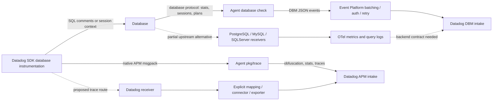

# Database Monitoring through the Collector

> **Revised implementation:** see [the runnable PostgreSQL + Datadog SDK OTLP PoC](../../implementation/database-monitoring/README.md).
> It extends the upstream receiver with SQL-comment trace context and supersedes
> this historical report's native receiver recommendations. The old prototype below
> is historical evidence only; it is not included in the new Collector deployment.
> Datadog DBM product behavior remains blocked on an explicit backend event contract
> and authenticated product readback.

Status: **SDK correlation fields locally validated; database collection remains in the
Agent; authenticated Datadog product experience unverified.** Dedicated owner:
`database_monitoring`; branch `dinesh.gurumurthy/poc-database-monitoring`.

DBM has two independent data paths. The SDK injects service identity and, in full mode,
execution context into a database request/session and sends an ordinary APM span. A
database check separately connects to the database, collects statistics/activity/plans,
and produces DBM Event Platform payloads. An HTTP proxy can relay the APM request or
already-produced DBM events. It cannot create database collection.

The instruction that every product is enabled in `pkg/trace` conflicts with the DBM row
of [the principles](../../principles.md). Starting at `pkg/trace` confirms APM SQL
obfuscation/stats, but **no universal DBM collection switch or DBM SDK upload endpoint**.
Retain Agent checks and use a proven Collector trace pipeline for SDK correlation;
pursue equivalent upstream collection separately, as principle 3 requires.

## Evidence and source versions

Inspected 2026-09-19, without modifying the source repositories. All five source repos
were clean at inspection. Paths/symbols below refer to these immutable commits.

| Source | Commit/version |
| --- | --- |
| Collector contrib `main` | `16fa3257d56c299e115a558b1a668018a39990d5` |
| Python `main` | `d6ab482ea3fb3c8666e75ac1905a3325b8f80098` |
| Java `master` | `7b903a53644abc39f55b2fb21283546ae9801f35` |
| JavaScript `master` | `d62655e12494634bb53f8c0cd440f087b004ca63` |
| Datadog Agent `main` | `761050392a732097645b76d9845d36629f1ef3dc` |
| Additional primary source: `~/dd/integrations-core` | `916e4f4364609494986417f9a5efc4b3b0281e52` |
| Executed Python distribution | `ddtrace==4.13.0rc1`, wheel SHA256 `8898aede97a229163903771ca68018c829605a704cc5ba26d3c087afae1064ac` |
| Wheel source snapshot supplied by shared investigation | `c280552330bb906df23b2963d6457a8d23fb81de` (separate from inspected `main`) |
| Executed Agent mapping helper dependency | `github.com/DataDog/datadog-agent/pkg/trace v0.83.1`; see prototype `go.mod`. This is the helper's module version, not an executed full-exporter version. |

The installed Python propagator differs from `main` in typing/import syntax in the
inspected file; do not call the executed wheel a build of `main`. Source inspection,
SDK execution, native receiver execution, and backend acceptance are different evidence.

## Current and proposed architecture



Correlation requires both sides to reach compatible backend identities: trace/span ID,
database service/host/name, application service/environment/version, and query attributes.
The backend matching algorithm, retention rules, sampling requirements, and UI joins are
not present in the inspected repositories. They require DBM/APM product-team validation.

## SDK collection and propagation

All three SDKs have `DD_DBM_PROPAGATION_MODE`, default `disabled`, with `service`,
`full`, and `dynamic_service` in the inspected sources. This changes database traffic;
the Collector does not inject the SQL comment after the query has executed. In SQL
instrumentation, `service` conveys identity, while `full` also conveys W3C traceparent
and normally sets `_dd.dbm_trace_injected` on the DB span. `dynamic_service` adds a
process-tag-derived service hash (`ddsh`, corresponding span `_dd.propagated_hash`)
when available. Hash policy and encoding are language-specific; this prototype does
not validate dynamic-service attribution.

| Language | Primary implementation and supported paths inspected | Differences that matter |
| --- | --- | --- |
| Python | `ddtrace/propagation/_database_monitoring.py::_DBM_Propagator.inject/_get_dbm_comment`, `internal/settings/_database_monitoring.py`; integration hooks for psycopg, asyncpg, pymysql, mysql, mysqldb, aiomysql, pymongo | Default injector prepends a comment and preserves `str`/`bytes`. Samples the local root before reading `Context._traceparent`. Psycopg has a custom SQL object injector. Asyncpg `bind_execute_many` deliberately bypasses injection. PyMongo uses Mongo `comment`/`$comment`, merges strings/lists, preserves incompatible types, and rejects versions older than 3.9. No SQL Server/Oracle propagation hook was found in the inspected Python DBM registration/config paths; generic tracing support does not establish DBM support. |
| Java | `instrumentation/jdbc/.../JDBCDecorator.java`, `StatementInstrumentation.java`, `AbstractPreparedStatementInstrumentation.java`, `DBMCompatibleConnectionInstrumentation.java`, `SQLCommenter.java`; `agent-bootstrap/.../dbm/SharedDBCommenter.java` | Normal JDBC statements can carry comments. PostgreSQL prepared execution uses `setClientInfo("ApplicationName", "_DD_" + traceparent)` when prepared tracing is enabled; Oracle full propagation uses `OCSID.ACTION`; SQL Server uses an extra `set context_info ?` with 25 binary bytes (version/sampling + span ID + high/low trace ID) and preallocates the eventual query span ID. Prepared SQL identity comments are generated at preparation, without per-execution traceparent. MySQL prepared execution has no matching per-execution context path in this code. Unsupported DB types are checked by `shouldInjectTraceContext`. |
| JavaScript | `packages/dd-trace/src/plugins/database.js::createDbmComment/injectDbmQuery` plus `datadog-plugin-{pg,postgres,mysql,mysql2,oracledb,tedious,mongodb-core}` | `pg` named queries and `postgres` prepared queries pass `disableFullMode`, retaining identity but no execution traceparent. `tedious` always disables full comment context to avoid cache churn; it does not implement Java's binary session mechanism. `oracledb` calls the normal full SQL comment injector in this snapshot; that is verified injection behavior, not verified Oracle DBM product support. Mongo uses command comments, not SQL. `appendComment` selects comment position. |

Java `SQLCommenter.inject` also avoids PostgreSQL JDBC callable braces, appends for CALL,
MySQL callable statements, and PostgreSQL hint comments, and avoids duplicate DD comments.
Oracle dynamic-service action-only mode is another Java-specific session-state path.
Mongo Java `MongoCommentInjector.generateComment` sets the injection marker before its
full-mode conditional, including service mode: do not generalize that marker as proof
of per-execution context for every database/language.

SQL identity keys are `dddbs` (DB service), `ddps` (application service), `dde`, `ddpv`,
`ddh` (DB host), `dddb` (database), `ddprs` (peer service), and optionally `ddsh`.
Presence and service derivation depend on peer-service settings. Python's vendored
`sqlcommenter` sorts keys and doubles percent signs after URL encoding; Java uses its
shared encoder; JavaScript builds its own ordered string. Do not assume Go's ordering,
escaping, or trace-ID truncation from [the older notes](../../dbm.md).

For inspected Python/Java/JavaScript paths, traceparent comes from the actual DB span's
context and supports the full trace ID. Native APM msgpack still represents 128-bit IDs
using a low 64-bit integer plus `_dd.p.tid` metadata. Both parts must survive translation.
Primary ID sources: Python `Context._traceparent`, Java
`internal-api/.../propagation/W3CTraceParent.java`, JavaScript
`opentracing/span_context.js::toTraceparent`.

There is no additional DBM HTTP upload from these SQL propagators. Normal SDK trace
writers send native msgpack to Agent trace endpoints, use SDK/language/version/count
headers, and receive APM sampling feedback (`rate_by_service`). Java feature discovery
advertises/selects v0.4/v0.5 through `communication/.../DDAgentFeaturesDiscovery.java`;
Python's `internal/writer/writer.py` and JavaScript's `exporters/agent/writer.js` retain
their ordinary writer behavior. The executable pins Python to `/v0.4/traces`.
SDK-to-local-Agent requests do not require a Datadog API key; backend credentials belong
to the Agent/exporter. No DBM-specific RC capability/return protocol was found in the
propagators; shared tracer discovery, sampling and optional RC still need honest responses.

## Agent responsibilities, starting at `pkg/trace`

| Stage | Verified code and behavior | Collector placement |
| --- | --- | --- |
| APM reception | `pkg/trace/api/endpoints.go` registers `/v0.4/traces`, `/v0.5/traces`; `api/responses.go::httpRateByService` returns sampling state | Existing native trace receiver with compatible discovery/responses, or forwarding to a complete Agent. No dedicated DBM trace endpoint needed. |
| SQL normalization | `pkg/trace/agent/obfuscate.go::obfuscateSQLSpan` calls `pkg/obfuscate` using DBMS; updates Resource, `sql.query`, tables; parse errors replace resource with non-parsable sentinel | Datadog export/trace processing; preserve raw correlation fields until appropriate processing. Receiver alone does not obfuscate the fixture SQL. |
| APM stats | `agent.go` calls `ObfuscateSpan` before `Concentrator.Add`; `stats/aggregation.go` and `statsraw.go` aggregate resource/service/type/peer dimensions, counts/durations/sketches. `obfuscateStatsGroup` normalizes client stats too | Existing `datadogconnector` and exporter processing, configured explicitly and before Collector sampling. Validate matching SQL resource/DB type and avoid duplicate stats. |
| APM writes | `pkg/trace/writer/{trace,stats}.go` send `/api/v0.2/traces` and `/api/v0.2/stats` to configured APM destinations | Existing Datadog exporter. It instantiates an Agent and feeds `OTLPReceiver.ReceiveResourceSpans`; this is more than HTTP forwarding. |
| Database collection | `integrations-core/postgres/.../postgres.py` registers `PostgresStatementMetrics` and `PostgresStatementSamples` with `dbm:true`; config gates query samples/activity/metrics/settings/schemas/column stats. Oracle Go config uses `DBM` at `pkg/collector/corechecks/oracle/config/config.go` | Agent database checks under current principles; upstream DB receivers for incremental equivalent coverage. Requires database connections, privileges, DB-specific SQL, cadence, deltas/caches, plan collection and obfuscation. |
| DBM identity and context | Postgres `statement_samples.py` normalizes rows, computes query signature, keeps metadata comments, emits `db.application`, `db.metadata.comments`, host/database instance/tags and plan signatures. SQL Server `activity.py` retains context_info as hex | Database receiver/check, not generic HTTP proxy. Backend extraction/join semantics remain unverified. |
| Event submission | `datadog_checks/base/checks/base.py::database_monitoring_{query_sample,query_metrics,query_activity,metadata}` -> C/Go `pkg/collector/aggregator::SubmitEventPlatformEvent` -> `pkg/aggregator/sender.go::EventPlatformEvent` -> aggregator -> Event Platform forwarder. Oracle emits through sender directly | Reuse Agent while collection stays there. A future supported upstream-to-DBM mapping requires an explicit exporter/backend contract. |
| DBM transport | `comp/forwarder/eventplatform/impl/{pipelines_dbm,epforwarder}.go` chooses JSON passthrough pipelines with batching/compression/queues; `comp/logs-library/client/http/destination.go` constructs URL/auth/retry | Existing Agent Event Platform transport. An HTTP forwarder can relay already-formed requests, but does not replace its data production or reliability pipeline. |

DBM intake defaults to `https://dbm-metrics-intake.<site>/api/v2/<track>`.
The six routing tracks are:

| Check event type | Intake track | Endpoint config namespace |
| --- | --- | --- |
| `dbm-samples` | `databasequery` | `database_monitoring.samples.*` |
| `dbm-metrics` | `dbmmetrics` | `database_monitoring.metrics.*` |
| `dbm-activity` | `dbmactivity` | `database_monitoring.activity.*` |
| `dbm-metadata` | `dbmmetadata` | `database_monitoring.metrics.*` |
| `dbm-health` | `dbmhealth` | `database_monitoring.metrics.*` |
| `dbm-column-statistics` | `dbmcolumnstatistics` | `database_monitoring.metrics.*` |

All six descriptors use JSON, concurrency 10, input buffer 500; samples cap batches at
10 MB and the others at 20 MB. Compression is configured by the logs transport, not
universally fixed to gzip. Requests include `DD-API-KEY`, content type, conditional
content encoding, Agent user agent, origin/version and timestamps. Network/retryable
HTTP failures use the transport's retry machinery. Successful intake responses are
transport acknowledgments; no DBM-specific response is sent back to SDK SQL injection.
DBM event JSON is not the metrics serializer's wire schema. Autodiscovery under
`pkg/databasemonitoring/aws` discovers databases, rather than collecting or replacing
APM traffic.

## Options and recommendation

| Concrete route | Correctness / compatibility | Complexity / maintenance / principles |
| --- | --- | --- |
| Existing `http_forwarder`: SDK -> native receiver or Agent | Locally verified real Python full-mode trace through unmodified forwarder and native receiver. Preserves path/body/response; receiver/exporter still must preserve semantics. Direct SDK -> DBM intake is invalid: it sends APM msgpack, not DBM event JSON. | Lowest proxy cost; explicit listener and single egress. No DB collection capability. Suitable optional transport, not a standalone DBM product solution. |
| Extend `http_forwarder` for multiple intake routes | Could relay separately produced DBM events or native traces to their correct upstream. Cannot implement stats, grants, scraping, plan collection by adding routes. | Route/auth/site/allowlist changes belong to shared work only when another producer needs them; building DB checks here creates an inappropriate maintenance burden. No DBM-specific extension recommended. |
| Datadog extension as configuration/proxy entry | Proposed `correlation_only` validates a trace pipeline and shared ingress; existing extension has no products schema. It cannot activate database checks in the Collector or modify executing application SQL. | Consistent opt-in entry point under principles; share trace ingress/discovery with APM/AppSec, never implement a second trace engine. Product-aware disable policy needs shared pipeline cooperation. |
| Existing native receiver + transform + connector/exporter; upstream DB receivers separately | Recommended trace route after the mapping gaps below are validated. Current DB receivers have substantial collection but different context extraction and schemas; they are a foundation for principle-3 work, not established DBM intake compatibility. | More explicit pipeline config, reuse maintained components, clear ownership. Retain Agent checks until DBM team accepts upstream payload mapping and measured feature parity. |

For an existing Agent DBM deployment, keep checks and their transport intact and change
only the application's APM destination to the validated Collector path. An optional
forwarder can target that native receiver. Do not proxy native SDK `/v0.4/traces`
directly to DBM intake, or treat a 200 response on an unrelated receiver route as DBM
acceptance.

## Existing upstream collection: concrete reuse and gaps

At the Collector commit above, PostgreSQL/MySQL/SQLServer receivers have **development
logs** and beta metrics, including `db.server.query_sample` and `db.server.top_query`.
They are not metrics-only receivers. Inspect their `metadata.yaml`, scraper/client
implementations and query collection settings before proposing duplicate collection.

| Receiver | Reusable collection | DBM compatibility gap verified in code |
| --- | --- | --- |
| PostgreSQL | Query samples, top-query counters, EXPLAIN plans, waits/blocking and SQL/plan obfuscation (`client.go`, `obfuscate.go`) | `client.go` extracts a plain W3C traceparent from `application_name`; Java writes `_DD_` + traceparent, while Python/JS use SQL comments. No equivalent DD comment context extractor was found here; obfuscation returns query text without comment metadata. |
| MySQL | Performance Schema samples, top queries, query plans where version supports concrete sample SQL (`scraper.go`, `client.go`) | Extracts W3C context from the session `@traceparent` user variable, not DD SDK comments. MySQL 5.x/MariaDB lack the same plan source as MySQL 8+. |
| SQL Server | Query samples/top queries/plans and stored-procedure deltas (`scraper.go`, `metadata.yaml`) | Passes `context_info` to a W3C text extractor. Java Datadog SDK sets compact binary context; unsupported values are retained as hex attribute rather than decoded to OTel IDs. |

These are source-verified format mismatches; no live DB was used. Do not infer that
PostgreSQL's statistics view always strips comments: backend query normalization,
representative query text and per-execution observation are separate concerns.
MongoDB/MongoDB Atlas receivers exist, but no complete equivalence to the inspected
Agent Mongo DBM checks was established. No dedicated Oracle receiver exists in this
checkout; generic SQL collection alone is not equivalent to the Oracle DBM check.

Upstream signals use OTel log/event attributes and resource identities. Sending them
through a generic Datadog logs exporter has not been shown to produce the six DBM
intake tracks. Missing work includes schema mapping, database identity/cloud metadata,
comment/session context decoding, signature/obfuscation compatibility, collection-health
events, plan/sample relationships, and backend contract validation. Prioritize neutral
context/collection improvements upstream; agree Datadog-specific translation with DBM.

## Configuration and disable semantics

[configurations.md](configurations.md) distinguishes a current trace pipeline example,
Agent DB setup, actual forwarding config, and the future extension stanza. Canonical
future configuration is [shared/configuration.md](../../shared/configuration.md):

```yaml
products:
  database_monitoring:
    enabled: false
    modes: [correlation_only]
    pipelines:
      correlation_only: traces/native
```

Absent/false is inert for extension-managed DBM behavior. `enabled:true` must validate
the referenced trace pipeline and documented ID/attribute preservation; unsupported
`collection` mode must fail. The extension must neither open DB sockets nor instantiate
Collector receivers/pipelines implicitly. SDK `DD_DBM_PROPAGATION_MODE` and Agent
`instances[].dbm` remain separate settings with separate credentials.

Disabling the extension cannot retract comments already emitted by an SDK, disable an
external Agent check, or filter DBM fields from an independent mixed-product trace
pipeline. Global suppression requires explicit SDK disablement, check disablement,
and product-aware pipeline policy. An upstream-only build/pipeline remains available.

## Executed prototype and observed limits

The [prototype](prototype/) runs an installed Python SDK, calls its actual propagator
on a manually-created SQL client span, and sends the real native msgpack writer output
to an unmodified `datadogreceiver`, capturing actual pdata. It additionally places the
unmodified `http_forwarder` in front of that receiver. There is no database driver or
service in the test. This isolates propagation and transport without claiming collection.

Five cases pass in [result.json](prototype/result.json): disabled, service, full,
full with the receiver's 128-bit gate disabled, and full through the forwarder.
Assertions cover unchanged SQL in disabled mode; service identity without traceparent;
full comment traceparent equal to SDK context; DB span marker, name/host/peer attributes
and span ID; and full trace-ID equality under the default enabled gate. With the gate
disabled, the receiver intentionally zero-pads the lower 64 bits, breaking equality
with the SDK comment's full ID. This is an observed configuration hazard.

Another observed gap: receiver SQL Resource becomes `dd.span.Resource`, while the
exporter's imported `transform.GetOTelResourceV2` returns the fallback `postgres.query`
for that span. Setting `resource.name` from `dd.span.Resource` restores the SQL string
in the actual mapping helper. The test checks the helper both ways; it **does not** run
the full Datadog exporter, connector, stats intake or backend. The suggested transform
is therefore a tested bridge at the mapping boundary, not full product validation.
`db.type` is translated to `db.system.name`; do not assert it survives under its old key.

Reproduction and prerequisites are in [prototype/README.md](prototype/README.md).
No backend API key, database endpoint/monitoring credentials, live DB driver workloads,
or product UI were available. Java and JavaScript paths are source-inspected only.

## Corrections to the preserved earlier DBM notes

[research/dbm.md](../../dbm.md) remains historical evidence. This report supersedes:

- Its claimed universal, always-on backend join on identical normalized text: client
  resources, signatures and tags are visible; backend matching semantics are unverified.
- Its illustrative Postgres `dd.trace_id`/`dd.span_id` emission: the inspected check
  instead preserves `db.metadata.comments` and `db.application`; backend parsing is
  outside the inspected repositories. Normal plan samples contain obfuscated statements;
  raw-query opt-in is separate.
- Its generalization of Go-only comment ordering, low-64-bit traceparent and injection
  placement: the three requested SDKs have their own implementations above.
- Its assertion that comments disappear universally from query metrics text: no such
  universal database behavior was established. Aggregate rows do not identify each
  execution; do not derive storage behavior from that fact.
- Its implication that matching obfuscators alone proves correlation: settings/version,
  database identity, SDK fields and backend interpretation still require validation.

## Prioritized follow-up and blockers

| Priority / owner | Concrete work | Acceptance / blocker |
| --- | --- | --- |
| P0 Collector + APM | Turn the demonstrated resource bridge and 128-bit preservation into reviewed native->pdata->Datadog trace/stats compatibility coverage, using existing connector/exporter | Capture actual final traces/stats and compare IDs, service/resource/type/peer tags and sampling. No backend access is needed for this next local test; not executed in this bounded prototype. |
| P0 DBM + SDK teams | Provide a disposable supported Postgres/MySQL DB and an org/API key with DBM/APM access; run Python/Java/JS driver workloads in service/full/prepared modes | Confirm Agent check sees comments/session context and backend shows service attribution + individual query/trace links. Access and live services unavailable here. |
| P0 DBM backend | Specify accepted payload/identity/signature/context contracts and confirm normalized-query matching behavior | Backend source/contract and UI validation unavailable; avoid turning the old inferred join into a compatibility promise. |
| P1 OTel Agent + Collector | Implement only `correlation_only` dependency validation/shared ingress policy in Datadog extension, including truthful off behavior | Requires shared product configuration implementation and mixed-product trace disable decision. No new DBM HTTP endpoint. |
| P1 OTel + DBM | Extend existing database receivers with interoperable context extraction and compare collection parity per DB/version | PostgreSQL `_DD_` context, SQL comments, SQL Server binary context need explicit support or SDK interoperability work. Preserve standards-based extraction. |
| P2 DBM + exporter owners | Define supported upstream-query-log -> DBM backend route/schema, reliability, health/metadata and plan support | Needs product agreement; generic logs delivery or HTTP 200 does not establish DBM support. |

Local deliverables are complete within those limits. No SDK, Agent or Collector
production source was changed. PR publication/readiness follows the repository's
human-written PR requirements and is coordinated centrally.
