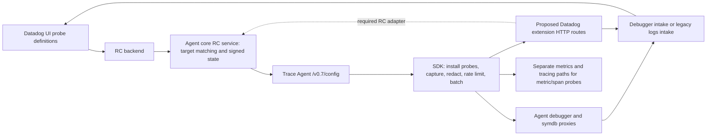

# Live Debugging through the Collector

> **Revised implementation:** [runnable real-SDK kind workloads](../../implementation/live-debugging/README.md)
> use both implemented Collector forwarding alternatives and real Datadog destinations.
> This supersedes the local adapter and mock-only transport status below. Signed RC
> and authenticated Datadog UI/API readback remain blocked. The old prototype is
> historical evidence and is not part of the deployed solution.

Status: source-backed architecture and executed local transport prototype; **no Datadog
backend/UI validation**. The snapshot, diagnostic and symbol upload data plane is an HTTP
proxy plus metadata enrichment. The complete product additionally needs discovery, remote
configuration (RC), and, for some probe types, metrics/traces. Current `http_forwarder`
configuration cannot replace the Agent for SDK agent-mode requests sent directly to intake.

## Baseline and scope

Inspected 2026-09-19 without modifying SDK or Agent checkouts:

| Source | Commit |
| --- | --- |
| Collector contrib `main` | `16fa3257d56c299e115a558b1a668018a39990d5` |
| Python `main` | `d6ab482ea3fb3c8666e75ac1905a3325b8f80098` |
| Java `master` | `7b903a53644abc39f55b2fb21283546ae9801f35` |
| JavaScript `master` | `d62655e12494634bb53f8c0cd440f087b004ca63` |
| Agent `main` | `761050392a732097645b76d9845d36629f1ef3dc` |
| Python's libdatadog dependency `v43.0.0` | `8c3d06ba9ff2a61f656782d59b1be00f09138e26` |

All links below pin these commits. `src/native/Cargo.lock` in Python pins libdatadog;
its sender source was fetched read-only into `/tmp` to close the native transport boundary.
“Live Debugging” here includes Dynamic Instrumentation logs/snapshots and diagnostics,
symbol database support, and required probe configuration. Exception Replay and Code Origin
share upload routes; they are called out where they affect disablement, without adding new
inventory products beyond the [principles](../../principles.md).

## End-to-end model



The SDK instruments the running application. The Agent upload proxy neither installs probes
nor redacts locals, evaluates expressions, joins snapshots, aggregates batches, or translates
them to OTLP. Those responsibilities remain in the SDK/backend. The backend must accept and
correlate runtime/probe/service identifiers, process diagnostics and symbol uploads, and expose
the resulting state in the UI. HTTP 202 from our mock proves none of those backend steps.

## SDK behavior and language differences

All three implement Dynamic Instrumentation with `DD_DYNAMIC_INSTRUMENTATION_ENABLED=true`
and an Agent destination (`DD_TRACE_AGENT_URL`); normal Agent mode needs no application API
key because the Agent supplies it. Do not equate this with universal probe-type support.

| Capability at pinned source | Python | Java | JavaScript |
| --- | --- | --- | --- |
| Dynamic logs/snapshots | Implemented; source-inspected | Implemented; source-inspected | Implemented; source components executed |
| Discovery and RC probes | `/info`, `LIVE_DEBUGGING` | `/info`, `LIVE_DEBUGGING` | `/info`, `LIVE_DEBUGGING` |
| Snapshot/log target selection | v2, then diagnostics; no legacy v1-only support in this uploader | v2, diagnostics; logs additionally fall back to v1 | v2, then diagnostics |
| Probe diagnostics | Multipart `event` containing JSON array | Multipart `event` when Agent supports diagnostics | Multipart `event` containing JSON array |
| Symbol database | Implemented; `LIVE_DEBUGGING_SYMBOL_DB` | Implemented; `LIVE_DEBUGGING_SYMBOL_DB` | No implementation found in `packages/dd-trace/src`; not claimed supported |
| Metric/span probes | Implemented; independent DogStatsD/tracer outputs | Implemented; independent DogStatsD/tracer outputs | Worker explicitly rejects non-`LOG_PROBE` types |
| Actual installed SDK through Collector | Passed local probe through forwarder + candidate adapter; separately versioned `4.13.0rc1` | Not run | Not run; narrow source-component test only |
| Signed RC and Datadog UI | Unverified | Unverified | Unverified |

### Python

[`DynamicInstrumentationConfig`](https://github.com/DataDog/dd-trace-py/blob/d6ab482ea3fb3c8666e75ac1905a3325b8f80098/ddtrace/internal/settings/dynamic_instrumentation.py#L51)
defaults to disabled, derives intake from trace Agent URL, and derives query tags from
env/version/host/debugger version/global tags/git metadata. The product
[`start` and `update_config`](https://github.com/DataDog/dd-trace-py/blob/d6ab482ea3fb3c8666e75ac1905a3325b8f80098/ddtrace/debugging/_products/dynamic_instrumentation.py#L19)
enable instrumentation and accept library RC activation, respecting explicit local settings.
[`Debugger`](https://github.com/DataDog/dd-trace-py/blob/d6ab482ea3fb3c8666e75ac1905a3325b8f80098/ddtrace/debugging/_debugger.py#L295)
registers/enables `LiveDebugging`, loads optional local probe files, installs function/line
hooks and manages removal. It can force SDK RC on when DI is enabled, so disabling only an
SDK RC environment flag is not a Collector disablement mechanism.

[`_encoding._build_log_track_payload`](https://github.com/DataDog/dd-trace-py/blob/d6ab482ea3fb3c8666e75ac1905a3325b8f80098/ddtrace/debugging/_encoding.py#L97)
serializes service, debugger snapshot, logger, source `dd_debugger`, message, timestamp,
optional process tags and trace/span correlation IDs. Queues construct JSON arrays.
[`SignalUploader.info_check` and `_flush_track`](https://github.com/DataDog/dd-trace-py/blob/d6ab482ea3fb3c8666e75ac1905a3325b8f80098/ddtrace/debugging/_uploader.py#L129)
normalize leading slashes in `/info`, select v2 or downgrade to diagnostics, disable uploads
when neither is advertised, retry rejected uploads, and re-enter discovery if fallback fails.
The fallback trigger is a rejected payload after retries, broader than JS's 404-only trigger.
Transport failure can drop the batch; this is not a durable queue.

[`DebuggerSenderPy`](https://github.com/DataDog/dd-trace-py/blob/d6ab482ea3fb3c8666e75ac1905a3325b8f80098/src/native/debugger.rs#L217)
passes JSON bytes, percent-encoded tags, timeout, and track to libdatadog. Its pinned
[`sender.rs`](https://github.com/DataDog/libdatadog/blob/8c3d06ba9ff2a61f656782d59b1be00f09138e26/datadog-live-debugger/src/sender.rs#L26)
derives `/debugger/v2/input` for logs/snapshots, `/debugger/v1/diagnostics` for diagnostics,
and `/symdb/v1/input` for symbols. It builds POSTs, JSON Content-Type or multipart diagnostics
with `event.json`, and query `ddtags` ([request construction](https://github.com/DataDog/libdatadog/blob/8c3d06ba9ff2a61f656782d59b1be00f09138e26/datadog-live-debugger/src/sender.rs#L400)).
Agentless construction uses site/API key and `/api/v2/debugger`; it sets origin
`agent-debugger` itself. We did not execute this native dependency.

[`ProbeStatusLogger`](https://github.com/DataDog/dd-trace-py/blob/d6ab482ea3fb3c8666e75ac1905a3325b8f80098/ddtrace/debugging/_probe/status.py#L37)
emits probe ID/version, runtime/parent ID and status. Python
[`SymbolDatabaseUploader`](https://github.com/DataDog/dd-trace-py/blob/d6ab482ea3fb3c8666e75ac1905a3325b8f80098/ddtrace/internal/symbol_db/symbols.py#L650)
uploads a multipart event plus gzipped symbols attachment, with upload ID and batch number.
[`SymDBSenderPy`](https://github.com/DataDog/dd-trace-py/blob/d6ab482ea3fb3c8666e75ac1905a3325b8f80098/src/native/symdb.rs#L79)
preserves multipart bytes and sends tags in `X-Datadog-Additional-Tags`.

Metric probes call DogStatsD through
[`probe_metrics`](https://github.com/DataDog/dd-trace-py/blob/d6ab482ea3fb3c8666e75ac1905a3325b8f80098/ddtrace/debugging/_metrics.py#L10)
and [`MetricSample.sample`](https://github.com/DataDog/dd-trace-py/blob/d6ab482ea3fb3c8666e75ac1905a3325b8f80098/ddtrace/debugging/_signal/metric_sample.py#L40).
Span/decoration probes are modeled separately in
[`_probe/model.py`](https://github.com/DataDog/dd-trace-py/blob/d6ab482ea3fb3c8666e75ac1905a3325b8f80098/ddtrace/debugging/_probe/model.py#L302).
They need the configured tracing path, outside debugger HTTP upload support.

### Java

[`DebuggerAgent.run`](https://github.com/DataDog/dd-trace-java/blob/7b903a53644abc39f55b2fb21283546ae9801f35/dd-java-agent/agent-debugger/src/main/java/com/datadog/debugger/agent/DebuggerAgent.java#L96)
starts DI when configured, starts Code Origin and symbols unless explicitly disabled, and
registers `LIVE_DEBUGGING` / `LIVE_DEBUGGING_SYMBOL_DB` with the shared RC poller (lines 218–255).
Probe configuration drives bytecode transformation/retransformation through
[`DebuggerTransformer`](https://github.com/DataDog/dd-trace-java/blob/7b903a53644abc39f55b2fb21283546ae9801f35/dd-java-agent/agent-debugger/src/main/java/com/datadog/debugger/agent/DebuggerTransformer.java#L85).
Local probe-file configuration is also supported, but does not validate UI/RC operation.

[`DDAgentFeaturesDiscovery.setDebuggerEndpoints`](https://github.com/DataDog/dd-trace-java/blob/7b903a53644abc39f55b2fb21283546ae9801f35/communication/src/main/java/datadog/communication/ddagent/DDAgentFeaturesDiscovery.java#L336)
accepts endpoint names with or without leading slash. Logs choose v2 → diagnostics → v1;
snapshots choose v2 → diagnostics. These are discovery choices; do not assume the JS runtime
404 retry behavior exists in Java. A configured snapshot URL bypasses the ordinary selection
([`Config`](https://github.com/DataDog/dd-trace-java/blob/7b903a53644abc39f55b2fb21283546ae9801f35/internal-api/src/main/java/datadog/trace/api/Config.java#L5038)).

[`SnapshotSink`](https://github.com/DataDog/dd-trace-java/blob/7b903a53644abc39f55b2fb21283546ae9801f35/dd-java-agent/agent-debugger/src/main/java/com/datadog/debugger/sink/SnapshotSink.java#L35)
has independent bounded low/high rate queues for snapshots/dynamic logs and serializes JSON
batches. [`BatchUploader`](https://github.com/DataDog/dd-trace-java/blob/7b903a53644abc39f55b2fb21283546ae9801f35/dd-java-agent/agent-debugger/src/main/java/com/datadog/debugger/uploader/BatchUploader.java#L237)
POSTs `application/json`, optional `ddtags`, container/entity headers, and a configured API
key if present. Thus “SDK never sends an API key” would be false. The Agent replaces the key.
Its response callback checks success, logs rejection, and consults retry policy for 5xx/408/429;
snapshot sink's retry policy is zero retries. Diagnostics use
[`ProbeStatusSink.flush`](https://github.com/DataDog/dd-trace-java/blob/7b903a53644abc39f55b2fb21283546ae9801f35/dd-java-agent/agent-debugger/src/main/java/com/datadog/debugger/sink/ProbeStatusSink.java#L105)
and multipart `event.json` when supported. [`SymbolSink`](https://github.com/DataDog/dd-trace-java/blob/7b903a53644abc39f55b2fb21283546ae9801f35/dd-java-agent/agent-debugger/src/main/java/com/datadog/debugger/sink/SymbolSink.java#L124)
collects scopes into multipart event+file batches, optionally compressed, under one upload ID.
[`StatsdMetricForwarder`](https://github.com/DataDog/dd-trace-java/blob/7b903a53644abc39f55b2fb21283546ae9801f35/dd-java-agent/agent-debugger/src/main/java/com/datadog/debugger/agent/StatsdMetricForwarder.java#L12)
confirms metric probes use DogStatsD independently of debugger uploads.

### JavaScript

[`supported-configurations.json`](https://github.com/DataDog/dd-trace-js/blob/d62655e12494634bb53f8c0cd440f087b004ca63/packages/dd-trace/src/config/supported-configurations.json#L795)
defaults DI off. [`Proxy.#updateDebugger`](https://github.com/DataDog/dd-trace-js/blob/d62655e12494634bb53f8c0cd440f087b004ca63/packages/dd-trace/src/proxy.js#L464)
can start/stop it on configuration changes. [`debugger.start`](https://github.com/DataDog/dd-trace-js/blob/d62655e12494634bb53f8c0cd440f087b004ca63/packages/dd-trace/src/debugger/index.js#L99)
loads optional probe files, registers `LIVE_DEBUGGING`, forwards apply/unapply/modify to a
worker, and calls the RC acknowledgement callback after the worker replies. The worker
captures using the DevTools client; its
[`remote_config.processMsg`](https://github.com/DataDog/dd-trace-js/blob/d62655e12494634bb53f8c0cd440f087b004ca63/packages/dd-trace/src/debugger/devtools_client/remote_config.js#L67)
explicitly rejects non-`LOG_PROBE` types. No equivalent symbol database client was found.

[`detectDebuggerEndpoint`](https://github.com/DataDog/dd-trace-js/blob/d62655e12494634bb53f8c0cd440f087b004ca63/packages/dd-trace/src/debugger/index.js#L275)
looks for the exact leading-slash v2 string in `/info`, otherwise uses diagnostics.
[`send.js`](https://github.com/DataDog/dd-trace-js/blob/d62655e12494634bb53f8c0cd440f087b004ca63/packages/dd-trace/src/debugger/devtools_client/send.js#L50)
builds JSON arrays with source/hostname/service/message/logger/correlation IDs/process tags/
snapshot, bounded queues, size pruning, and query tags. V2 HTTP 404 changes the target to
diagnostics and resends that batch. Both JSON snapshots and multipart diagnostic traffic can
therefore arrive on `/debugger/v1/diagnostics`: never enforce multipart-only on that route.
[`status.js`](https://github.com/DataDog/dd-trace-js/blob/d62655e12494634bb53f8c0cd440f087b004ca63/packages/dd-trace/src/debugger/devtools_client/status.js#L106)
sends `event.json` multipart with `RECEIVED`, `INSTALLED`, `EMITTING`, or `ERROR`.
[`request-options.js`](https://github.com/DataDog/dd-trace-js/blob/d62655e12494634bb53f8c0cd440f087b004ca63/packages/dd-trace/src/debugger/devtools_client/request-options.js#L14)
sets POST/url/path/Content-Type; agentless mode additionally supplies API key and origin.
The actual common request transport adds Content-Length and container headers, handles errors
and connection retry behavior ([`request.js`](https://github.com/DataDog/dd-trace-js/blob/d62655e12494634bb53f8c0cd440f087b004ca63/packages/dd-trace/src/exporters/common/request.js#L36));
that transport is explicitly replaced in our source-component experiment.

## Agent entry points and responsibilities

[`pkg/trace/api/endpoints.go`](https://github.com/DataDog/datadog-agent/blob/761050392a732097645b76d9845d36629f1ef3dc/pkg/trace/api/endpoints.go#L145)
registers all four data routes without a product-specific `IsEnabled` predicate:

| SDK HTTP route | Destination by default | Body processing |
| --- | --- | --- |
| `/debugger/v1/input` | `https://http-intake.logs.{site}/api/v2/logs` | Opaque proxy; legacy logs |
| `/debugger/v2/input` | `https://debugger-intake.{site}/api/v2/debugger` | Opaque proxy; current snapshots/logs |
| `/debugger/v1/diagnostics` | Same debugger intake | Opaque proxy; multipart diagnostics **or fallback JSON** |
| `/symdb/v1/input` | Same debugger intake | Opaque multipart proxy; symbol event/attachment |

[`debuggerProxyHandler/getRewrite`](https://github.com/DataDog/datadog-agent/blob/761050392a732097645b76d9845d36629f1ef3dc/pkg/trace/api/debugger.go#L78)
choose configured per-product URL/key or site/default key; add `DD-REQUEST-ID` UUID,
`DD-EVP-ORIGIN: agent-debugger` and forwarding headers; derive container identity; merge
`host`, `default_env`, Agent version, optional Fargate orchestrator, container tags, incoming
`X-Datadog-Additional-Tags`, and query `ddtags`; truncate tags at 4001 bytes before URL encoding.
The payload remains opaque. [`symdb.go`](https://github.com/DataDog/datadog-agent/blob/761050392a732097645b76d9845d36629f1ef3dc/pkg/trace/api/symdb.go#L69)
instead uses origin `agent-symdb` and puts merged tags in `X-Datadog-Additional-Tags` (no
equivalent truncation in that rewrite). Metadata policy must account for gateways: a
Collector host tag must not silently claim to be the source application host.

[`forwardingTransport.RoundTrip`](https://github.com/DataDog/datadog-agent/blob/761050392a732097645b76d9845d36629f1ef3dc/pkg/trace/api/transports.go#L93)
replaces host **and path**, preserves rewritten query, replaces `DD-API-KEY`, supports additional
endpoints/keys, and returns the primary destination response after secondary requests finish.
The proxy does not have a product durable queue/retry subsystem. Standard receiver timeouts,
configured request limits where wrapped/read, transport/TLS/proxy settings, error handling,
and request/error/duration metrics must be retained deliberately rather than assumed to come
from an OTLP pipeline. The single-target transport does not itself wrap the body limiter;
the fan-out branch does. No uniform upload size enforcement is claimed from that helper alone.

[`comp/trace/config/impl/setup.go`](https://github.com/DataDog/datadog-agent/blob/761050392a732097645b76d9845d36629f1ef3dc/comp/trace/config/impl/setup.go#L664)
sets `DebuggerLogsEnabled = logsEnabled || !logsConfigured || debugger_logs_enabled_override`.
Explicit Agent `logs_enabled: false` (absent override) causes v1/v2 input handlers to drain a
bounded body and return **200 while dropping**. Diagnostics and symbols still forward, and
the discovery endpoint still advertises registered routes. Consequently neither an advertised
route nor HTTP 200 proves storage, and this flag does not meet the principles' whole-product
disablement requirement.

### Discovery and RC are required return paths

[`pkg/trace/api/info.go`](https://github.com/DataDog/datadog-agent/blob/761050392a732097645b76d9845d36629f1ef3dc/pkg/trace/api/info.go#L263)
advertises endpoints and Agent metadata; SDKs use it before selecting upload/config paths.
New Collector discovery must advertise only implemented and enabled routes.

RC is attached to that receiver from
[`comp/trace/agent/impl/run.go`](https://github.com/DataDog/datadog-agent/blob/761050392a732097645b76d9845d36629f1ef3dc/comp/trace/agent/impl/run.go#L51)
only when Agent RC is enabled. `/v0.7/config` uses
[`cmd/trace-agent/config/remote.ConfigHandler`](https://github.com/DataDog/datadog-agent/blob/761050392a732097645b76d9845d36629f1ef3dc/cmd/trace-agent/config/remote/config.go#L44):
decode JSON `ClientGetConfigsRequest`, normalize service/env, enrich container tags, invoke
the core RC service over authenticated Agent IPC/gRPC, encode response JSON, preserve 404/500
and no-content behavior. This is **not** a direct URL rewrite to the cloud.

The core service tracks clients, performs target selection and cache/update handling, returns
signed roots/targets/files/config IDs, and handles acknowledgements/state on subsequent polls
([`CoreAgentService.ClientGetConfigs`](https://github.com/DataDog/datadog-agent/blob/761050392a732097645b76d9845d36629f1ef3dc/pkg/config/remote/service/service.go#L958)).
The backend is `https://config.{site}/api/v0.1/configurations`, configurable by
[`rcservice`](https://github.com/DataDog/datadog-agent/blob/761050392a732097645b76d9845d36629f1ef3dc/comp/remote-config/rcservice/impl/rcservice.go#L94).
[`HTTPClient.Fetch`](https://github.com/DataDog/datadog-agent/blob/761050392a732097645b76d9845d36629f1ef3dc/pkg/config/remote/api/http.go#L78)
uses protobuf `LatestConfigsRequest/Response`, not the SDK JSON protocol; API-key auth and
normal TLS verification apply. The code explicitly identifies an RC-scoped API key requirement.
Shared RC support needs an agreed deployment/service boundary and reuse of existing signed
configuration machinery. A sidecar Agent relay is a useful interim architecture but still
depends on Agent core and does not validate standalone Collector RC.

## Collector placement and concrete options

| Approach | Correctness and SDK compatibility | Configuration/maintenance | Decision |
| --- | --- | --- | --- |
| Current `http_forwarder` → Datadog intake | Changes only URL host/scheme, preserves SDK path; one destination; no `/info`, RC, per-request metadata or route policy. Actual JS components receive 404 and fallback still uses a wrong intake path. | Small YAML but insufficient; static headers cannot express all behavior. | Reject as standalone end-to-end solution. |
| Current `http_forwarder` → real Agent | Paths and JSON RC protocol remain Agent-compatible; Agent performs routing/metadata/RC. Whole product disablement absent on the forwarder. | Simple bridge; keeps running/configuring Agent; test full SDK+Agent before claiming success. | Viable interim deployment, source-inspected only here. |
| Extend `http_forwarder` with generic path routing/header replacement/opaque body options | Generic routing could map upload paths, but product-aware metadata and discovery/RC remain additional logic. Multiple independent forwarders cannot share one port or infer routing from SDK requests. | Larger generic proxy API; vendor behavior in upstream component would be inappropriate. | Reuse upstream-safe improvements, not all Datadog behavior. |
| Datadog extension HTTP support | Owns explicit product gating, route registry, correct destinations/auth, shared metadata and RC interface; can reuse Agent proxy code behind adapters. | Central vendor configuration, startup validation, one SDK-facing listener; new implementation required. | Recommended data plane, conditional on shared RC design. |
| Dedicated receiver converting snapshots to OTLP logs | Breaks proprietary multipart/snapshot/diagnostic/symbol semantics; conversion does not provide RC or UI protocol. | New receiver/exporter pipeline without benefit for opaque data. | Reject for these uploads. Separate metrics/traces can still use suitable receivers. |

Current [`httpforwarderextension.forwardRequest`](https://github.com/open-telemetry/opentelemetry-collector-contrib/blob/16fa3257d56c299e115a558b1a668018a39990d5/extension/httpforwarderextension/extension.go#L70)
and [`Config`](https://github.com/open-telemetry/opentelemetry-collector-contrib/blob/16fa3257d56c299e115a558b1a668018a39990d5/extension/httpforwarderextension/config.go#L12)
are the actual implementation compared, not an imagined NGINX-style route table. Set
`ingress.compression_algorithms: []` for opaque compressed payloads; default Collector HTTP
middleware can decompress requests. Preserve boundary/content-type/body/query and response
status, especially 404 fallback and 429/5xx retry signals. See shared forwarder research for
additional header/redirect/transport behavior.

Current [`datadogextension.Config`](https://github.com/open-telemetry/opentelemetry-collector-contrib/blob/16fa3257d56c299e115a558b1a668018a39990d5/extension/datadogextension/config.go#L23)
has API/hostname/http metadata settings and no Live Debugging products block. Its
[`httpserver.New`](https://github.com/open-telemetry/opentelemetry-collector-contrib/blob/16fa3257d56c299e115a558b1a668018a39990d5/extension/datadogextension/internal/httpserver/httpserver.go#L83)
registers metadata, not SDK debugger proxy routes. Proposed YAML below does not work today.

Responsibility placement: SDK remains responsible for probe execution/capture/redaction/rate
limits; extension HTTP support handles route/auth/metadata/discovery/disablement and proxy
observability; shared RC support handles control state and SDK response protocol; explicit
Collector receivers/pipelines handle metric/span outputs where semantically compatible;
backend handles product storage/correlation/UI. The proxy data plane fits principle 2.
Stateful RC and DogStatsD/trace dependencies require an explicit cross-team agreement on
scope; they must not be silently categorized as HTTP forwarding only.

## Proposed configuration and disablement

Schema follows the [shared proposal](../../shared/proposed-config.yaml); all new fields are
research proposals. Keep `live_debugging`
disabled by default; turning it on is a local Collector opt-in independent of SDK enablement.

```yaml
extensions:
  datadog:
    api:
      site: datadoghq.com
      key: ${env:DD_API_KEY}
    products:
      live_debugging:
        enabled: false
        modes: [native_proxy]
    native_sdk_proxy:
      enabled: false
      endpoint: 127.0.0.1:8126
    remote_configuration:
      enabled: false
      provider: agent_relay
      endpoint: http://127.0.0.1:18125
```

An enabled deployment also needs a shared SDK-facing listener, metadata source selection,
and an RC service/relay that can serve `LIVE_DEBUGGING`; symbol support additionally requires
`LIVE_DEBUGGING_SYMBOL_DB`. Those are dependencies, not secretly constructed Collector
pipelines. The exact shared listener/RC configuration belongs in the shared-components design.
Recommended startup behavior: reject enabled full-product mode if RC is unavailable; expose
any intentional local-probe/upload-only experiment explicitly and do not advertise RC.
Validate intake/site/key, listener collisions, route ownership, endpoint allowlists, and
required metadata providers before advertising readiness. Start routes after dependencies;
stop advertising/gate requests before draining them on shutdown/configuration replacement.

`enabled: false` must remove debugger/symbol routes from `/info`, block their egress, stop
product-specific background work, and stop matching/delivering both RC products. With shared
RC, other enabled products must continue receiving their configs. Disablement must be
implemented at the RC service's matching/subscription layer; stripping arbitrary signed
target content in a byte proxy is not an acceptable design. Define removal delivery for
already-installed probes and active clients; simply denying polling leaves SDK-local probes
installed, even if uploads are blocked. Collector disablement guarantees no collection-path
egress through that Collector; stopping capture in applications additionally requires SDK
configuration/probe removal and preventing SDK direct-intake bypass.

Exception Replay/Code Origin share these routes and may upload while DI is disabled locally.
The proposed product gate owns the shared upload surface as a whole; finer independent
disablement needs agreed product boundaries and cannot be inferred from URL alone. Explicitly
disabled Collector functionality must not be re-enabled by an SDK request or library RC flag.

## Prototype and observed validation

[`prototype/transport.cjs`](prototype/transport.cjs) starts the unmodified shared
`http_forwarder` factory harness, loopback mock intakes, and a deliberately small candidate
adapter. It loads actual pinned JavaScript `send.js`, `status.js`, `JSONBuffer`, request-options,
tag builder and multipart builder source, without changing the source checkout. It stubs
common HTTP transport with Node HTTP, worker config, logger, guardrail telemetry, TTL expiry
and oversized snapshot pruning. It supplies a synthetic capture/diagnostic to the upload
components. It is **not** a full SDK run or a real probe installation.

Prerequisites: Node (executed with v24.18.0), the pinned JS checkout, and the shared Go factory
harness built from the pinned Collector extension. After integration, from repository root:

```sh
cd research/shared/forwarder
GOCACHE=/tmp/ddot-research-go-cache go build -o /tmp/ddot-research-forwarder .
cd ../../..
DD_TRACE_JS_SOURCE="$HOME/dd/dd-trace-js" \
  FORWARDER_BINARY=/tmp/ddot-research-forwarder \
  node research/products/live-debugging/prototype/transport.cjs
```

The program checks the SDK commit, binds ephemeral loopback ports, generates temporary
current-schema YAML, launches/terminates the harness, and removes fixtures. See
[`prototype/forwarder.yaml`](prototype/forwarder.yaml) for the static equivalent. It uses only
the dummy key `research-only`. Its default binary path is the integrated
`research/shared/forwarder/forwarder`; an environment override avoids writing build output
into the repository.

Observed 2026-09-19, exit 0, four core assertion groups:

1. Configured egress `/api/v2/debugger` was ignored for path rewriting. Real JS upload
   components produced v2 POST, diagnostics POST and v2→diagnostics retry; mock intake
   returned 404 to all. Configured API key arrived, but Agent origin/metadata did not.
2. The reference adapter mapped current JSON snapshots and multipart diagnostics to
   `/api/v2/debugger`, preserved payload semantics, added host/env tags/origin/distinct UUIDs,
   and returned mock 202 to the components.
3. Synthetic legacy log and binary symbol bodies mapped to the correct backend paths;
   symbol bytes and tag header survived. Discovery listed four implemented routes and no RC.
4. Disabling the candidate adapter hid all product discovery and prevented forwarding on
   all four data paths and `/v0.7/config`.

The optional **full Python SDK** test also passed with installed `ddtrace==4.13.0rc1`, Python
3.12.13. This is an older release (coordinator recorded 569 commits behind inspected Python
HEAD); it is not validation of the newer native sender. The program generates `workload.py`
with `hot(value)`, a JSON local `LOG_PROBE` targeting that function with `captureSnapshot:true`,
and an application using `import ddtrace.auto` before importing the workload. It runs 30 calls,
discovers the adapter's debugger endpoints through the actual forwarder, and uses the installed
SDK's real uploader. **18 real snapshots with captured application state and an INSTALLED
diagnostic** arrived at mock intake in the observed run. Snapshot count is rate/timing-dependent;
the test requires at least one actual capture and the installed diagnostic, not exactly 18.

To reproduce the supplemental test in an isolated directory:

```sh
python3 -m pip install --target /tmp/ddot-research-python-runtime 'ddtrace==4.13.0rc1'
PYTHON_SDK_PATH=/tmp/ddot-research-python-runtime \
  FORWARDER_BINARY=/tmp/ddot-research-forwarder \
  node research/products/live-debugging/prototype/transport.cjs
```

The child uses `PYTHONDONTWRITEBYTECODE=1`, `DD_DYNAMIC_INSTRUMENTATION_ENABLED=true`, a
generated `DD_DYNAMIC_INSTRUMENTATION_PROBE_FILE`, and `DD_TRACE_AGENT_URL` pointing to the
forwarder. Service/env/version are fixture values; telemetry/tracing/symbol collection are
disabled for this focused snapshot test. RC is unavailable on the adapter; local probe
installation explicitly does not test UI-created probes. The SDK may turn its own RC polling
back on, but the local adapter never forwards that path. No external intake is contacted.

The reference adapter uses static metadata; it does not reproduce container resolution,
Agent fan-out, signed RC, full request limits, retries or production lifecycle. Its JS string
tag truncation is illustrative, not byte-equivalent to Go for Unicode. It models enablement
and routing, not a production component or proposed API contract. No test claims Java wire
execution, pinned Python HEAD/native-sender execution, DogStatsD, trace correlation, signed RC,
or backend UI. Python's older installed SDK does exercise actual discovery and upload.

## Blockers and implementation handoff

| Priority / owner | Concrete next work | Evidence needed to close |
| --- | --- | --- |
| P0 DDOT SDK + OTel Agent + RC | Agree full-product boundary, shared RC hosting/relay and disablement semantics, including shared Exception Replay/Code Origin routes | Signed config installs/removes a probe; diagnostic ACK and client state observed; disabled product cannot receive new configs |
| P0 OTel Agent / extension maintainers | Implement gated route registry, Agent-compatible metadata/auth/intake mapping/discovery and opaque body handling | Handler tests for all four routes, fallback JSON, multipart/gzip, API-key replacement, request IDs, limits, main/additional response semantics |
| P1 Python/Java/JS SDK teams | Build isolated pinned SDK artifacts and extend the older Python local-probe success to current Python/Java/JS and UI-created probes | Capture/diagnostic/symbol requests from real applications; both v2 and diagnostics fallback; no stubbed SDK dependencies |
| P1 Live Debugging backend + RC | Supply non-production org/site/API key with relevant RC access and product entitlement; perform authenticated product validation | UI probe reaches SDK, INSTALLED/EMITTING appears, actual snapshots/locals correlate, symbols usable; remove probe and confirm stop |
| P1 OTel + SDK teams | Validate Python/Java metric/span probe paths, DogStatsD semantics and trace correlation | Explicit metrics/traces receivers/pipelines tested; JS unsupported probe types kept out of coverage claims |
| P2 Upstream HTTP forwarder maintainers | Consider generic fixes independently of vendor code | Reusable route/header/opaque forwarding requirements agreed with maintainers before production implementation |

No `DD_API_KEY`/`DD_APP_KEY` was available to the coordinator, and no authenticated product
backend/UI was used. Python HEAD source import failed on missing `envier`; the coordinator
subsequently supplied isolated full `4.13.0rc1`, enabling the supplemental local-probe test.
Pinned HEAD's native sender remains unexecuted. Java artifacts were not built. JavaScript had
no `node_modules`; only the documented source components were executed. Public libdatadog
sender retrieval required network permission but succeeded at the pinned revision. These
are concrete remaining validation tasks, not evidence that the languages are unsupported.

Source research and local prototype are complete for this branch. Backend/current-SDK/RC
validation remains incomplete as described above. No production code, source-repository edits,
deployment, issue/PR comments, or generated PR description are part of this deliverable.
