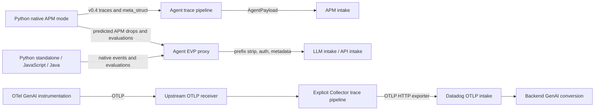

# LLM Observability through the Collector

Status: source investigation complete; focused writer/forwarder contract prototype and
full Python 4.13.0rc1 transport experiment passed. Pinned HEAD full SDK, authenticated intake,
and Datadog UI validation remain blocked or unexecuted.
Branch: `dinesh.gurumurthy/poc-llm-observability`. Research date: 2026-09-19.

The recommended design has **two complementary paths**: upstream OTLP for supported GenAI
spans, and a Datadog extension managed native proxy for native LLM events and evaluations.
The pinned Python SDK also carries LLM data inside native APM traces. An EVP proxy alone
does not implement that path. Current `http_forwarder` configuration cannot replace EVP:
it does not strip the prefix, route between intake hosts, or answer Agent discovery.

## Versions and evidence

| Source alias | Repository / reference | Researched commit |
| --- | --- | --- |
| P | `~/dd/dd-trace-py`, main | `d6ab482ea3fb3c8666e75ac1905a3325b8f80098` |
| J | `~/dd/dd-trace-java`, master | `7b903a53644abc39f55b2fb21283546ae9801f35` |
| N | `~/dd/dd-trace-js`, master | `d62655e12494634bb53f8c0cd440f087b004ca63` |
| A | `~/dd/datadog-agent`, main | `761050392a732097645b76d9845d36629f1ef3dc` |
| C | Collector contrib, main | `16fa3257d56c299e115a558b1a668018a39990d5` |

An additional official PyPI wheel, `ddtrace==4.13.0rc1`, was installed by the coordinator into
`/tmp/ddot-research-python-runtime` for a full Python experiment. This release is **not** the
pinned Python HEAD (569 commits later); runtime evidence is labeled separately and does not
validate the HEAD export-mode selection. The wheel release tag is
`c280552330bb906df23b2963d6457a8d23fb81de`; see [runtime provenance](../../python-runtime.json)
for the coordinator's separately recorded wheel metadata.

All path/line citations below refer to these commits, not an unspecified release. Repositories
were inspected read-only. A source comment about backend behavior is not backend validation.
Current public documentation is a separate, dated source and can differ from these snapshots.

## Paths and language coverage



The proposed Collector native proxy replaces the EVP box. It does not replace the trace
pipeline box. Keeping the Agent behind the current forwarder preserves both existing Agent
paths, but retains the Agent dependency and its product processing.

| Language | Native LLM SDK at pinned commit | Wire behavior | Executed evidence |
| --- | --- | --- | --- |
| Python | Supported, manual API and integration instrumentation | Default with APM on: LLM `meta_struct` inside native v0.4 trace; predicted dropped traces use EVP JSON. APM off: EVP JSON. Evaluations remain EVP JSON. Agentless modes exist. | HEAD import blocked by missing compiled native module; full 4.13.0rc1 standalone span/evaluation executed through real forwarder |
| JavaScript | Supported, manual API and integration instrumentation | Separate native JSON span/evaluation writers through EVP, alongside ordinary APM | Actual writer classes executed with explicit ancillary stubs and synthetic events; real forwarder tested |
| Java | Supported; do not label unsupported | Separate LLM track, gzip MessagePack span envelope; JSON evaluations v1 and feedback v2; ordinary APM alongside it | Source inspected; JVM runtime not executed |
| Upstream OTel, any language | Separate supported ingestion contract | OTLP traces with supported GenAI/OpenInference attributes | Official documentation verified; no backend or OTLP prototype execution |

No language above is unsupported for core native LLM telemetry. The three native SDKs are
not identical, and none of the native event payloads is an OTLP `ExportTraceServiceRequest`.
Changing an endpoint to `:4318/v1/traces` does not convert these payloads. DD SDK generic OTLP
exporters, where available, need separate LLM fidelity testing; native LLM support alone is
not evidence for that combination.

## SDK collection and export

### Python

`LLMObs.enable()` accepts API configuration and patches integrations; explicit
`DD_LLMOBS_ENABLED=false` prevents startup. Product defaults are off. `DD_LLMOBS_ML_APP`
or the manual API supplies application association; spans collect model/provider, input/output,
token metrics, error state, parent/session links, tags, sampling, and user span processing.
See P `ddtrace/llmobs/_llmobs.py:931` (`enable`), `:633` (`_on_span_start`), `:727`
(user processing and `gen_ai` APM tags), `:768` (`_llmobs_span_event`), and
`ddtrace/internal/settings/_config.py:405` (enable/app/sampling configuration).

P `ddtrace/llmobs/_llmobs.py:584-595` selects four export modes:

- APM enabled, Agent transport: `APM_AGENT`.
- APM enabled, agentless transport: `APM_AGENTLESS`.
- `DD_APM_TRACING_ENABLED=false`, or a nonempty `DD_LLMOBS_OVERRIDE_ORIGIN`: a dedicated
  LLM writer, either `LLMOBS_AGENT_PROXY` or `LLMOBS_AGENTLESS`.

`_prepare_llmobs_span_data` writes the structured payload at `:765`.
`enable` resets the APM writer to v0.4 at `:1057` because v0.5 strips `meta_struct`.
P `ddtrace/llmobs/_processor.py:130-164` predicts dropping from the local root's sampling
priority. If an APM trace can carry the event, it leaves the structure attached; otherwise
it removes that structure, marks `_dd.llmobs.submitted`, and enqueues the separate event.
Collector sampling or translation that differs from the assumed Agent path can therefore
lose events or disrupt deduplication/correlation. APM transport cannot be dismissed as an
optional side channel for this version.

P `ddtrace/llmobs/_writer.py:67-90` queries Agent `/info` unless agentless is explicit;
absence of a matching EVP endpoint selects agentless. An API key is then required.
`BaseLLMObsWriter.__init__` (`:125-159`) selects the Agent URL or direct host, attaches
JSON content type, and uses either `X-Datadog-EVP-Subdomain` or `DD-API-KEY`.
`periodic`/`_send_payload` (`:174-267`) batch, limit payload size, send POST, and retry
timeouts/408/429/5xx/connection failures up to three attempts. They log/drop failed batches.
`LLMObsSpanWriter._data` (`:1089`) creates an array of raw event envelopes with tracer
version and one span per envelope. `LLMObsEvalMetricWriter._data` (`:300`) creates
`data.type=evaluation_metric`, `data.attributes.metrics=[...]`.

### JavaScript

N `packages/dd-trace/src/config/supported-configurations.json:1383-1432` declares
`DD_LLMOBS_ENABLED=false`, optional agentless choice, application name, and sample rate.
`config/index.js:530-536` also auto-enables when other explicit LLM options are set.
`llmobs/sdk.js:85-110` implements `enable`; explicit false prevents it.
`llmobs/index.js:76-127` creates writers and subscribes to span-finish/flush channels.
`llmobs/span_processor.js:88-116` converts tagged spans, runs the writer, and marks
`_dd.llmobs.submitted` only when enqueueing succeeds. Input, output, model and metrics are
prepared in `format` at `:128`; instrumentation plugins populate the private tagger map.

`llmobs/writers/util.js:12-31` uses an explicit transport selection or `/info` with an exact
`/evp_proxy/v2/` endpoint match; failure selects agentless. `writers/base.js:253-292`
constructs native JSON POST paths and headers. `writers/spans.js:51-63` creates the same
array-of-envelopes shape as Python; `writers/evaluations.js:21-31` wraps metrics. The
writer handles batching, per-routing buffers and response logging (`base.js:108-217`).
Per-event routing with an API key goes directly to that tenant's intake (`:166-205`),
independently of the default proxy. Collector settings cannot disable those external sends.

### Java

J `dd-trace-api/src/main/java/datadog/trace/api/ConfigDefaults.java:197-199` defaults both
LLM enablement and agentless to false. `internal-api/src/main/java/datadog/trace/api/Config.java:2705-2709` reads
agentless/application configuration and falls back to the service name for the application.
`dd-java-agent/agent-llmobs/src/main/java/datadog/trace/llmobs/LLMObsSystem.java:38-54` installs manual span, evaluation,
and feedback processors when enabled; `domain/DDLLMObsSpan.java:131-225` creates typed
LLM spans and associates input/output, model, sampling, session and parent metadata.

J `dd-java-agent/agent-bootstrap/src/main/java/datadog/trace/bootstrap/Agent.java:288-303`
sets up the LLM intake writer plus APM writer. `dd-trace-core/src/main/java/datadog/trace/common/writer/WriterFactory.java:162-165`
adds the LLM track; `:245-300` selects discovered EVP versus direct intake.
`dd-trace-core/src/main/java/datadog/trace/common/writer/ddintake/DDEvpProxyApi.java:82-100,127-149` resolves the discovered prefix,
sets subdomain `llmobs-intake`, and forwards status to the writer with retries.
`dd-trace-core/src/main/java/datadog/trace/llmobs/writer/ddintake/LLMObsSpanMapper.java:163-173,187-271,807-819` serializes
a MessagePack map (`event_type`, `_dd.stage`, `spans`) and produces a gzip request body.
This is not the Python/Node JSON array. `communication/src/main/java/datadog/communication/ddagent/DDAgentFeaturesDiscovery.java:286-290,438-441`
prefers a discovered EVP endpoint and considers content-encoding support available at v4
and later. Preserve compressed bodies and advertise v4 only when the proxy supports it.

J `dd-java-agent/agent-llmobs/src/main/java/datadog/trace/llmobs/LLMObsSystem.java:29-33` uses v1 for evaluations and
v2 for feedback, unlike Python/Node's v2 evaluation path.
`LLMObsIntakeWorker.java:63-79` selects the explicit agentless flag for these calls and
hardcodes EVP v2 for the Agent path; it does not share the span writer's discovery fallback.
It buffers JSON and retries HTTP failures (`:171-216`). This asymmetry matters when `/info`
is absent: span and evaluation transports can diverge.

## HTTP contracts, discovery and return paths

| Request from SDK | Agent transformation | Backend destination |
| --- | --- | --- |
| POST `/evp_proxy/v2/api/v2/llmobs` (Java may use v4), subdomain `llmobs-intake` | Strip EVP version prefix, preserve event body, supply API key and Agent metadata | `https://llmobs-intake.<site>/api/v2/llmobs` |
| POST `/evp_proxy/v2/api/intake/llm-obs/v2/eval-metric`, subdomain `api` | Same | `https://api.<site>/api/intake/llm-obs/v2/eval-metric` |
| Java evaluations: same prefix with `v1/eval-metric` | Same; preserve distinct schema/version | `https://api.<site>/api/intake/llm-obs/v1/eval-metric` |
| Python APM-carried LLM: `/v0.4/traces` | Native trace decode/processing/sampling, preserve structured payload for kept traces, construct AgentPayload | `https://trace.agent.<site>/api/v0.2/traces` by default |
| GET `/info` | Agent generated capability document | Local response; never an intake upload |

Endpoint constants: P `_constants.py:121-128`; N `llmobs/constants/writers.js:4-13`;
J `DDIntakeApi.java:85-96`, `DDEvpProxyApi.java:82-100`, and `LLMObsSystem.java:29-33`.

Basic native span and evaluation ingestion can work with local static SDK enablement; Remote
Configuration is not a prerequisite for manual instrumentation. However Python's one-click
enablement is an explicit return-path dependency: P `ddtrace/llmobs/_product.py:15-20,59-88`
registers `LlmObsActivation` and applies `APM_TRACING` configuration for enable/app-name.
Agent A `comp/trace/agent/impl/run.go:59` adds `/v0.7/config` to the trace HTTP receiver.
An extension must reuse the shared RC service for this contract, including capability and
disablement policy. A generic HTTP proxy to the public API is not an RC service. Java/Node
equivalent LLM-specific RC activation was not established by this investigation; do not
assume Python parity. All native senders depend on truthful status propagation; suppressing
errors as 2xx loses the SDK's error/retry signal.

Dataset/experiment/prompt APIs are a wider product surface than telemetry upload.
P `_writer.py:304-325` expects the Agent to supply an application key when
`X-Datadog-NeedsAppKey` is requested (constant in `ddtrace/internal/evp_proxy/constants.py:10`).
But pinned A `pkg/trace/api/evp_proxy.go:36-37,144-191` neither forwards that header nor
adds an application key. The SDK's comment claims behavior not implemented by this Agent
snapshot: classify the proxied control-plane combination as **not supported by this pinned
Agent implementation**, pending version/ownership resolution. Direct Python calls can use
both credentials. N `llmobs/experiments/client.js:92-156` calls `api.<site>` directly with
both API and application keys, bypassing Agent URL configuration. Prompt/control-plane
feature parity and Java equivalents remain unverified; do not imply native telemetry proxy
support includes these workflows. Control-plane calls parse JSON response bodies and errors,
so full response forwarding is necessary where a proxy is supported.

## Agent responsibilities and Collector placement

Investigation starts at A `pkg/trace/api/endpoints.go:126-143`, which registers EVP v1-v4.
`evpProxyHandler` in `evp_proxy.go:61-66` checks `EVPProxy.Enabled` and strips the prefix.
`pkg/trace/config/config.go:739` defaults EVP enabled; `comp/trace/config/impl/setup.go:706-718`
maps `evp_proxy_config` settings. Disabling it returns 405 (`evp_proxy.go:71-75`).
The endpoint list lacks a per-EVP `IsEnabled` predicate, so `/info` generated at
`pkg/trace/api/info.go:137-145` can advertise EVP even when its handler rejects traffic.
The proposed product facade should improve this discrepancy rather than copy it.

| Responsibility, source | Required in Collector? / placement |
| --- | --- |
| Prefix removal, host selection from validated subdomain and site (`evp_proxy.go:126-142,185-197`) | Yes for native events; shared Datadog HTTP proxy with product path/subdomain allowlist. Avoid arbitrary client host selection. |
| Authentication (`:40-58,185-197`), per-additional-endpoint keys | Yes; extension owns site/API key policy. Multiple targets are optional, and only primary response is returned (`:200-230`). Reuse shared fan-out behavior if promised. |
| Header filtering (`:144-158`), no arbitrary credential forwarding | Yes; common native-proxy layer. Explicit allowlist includes content type/encoding, user-agent, EVP origin/version; suppress client API keys in favor of configured credentials. |
| Container ID resolution, container tags, hostname/default env (`:127,160-175`) | Preserve where available via shared metadata/origin resolver. Headers matter; an OTLP resource processor cannot enrich an opaque HTTP body. Do not invent host/container association for remote clients. |
| Payload limit, timeout/deadline and `X-Datadog-Timeout` (`:108-110,177-183`), proxy telemetry (`:112-124`) | Yes in HTTP layer; bounded requests and useful delivery errors are part of operational correctness. |
| Native LLM body processing | No LLM-specific decode, aggregation or transformation exists in this EVP handler. Keep JSON/MessagePack/gzip opaque. |
| Native APM processing carrying Python LLM data | Separate dependency, not EVP work. A `pkg/trace/agent/agent.go:492-634` normalizes, filters, obfuscates/truncates, tags, samples, computes stats and writes chunks. `writer/trace.go:270-347` creates/serializes compressed AgentPayload. Reuse Agent pipeline parity work or prove a lossless receiver/exporter mapping. |
| `/info`, HTTP responses and optional RC | Shared facade/discovery plus RC service, not an ordinary trace exporter. Advertise only supported active routes. |

The backend consumes native LLM envelopes or derives LLM observations from eligible trace
data; UI presence, evaluation joins, parent/session links, cost/token fields, and sampling
behavior remain backend acceptance criteria. Backend implementation was not inspected in this
investigation. No claim of authenticated end-to-end success is made.

## What “supports OTLP” means

The principles' compatibility entry is valid for a distinct upstream path. Current
[Datadog OpenTelemetry instrumentation documentation](https://docs.datadoghq.com/llm_observability/instrument/otel_instrumentation/)
(checked 2026-09-19) describes GenAI semantic conventions 1.37+ and supported OpenInference
traces. It allows standard Datadog OTLP ingestion routes and documents API-key authentication,
`dd-otlp-source=llmobs`, GenAI span attributes, and backend conversion. This supports an
upstream `otlp` receiver and explicit trace pipeline, with an OTLP HTTP exporter to Datadog.
The native evaluation, feedback and control-plane APIs above have no equivalent established
by that OTLP span contract.

That documentation also provides `dd_llmobs_enabled=false` to prevent backend conversion.
Therefore turning off the native proxy alone cannot disable all LLM product effects when
GenAI spans still reach the backend. SDK collection, managed routes, independent pipelines,
and direct SDK egress have separate controls. A promised global disable must validate and
enforce the relevant span/resource suppression contract; no such mechanism was implemented
or backend-tested here.

C `receiver/datadogreceiver/receiver.go:293-305` advertises `span_meta_structs:false`.
`internal/translator/traces_translator.go:298-388` maps native spans to pdata without
reading `Span.MetaStruct`. It is therefore not a proven lossless bridge for Python's default
native LLM path; setting `gen_ai.*` tags is not proof of full native input/output fidelity.
C `exporter/datadogexporter/traces_exporter.go:188-202` creates an Agent config with
`ReceiverEnabled=false`; the exporter does not silently provide the missing EVP endpoint.

## Options and recommendation

| Approach | Correctness / SDK compatibility | Configuration and maintenance | Recommendation |
| --- | --- | --- | --- |
| Current `http_forwarder`, no changes, directly to intake | Fails agentful EVP: unchanged path, one host, no discovery. Static headers do not fix routing. Can transport already-correct direct paths, or forward everything to a real Agent. | Small config; Agent-fronting retains Agent operations and cannot independently deny a product. | Useful control/Agent-fronting baseline; reject as standalone native LLM solution. |
| Extend `http_forwarder` | Could add generic route matching, prefix rewrite, status preservation and opaque payload handling. LLM still needs two hosts, metadata, discovery, product gates, RC and Python native trace support elsewhere. | Moderate generic work plus vendor-specific policy; upstream utility possible, but avoid duplicating Datadog facade services. | Reuse generic pieces if upstream accepts them; not sole product component. |
| Datadog extension HTTP proxy | Correct natural home for native routes, authenticated egress, shared enrichment, capability exposure and per-product controls. Needs implementation; existing extension has no SDK proxy. | One shared listener/route registry; explicit dependency checks; vendor ownership. Python APM and control-plane discrepancies remain distinct dependencies. | Recommended native-events path, together with trace pipeline parity work. |
| Existing OTLP receiver + explicit upstream trace pipeline | Correct for OTel GenAI span contract. Native EVP JSON/gzip MessagePack and evaluation APIs are incompatible. Native receiver translation currently loses structured metadata. | Lowest new component cost; standard operators/processors/exporter. Product-specific semantic preservation/disablement needs validation. | Recommended upstream instrumentation path. A new “LLM receiver” is unnecessary for this existing contract. |

Current forwarder source is C `extension/httpforwarderextension/extension.go:70-105`:
only scheme/host are replaced, configured endpoint path is ignored, and response is copied.
The [prototype](prototype/README.md) proves the path/discovery gap against the actual
extension implementation. See [shared component findings](../../shared/README.md) for
shared transport, compression, authentication and configuration decisions.

## Proposed Datadog extension configuration

This is a **design sketch, not accepted configuration**. It uses the shared product gate;
Collector components/pipelines are separately declared. Multiple LLM transports can coexist,
so `modes` is a list rather than a mutually exclusive choice. Pipeline routes must avoid
exporting the same native event twice through independent conversion and proxy paths.

```yaml
extensions:
  datadog:
    products:
      llm_observability:
        enabled: false
        modes: [otlp, native_proxy, native_traces]
        # Future associations with separately configured components; inert while disabled:
        pipelines:
          otlp: traces/llm
          native_traces: traces/native
```

Defaults: false, no native routes, no LLM-specific capabilities or RC activation, no
product-owned work. Enabling native proxy requires shared listener, site/API-key provider,
origin enrichment provider, allowed v2/v4 routes, and truthful `/info`. Enabling Python's
normal mode additionally requires a native trace pipeline preserving `meta_struct` and the
sampling/correlation contract; fail validation rather than assert support from an arbitrary
pipeline reference. Existing upstream OTLP does not require this extension. An association
can describe/validate configured pipelines but cannot create them.

`enabled:false` must deny product-owned ingestion/control paths even when generic EVP is
enabled for CI Visibility. Do not advertise disabled capabilities or allow RC to override the
local gate. This gate alone does not stop independently configured OTLP/APM exports or SDK
agentless sends. If the UI promises full product disablement, require explicit backend
suppression in all associated trace pipelines and document the remaining external egress
boundary. In particular, forwarding an opaque mixed native APM body cannot selectively
remove LLM data without a decoder; unrestricted pass-through plus a global-disable promise
is invalid. No application key should be added to all generic EVP traffic to paper over the
Python control-plane mismatch.

## Validation, blockers and next work

Executed locally: five contract cases, including actual pinned Node writer request/payload
construction and the unmodified Collector forwarder factory. Both native routes received
404 because their prefixes survived; both manually rewritten controls received mock 202;
`/info` received mock 404. Payload hashes and response headers were preserved. These are
successful **tests of the architecture limitation**, not successful LLM ingestion.

Also executed: full Python `ddtrace==4.13.0rc1`, manual LLM span with input/output and token
metrics, plus a custom evaluation, with APM tracing disabled and agentless explicitly false.
Both real SDK requests traversed the actual forwarder and reached the mock with unchanged
EVP paths, receiving 404. Assertions verified the application span/input and evaluation label
in the captured bodies. This confirms the forwarding limitation with a complete SDK runtime;
it does not verify automatic instrumentation or pinned HEAD's default APM carrier.

The Node writer tests stub logger, telemetry, Unicode helper (ASCII fixture), serverless hooks,
configuration helper and SDK transport. They do not instrument an application, exercise SDK
discovery/retry, or run complete Node SDK startup. Python HEAD's local lint environment cannot
import the SDK because `ddtrace.internal.native._native` is missing. Node has no installed
`node_modules`; Java application instrumentation was not executed. No live API/application
key or product-enabled backend was available. No SDK/Agent repository was modified.

| Priority / owner | Concrete next work and acceptance |
| --- | --- |
| P0 — DDOT SDK + LLM teams | Confirm pinned Python hybrid export and backend schema contract. Full SDK tests for kept/dropped traces, user processor drops, APM-off mode, sessions, distributed parents and duplicate prevention. |
| P0 — OTel Agent / shared proxy owners | Implement shared EVP route registry/enrichment/discovery once. Test LLM v2/v4, both host families, Java gzip MessagePack, size limits, primary response, failed delivery and disabled routes. |
| P0 — Datadog receiver/exporter + APM team | Resolve native `meta_struct` preservation before claiming Python default parity. Test actual encoded spans through both receiver and final exporter, with backend field assertions; reuse native Agent path if lossless mapping is unavailable. |
| P1 — LLM backend + OTel team | Run upstream GenAI OTLP through Collector to a test organization; confirm rendered inputs/outputs, costs, parent/session links, evaluation correlation and suppression. Determine which optional capabilities have no OTel equivalent. |
| P1 — SDK/Agent control-plane owners | Resolve Python app-key proxy assumption versus pinned Agent code; explicitly enumerate dataset/experiment/prompt support by language and supported direct/proxy routing. |
| P1 — shared RC team | Add Python LLM activation without allowing remote config to bypass local disable; establish Java/Node parity or explicitly unsupported capability claims. |
| Validation prerequisite | Provide built SDK artifacts/dependencies, a disposable product-enabled test organization and credentials via normal secret handling; execute real SDK+Collector tests, then verify Datadog UI/API. |

No implementation issue or external PR is opened by this workstream. Production component
changes should first have maintainer direction agreed through the human issue discussion
required by repository policy. PR creation/readiness also requires the human-written template
sections and human authorship checkbox; coordinator owns that handoff.
