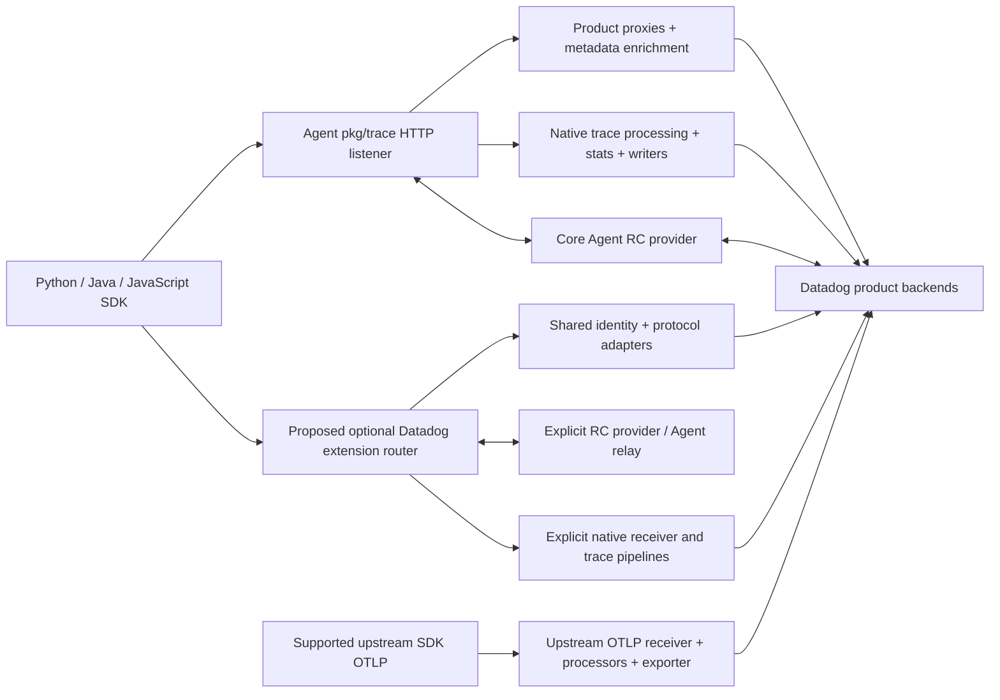

# Shared transport, control plane, and configuration

Status: source-backed architecture research and an executed **unmodified current
http_forwarder** experiment. No production Collector implementation changed. The proposed
Datadog extension product API does not exist today. See [configuration](configuration.md),
[proposed YAML](proposed-config.yaml), and [reproducible forwarder experiment](forwarder/README.md).

## Researched versions

| Implementation | Pinned source / dependency |
| --- | --- |
| Collector contrib main | `16fa3257d56c299e115a558b1a668018a39990d5` |
| Agent main | `761050392a732097645b76d9845d36629f1ef3dc` |
| Python SDK main | `d6ab482ea3fb3c8666e75ac1905a3325b8f80098` |
| Java SDK master | `7b903a53644abc39f55b2fb21283546ae9801f35` |
| JavaScript SDK master | `d62655e12494634bb53f8c0cd440f087b004ca63` |
| Current forwarder module | local source above; Go 1.26.0; Collector core `v1.67.1-0.20260917142259-65d9c38b188c`, confighttp `v0.161.1-0.20260917142259-65d9c38b188c` |
| Current Datadog extension | Datadog Agent config/serializer libraries primarily `v0.83.1`, with some transitive `v0.83.0` dependencies |
| Current Datadog receiver | `pkg/trace`, `pkg/proto`, obfuscation and stats dependencies `v0.83.1` |
| Current Datadog exporter | primarily Agent modules `v0.83.0`; does not imply Agent main behavior |
| Agent DDOT contrib component bundle | `comp/otelcol/collector-contrib/impl/go.mod` pins Datadog extension `v0.159.0` |
| Experiment runtime | Go 1.26.4, Linux arm64 |

The SDK commits identify the common source baseline; product reports own language-specific
investigation. Agent main is a behavioral reference, **not** the library version executed by
the Collector experiment. The experiment imports only the real forwarder, not Agent main.
Every path below is relative to the named pinned repository.

## What exists today

**Generic forwarder.** `extension/httpforwarderextension/config.go` exposes one ingress server
and one egress HTTP client. `extension.go:forwardRequest` clones each request, changes only
URL scheme/host and HTTP Host, clears RequestURI, adds configured headers and Via, calls the
client, then returns the destination's status/body. No path routing, prefix stripping,
destination selection, /info implementation, RC service, container-tag lookup or product
configuration exists. Multiple extension instances can use different ports but cannot share
one Agent-compatible listener or fan out a single request.

The executable experiment confirms endpoint path/query are ignored; the incoming path/query
survive. Egress DD-API-KEY wins over a caller's key because confighttp's transport sets it after
the forwarder adds headers. Unconfigured Authorization and EVP routing headers pass through.
Default ingress decompresses gzip and removes Content-Encoding; explicitly configuring
`compression_algorithms: []` preserves compressed bytes. Repeated response header values are
collapsed by Header.Get/Set. At this confighttp version invented nested `egress.routes` and
`egress.endpoints` are silently ignored by its custom unmarshaller; successful parsing is not
evidence of routing support. See test results for the precise assertions.

**Datadog extension.** `extension/datadogextension/{config,factory,extension}.go` and
`internal/httpserver/httpserver.go:NewServer` show a metadata service, periodic Collector
metadata/liveness emission, source/hostname discovery and shared serializer. The only mounted
HTTP handler is the configured metadata path (default `/metadata`). `GetSerializer` exposes
the Agent serializer to other components; it is not an inbound SDK proxy. ConfigSnapshotWatcher
observes an effective Collector configuration, but does not create receivers or pipelines.
Current `http` means metadata service configuration, not an Agent port. There is no `products`,
native SDK proxy, /info or remote-configuration setting. Reusing this extension as an entry
point requires new APIs, lifecycle, tests, and a decision about metadata-service coupling.

**Datadog receiver.** `receiver/datadogreceiver/receiver.go:getEndpoints/buildInfoResponse`
registers trace, metric and log endpoints depending on configured consumers. Trace formats
include `/v0.3/traces`, `/v0.4/traces`, `/v0.5/traces`, `/v0.7/traces`, `/api/v0.2/traces`.
The receiver translates into pdata; it does not embed the full trace Agent. /info explicitly
advertises `client_drop_p0s:false`, `span_meta_structs:false`, `long_running_spans:false`.
Unknown paths hit `/`, which returns **HTTP 200 without processing product data**. Its `/intake`
reverse proxy is a specific legacy intake case, not a general SDK product proxy. This fallback
makes status-only tests especially misleading. Product claims require observing output and
semantic preservation, not merely receiving 200. The source was inspected; no receiver runtime
was executed in the shared experiment.

**Agent DDOT/OTLP assemblies.** Agent
`comp/otelcol/collector-contrib/impl/components.go:components` imports the upstream Datadog
extension and its v0.159.0 manifest. It does not provide evidence for a new SDK proxy in that
extension. Agent `comp/otelcol/otlp/collector.go:getComponents` creates an OTLP receiver,
serializer/logs-agent exporters and infrastructure enrichment, and
`map_provider_config_not_serverless.go:defaultTracesConfig` forwards traces through OTLP to
the trace Agent. This is an embedded Agent pipeline with Agent dependencies, not proof that a
standalone upstream Collector performs the same trace processing.

## Agent responsibilities that must be separated

| Responsibility | Agent source / contract | Proposed placement and necessity |
| --- | --- | --- |
| Register data endpoints | `pkg/trace/api/endpoints.go`, `api.go` | One optional Datadog proxy router for opaque native products; route to explicitly configured native trace receiver for trace payloads. Do not bind two components to 8126. |
| Discover capabilities | `pkg/trace/api/info.go:makeInfoHandler` includes actual visible endpoints, feature flags, stats/obfuscation settings, Agent-state hash and container-tag hash | Shared Datadog discovery service; advertise only implemented, enabled, ready capabilities. Receiver /info alone cannot describe separately served product routes. Preserve response fields the enabled SDK paths rely on. |
| Credential/site/routing | `pkg/trace/api/evp_proxy.go:evpProxyTransport.RoundTrip`, profiles/debugger/pipeline_stats/openlineage handlers | Datadog proxy owns explicit product destination policy, per-target API keys, EVP allowlisted headers and prefix removal. Generic client TLS/auth can be reused. Never route a caller-supplied arbitrary URL. |
| HTTP upload/response semantics | `pkg/trace/api/transports.go:forwardingTransport`, profiles' `multiTransport`, EVP transport | Shared generic proxy primitives plus Datadog policies: opaque body/encoding, method/path/query, deadlines, size bounds, cancellation and response status/body/headers. Streaming, retryability and transport errors need product-specific compatibility tests. |
| Additional endpoints | Same transports return primary response and discard additional responses; bounded body replay where needed | Optional shared fan-out implementation, configured explicitly per product. Secondary destination failures cannot replace primary result; avoid blindly retrying non-idempotent control requests. Current generic forwarder has no fan-out. |
| Identity enrichment | `pkg/trace/api/{container_linux,idprovider}.go`, `config.AgentConfig.ContainerTags`, individual handlers | Shared identity provider with product adapters. Local Linux can resolve origin/container/PID with cgroups/tagger; remote gateway cannot infer a remote SDK's host from the Collector hostname. Preserve SDK identity, add trusted infrastructure metadata, define precedence. Static headers are only a single-host approximation. |
| Product tags | Profiling uses `X-Datadog-Additional-Tags`; debugger modifies `ddtags`; EVP injects host/default-env/container headers; DSM has its own tag headers | Product handler adapters over the identity provider. A universal fixed header is insufficient; query and header limits/escaping differ. |
| Tracer RC request path | `comp/trace/agent/impl/run.go:runAgentSidekicks/newConfigFetcher` attaches `/v0.7/config`; `cmd/trace-agent/config/remote/config.go:ConfigHandler` parses JSON/protobuf model, normalizes service/env, enriches container tags, calls authenticated local core-Agent gRPC ConfigFetcher and returns JSON/204/errors | Shared Datadog RC adapter and an explicit provider, ideally reuse supported Agent RC components. A plain backend HTTP proxy is insufficient. Agent relay is a coexistence option, not an Agentless result. Preserve target/config state and SDK acknowledgements; filter disabled product subscriptions/capabilities. |
| RC backend lifecycle | `pkg/config/remote/service`, `pkg/config/remote/client`; trace Agent's `pkg/trace/remoteconfighandler` separately consumes APM sampling/Agent changes | Core Agent RC infrastructure is outside pkg/trace. A standalone embedded provider needs design/ownership for polling, authentication, cache, signed metadata, client state and shutdown. Do not equate SDK RC relay with trace-Agent sampling subscription. |
| Native traces and stats | `pkg/trace/api` decodes SDK formats; `pkg/trace/agent/agent.go:Process/runSamplers` normalizes, filters, obfuscates, enriches and samples, feeds stats concentrators and trace writers; `api/responses.go` returns sampling rates | Existing receiver/processor/connector/exporter pipeline or explicit Agent pipeline integration. Must validate product fields and sampling behavior. HTTP forwarding plus metadata cannot replace this path. Principle 4 requires OTel Agent-team parity work; avoid rebuilding it separately in each product proxy. |
| Collection inside Agent | Database checks and message-system integrations exist outside pkg/trace | Remains Agent-owned under the principles. SDK DBM correlation and DSM payload relay are narrower distinct scopes, not replacement database/Kafka collection. |

Agent endpoint discovery currently filters endpoint `IsEnabled` where supplied. Some entries,
such as EVP, have no IsEnabled filter and return a disabled error inside the handler. A new
Collector service should derive capabilities from functioning routes rather than copy an
overbroad static list. Endpoint advertisement alone does not establish correct behavior.

## Concrete architecture comparison

| Approach | Correctness / SDK compatibility | Config and maintenance | Decision |
| --- | --- | --- | --- |
| Configure current http_forwarder | Works as a same-path, one-origin HTTP relay. Direct backend only if SDK can emit backend path already; no Agent path rewriting, EVP selection or RC. Agent-compatible paths can be relayed to a real Agent, retaining that dependency. | Small configuration and no code changes; separate ports for separate destinations; static enrichment only. Compression must be configured deliberately. | Use as a measured baseline and for narrowly proven compatible/agentless SDK modes. Not a universal product architecture. |
| Extend generic http_forwarder | Generic routing/prefix rewriting, header set/remove, response fidelity and optional fan-out would close transport gaps. Does not inherently supply Datadog discovery, RC, identity or native trace semantics. | Upstream reusable primitives with focused contracts; adding every Datadog product switch to a neutral extension would create inappropriate coupling. | Contribute reusable transport improvements where maintainers agree; retain Datadog policy separately. |
| Add optional proxy to Datadog extension | Can centralize site/key, product enablement, discovery/RC and enrichment; directly matches opaque external-SDK product paths when required behavior is preserved. Does not solve native trace processing by itself. | New implementation with a shared route registry, independent listener/lifecycle and bounded provider APIs. Existing metadata coupling must be addressed. | Recommended product configuration and Datadog policy entry point, with shared generic transport helpers and explicit external pipelines. |
| Dedicated receiver / existing OTLP/Datadog receiver | Appropriate when converting a real signal into pdata or running native trace processing; unnecessary transformation risks data loss for opaque multipart/msgpack uploads and return paths. Existing Datadog receiver is not product-complete. | Reuse standard pipelines for standard signals; native semantic gaps require targeted work. A receiver per opaque HTTP product would duplicate routing/credentials/discovery. | Use existing upstream receivers for genuinely standard paths (including supported LLM OTLP); use native receiver/Agent pipeline only when semantic preservation is proven. |

The preferred design is a small optional Datadog policy layer with shared routing/control and
identity services, plus existing Collector pipelines for traces/metrics/logs. It is not a
proposal to move database checks into an HTTP extension or translate arbitrary proprietary
payloads to OTLP. Product reports must select the exact route and document any exception to
the proxy/enrichment principle, especially features carried inside native trace payloads.

## Architecture map

Arrows under `Proposed` are researched design, not implemented in this branch. The executed
forwarder is a simpler SDK -> one HTTP origin relay, described separately. Backend/UI,
container identity, remote configuration and Agent parity have not been executed here.

## Shared implementation sequence / ownership

1. **OTel + SDK product teams:** lock endpoint/body/response and capability fixtures from all
   supported languages; keep current-forwarder negative tests as regression evidence. Obtain
   authenticated product test accounts for backend/UI checks.
2. **OTel Agent + DDOT SDK teams:** agree shared route/discovery/identity contracts and explicit
   product-disable semantics. Decide reusable forwarder changes with upstream maintainers.
3. **OTel Agent + RC owners:** expose a supported RC provider boundary. Deliver Agent relay as
   an explicitly Agent-dependent mode if helpful; standalone provider remains a distinct task.
4. **OTel Agent + APM/product teams:** validate native receiver/exporter preservation, sampling,
   stats, security structures and mixed-product payloads before claiming native path parity.
5. **Product owners:** run real SDK + real Collector + authenticated backend tests including
   disabled routes/RC, retry/failure responses, multi-target behavior and topology metadata.
6. **OTel + DBM/DSM/Profiling teams:** pursue upstream collection/standard signal paths where
   semantics match, without equating native upload transport with collection parity.

Open decisions: extension metadata coupling; RC standalone API and entitlement; native field
preservation; product disable behavior on mixed trace pipelines; trust/identity in gateways;
destination fan-out policy; exact API version/config shape. No shared proposal assumes any of
these have shipped or passed an authenticated backend test.
